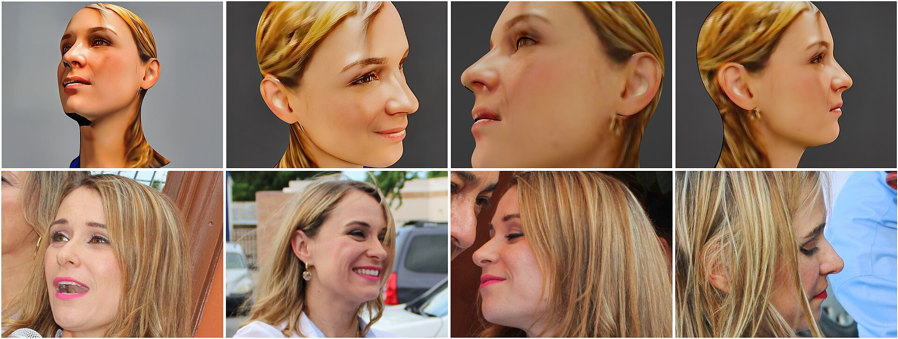

בתוך פחות משנתיים הפכה אמנות בינה מלאכותית מקוריוז טכנולוגי לאחד הנושאים הכי שנויים במחלוקת בעולם האמנות. במשפט אחד: מדובר ביצירת דימויים חזותיים באמצעות אלגוריתמים שלמדו ממיליוני תמונות, ומסוגלים להפוך משפט טקסט קצר ליצירה מלוטשת בתוך שניות. השאלה הגדולה שמרחפת מעל הגלריות היא לא רק "האם זה יפה" — אלא "האם זו בכלל אמנות".

## מה זו בעצם אמנות בינה מלאכותית?

מאחורי המונח מסתתרים כלים כמו מידג'רני (Midjourney), דאל-אי (DALL·E) וסטייבל דיפיוז'ן, שמתרגמים תיאור מילולי — "נוף עירוני בסגנון ואן גוך בשעת בין ערביים" — לדימוי מקורי. המשתמש אינו מצייר קו אחד; הוא מנסח, בוחר, מזקק ומכוון. התוצאה יכולה להיות מרהיבה, אך היא נשענת כולה על מאגר עצום של יצירות אנושיות קודמות שממנו "למדה" המכונה.

וכאן נולד הקרע. מבקרים טוענים שמדובר בקולאז' סטטיסטי מתוחכם, שמשתמש בעבודתם של אמנים אמיתיים ללא רשות. תומכים משיבים שכל אמן לומד מקודמיו, וששימוש חכם בכלי הוא כשלעצמו מעשה יצירתי.

## למה עולם האמנות כל כך מסוער?

הסערה התלקחה כשעבודות שנוצרו בעזרת בינה מלאכותית החלו לזכות בתחרויות ולהיכנס לאוספים. מוזיאונים גדולים כמו מוזיאון המטרופוליטן בניו יורק והטייט בלונדון כבר עוסקים בשאלה כיצד להציג ולתייג יצירה כזו. במקביל, ארגוני אמנים ברחבי העולם יצאו למאבק משפטי סביב זכויות יוצרים והשימוש ביצירותיהם לאימון המודלים.

בלב הוויכוח עומדות שלוש שאלות:

- **מקוריות** — האם דימוי שנוצר מצירוף של אינספור מקורות יכול להיחשב מקורי?
- **מחבר** — מי האמן: מנסח הפקודה, מפתחי האלגוריתם, או אולי אף אחד?
- **ערך** — האם ליצירה שנוצרה בשניות יש אותו משקל תרבותי כמו לציור שנמשך חודשים?

## איך זה נראה בישראל?

גם בזירה המקומית ניכרת תסיסה. יוצרים דיגיטליים ישראלים משלבים כלי בינה מלאכותית עם שפה חזותית מקומית — נופים מדבריים, טקסטים עבריים, מוטיבים מהאמנות הישראלית הקלאסית. סינמטקים ומרכזי אמנות עכשווית מקיימים פאנלים וסדנאות בנושא, ובמוסדות כמו מוזיאון תל אביב לאמנות ובצלאל מתנהל דיון ער על מקומם של הכלים החדשים בתוכניות הלימוד ובחלל התצוגה.

העניין המקומי אינו רק אמנותי אלא גם כלכלי: מעצבים, מאיירים וסטודיו לפרסום נדרשים כבר עכשיו להחליט אם הטכנולוגיה היא איום על פרנסתם או כלי שמייעל את עבודתם.

## טבלה: כלים מרכזיים ומה מייחד אותם

| הכלי | חוזק בולט | מתאים במיוחד ל |
|------|-----------|----------------|
| מידג'רני | איכות אסתטית ודמיון עשיר | קונספט-ארט ודימויים סוריאליסטיים |
| דאל-אי | הבנת פקודות מורכבות | איורים ותרחישים מדויקים |
| סטייבל דיפיוז'ן | קוד פתוח והתאמה אישית | יוצרים טכניים ומתקדמים |
| פיירפליי (אדובי) | שילוב בתוכנות עריכה מקצועיות | מעצבים גרפיים |

## האם הבינה המלאכותית תחליף את האמנים?

התשובה הזהירה היא: כנראה שלא, אבל היא תשנה את התפקיד. ההיסטוריה של האמנות מלמדת שכל טכנולוגיה חדשה — הצילום, הווידאו, המחשב — עוררה חרדה דומה, ובסופו של דבר הרחיבה את גבולות המדיום במקום למחוק אותו. הצילום לא הרג את הציור; הוא שחרר אותו מהחובה לתעד את המציאות ודחף אותו אל האימפרסיוניזם והאבסטרקט.

סביר שגם כאן ייווצר מודל שיתופי: האמן כאוצר וכמנצח, שמשתמש באלגוריתם ככלי אחד מיני רבים, ומביא אליו את מה שהמכונה עדיין חסרה — כוונה, הקשר, סיפור אישי ותעוזה לשבור כללים.

## אז איך כדאי להתייחס לכל זה?

במקום לשאול "אמן או מכונה", אולי כדאי לשאול "מה מעניין אותי לראות". אמנות בינה מלאכותית היא כרגע מעבדה ענקית של ניסוי וטעייה — חלקה חיקוי ריק, וחלקה יצירה שמצליחה לגעת. כמו בכל תקופת מעבר תרבותית, יידרשו כמה שנים כדי להפריד בין האופנה החולפת לבין מה שיישאר. בינתיים, שווה להיכנס לגלריה, אמיתית או וירטואלית, ולהחליט בעצמכם.

