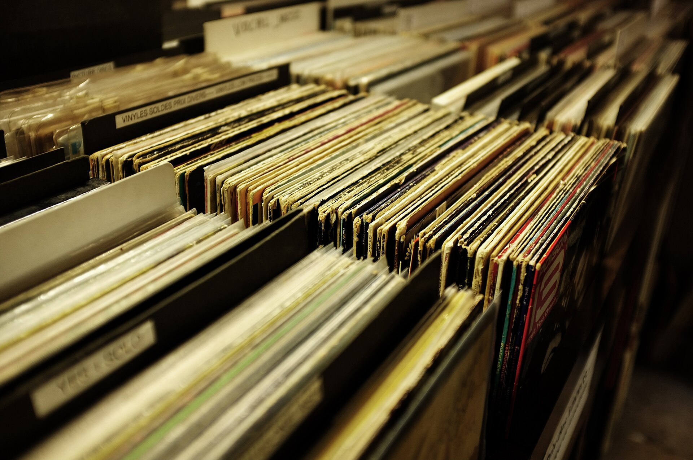

לפני עשור נדמה היה שהתקליט השחור נכחד סופית, קורבן ודאי של עידן הסטרימינג. אבל מהפכת הוויניל טרפה את הקלפים: התקליט חזר, והפעם לא רק כפריט נוסטלגי לאספנים מזדקנים אלא כאובייקט תרבותי נחשק שגם בני עשרים רודפים אחריו. התשובה הקצרה לשאלה "למה" פשוטה — בעולם שבו כל שיר זמין בלחיצה, דווקא החוויה האיטית, המוחשית והטקסית של הנחת מחט על תקליט הפכה למותרות של ממש.

## מה עומד מאחורי מהפכת הוויניל?

במשך שנים ארוכות סימנה תעשיית המוזיקה את הוויניל כפרק שנסגר. הקלטת, הדיסק ולבסוף קבצי ה־MP3 והסטרימינג דחקו את התקליט לפינה. אבל בשנים האחרונות המגמה התהפכה: מכירות הוויניל מטפסות בעקביות ברחבי העולם, ובשווקים מסוימים הן כבר עוקפות את מכירות הדיסקים.

מה קרה כאן? כמה כוחות פועלים במקביל. ראשית, **תגובת נגד לזמינות המוחלטת**. כשהכול נגיש תמיד, שום דבר לא מרגיש מיוחד. תקליט, לעומת זאת, דורש מחויבות: לבחור אלבום, להניח אותו, להפוך אותו באמצע. זהו טקס שמחזיר את הקשב למוזיקה עצמה.

שנית, **הממד הפיזי והוויזואלי**. עטיפת תקליט בגודל 30 סנטימטר היא יצירת אמנות בפני עצמה, בניגוד לתמונה זעירה על מסך הטלפון. אספנים מדברים על "החזקת האלבום ביד" כחלק בלתי נפרד מהחוויה.

### האם הוויניל באמת נשמע טוב יותר?

כאן מתחיל ויכוח נצחי. חובבי הוויניל מדברים על צליל "חם", אנלוגי ומלא יותר, בעוד ביקורתנים מזכירים שאיכות ההאזנה תלויה במערכת, בתקליט ובפטיפון. האמת נמצאת כנראה באמצע: הוויניל אינו בהכרח "נקי" יותר מקובץ דיגיטלי איכותי, אבל הצליל האנלוגי — כולל הרעש הקל, ה"נשימה" של החריצים — נתפס אצל רבים כאותנטי ואנושי יותר. במקרים רבים החוויה הרגשית חשובה יותר מהדיוק הטכני.

## אמנים גדולים מתדלקים את המגמה

המהפכה אינה רק תופעה של חנויות יד־שנייה. אמנים מהשורה הראשונה הפכו את הוויניל למרכיב שיווקי מרכזי. **טיילור סוויפט** מוציאה מהדורות ויניל בצבעים שונים ובעטיפות מתחלפות, מה שהופך כל גרסה לפריט אספנות. **אדל**, **בילי אייליש**, **הארי סטיילס** ולהקות ותיקות כמו **פינק פלויד** ו**הביטלס** ממשיכות למכור תקליטים בכמויות מרשימות.

גם בישראל אפשר לראות את ההשפעה: אמנים מקומיים מוציאים מהדורות ויניל מוגבלות, לעיתים כחלק ממימון המונים או כמזכרת יוקרתית להופעות. התקליט הפך לגשר בין האמן למעריצים — אובייקט שאפשר להחזיק, לחתום ולשמור.

## איפה קונים תקליטים בישראל?

התחייה של הוויניל החזירה לחיים את תרבות חנות התקליטים. בתל אביב, בירושלים ובחיפה פועלות חנויות ותיקות לצד חללים חדשים המשלבים מכירת תקליטים עם בית קפה או בר. במקביל צצו ירידי תקליטים ואירועי החלפה, שבהם אספנים נוברים בארגזים בחיפוש אחר הפנינה הבאה.

| סוג מקום | מה תמצאו | למי מתאים |
|---|---|---|
| חנות תקליטים עצמאית | מבחר חדש ומשומש, ייעוץ אישי | מתחילים ואספנים כאחד |
| יריד ואירוע החלפה | תקליטים נדירים במחירים משתנים | ציידי מציאות |
| חנות יד־שנייה | קלאסיקות במחירים נוחים | תקציב מוגבל |
| הזמנה מקוונת | מהדורות מיוחדות ויבוא | מעריצי אמן ספציפי |

המחירים נעים בטווח רחב: תקליט משומש נפוץ אפשר למצוא בעשרות שקלים, בעוד מהדורה חדשה ומושקעת של אמן מוביל עשויה לעלות מאות. מהדורות נדירות או חתומות מגיעות למחירים גבוהים בהרבה בקרב אספנים.

## מדריך קצר למתחילים

רוצים להצטרף למהפכת הוויניל? הנה כמה עקרונות בסיסיים:

- **פטיפון לפני הכול**: אל תתפתו לדגמים זולים במיוחד שעלולים לשרוט את התקליטים. השקעה בסיסית סבירה משתלמת לטווח ארוך.
- **מערכת שמע תואמת**: פטיפון זקוק למגבר ולרמקולים. בדקו אם המגבר כולל כניסת "פונו".
- **התחילו מהאהוב עליכם**: קנו קודם אלבומים שאתם מכירים ואוהבים — כך תיהנו מהחוויה מהרגע הראשון.
- **שמירה נכונה**: אחסנו את התקליטים אנכית, הרחק מחום ולחות, ונקו אותם מדי פעם.

## אז זה כאן כדי להישאר?

השאלה המעניינת אינה אם הוויניל יחזור לשלוט בשוק — הוא לא. הסטרימינג נשאר הדרך הנוחה והזולה ביותר להאזין למוזיקה בכל מקום. אבל הוויניל מצא לעצמו תפקיד חדש: הוא אינו מתחרה בסטרימינג אלא משלים אותו. בזמן שהפלייליסט מלווה אותנו בדרך לעבודה, התקליט שמור לאותם רגעים שבהם אנחנו רוצים באמת לשבת ולהקשיב.

מהפכת הוויניל היא בסופו של דבר סיפור על הצורך האנושי במגע, בטקס ובמשמעות בעידן דיגיטלי ומרוחק. וכל עוד הצורך הזה קיים, נראה שהמחט תמשיך לרחף מעל החריצים השחורים עוד שנים ארוכות.
