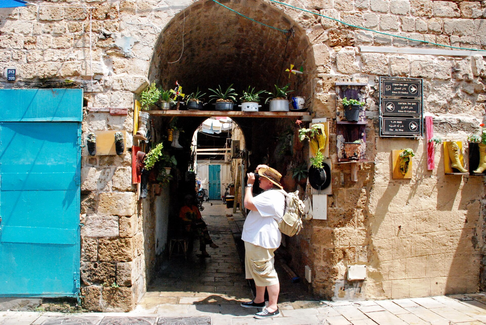

מהו בעצם פסטיבל עכו, ולמה הוא ממשיך לרתק קהל שנה אחר שנה? **פסטיבל עכו** לתיאטרון אחר הוא הזירה המרכזית של תיאטרון השוליים בישראל — אירוע שבו יוצרים צעירים, נועזים ולעיתים חסרי כל פשרה מציגים עבודות ניסיוניות בסמטאות העיר העתיקה. בשעה שהתיאטרון הממוסד עסוק בהפקות גדולות ומהוקצעות, הפסטיבל הזה נותר המקום שבו התיאטרון הישראלי מעז לשבור כללים.

## מה הופך את תיאטרון השוליים לכל כך חי

תיאטרון פרינג' — או בעברית, תיאטרון שוליים — הוא הכינוי לעבודות שנוצרות מחוץ למוסדות הגדולים כמו הבימה או הקאמרי. אין כאן תקציבי ענק, אין כוכבים מוכרים מהטלוויזיה, ולעיתים אין אפילו במה במובן המסורתי. מה שיש הוא חופש. יוצרים בוחרים נושאים בוערים, צורות ביטוי לא שגרתיות ומרחבים מפתיעים — מרתף, חצר, מחסן נטוש.

דווקא המגבלות הן שמייצרות את הכוח. כשאין תפאורה מפוארת, השחקן, הטקסט והמרחב חייבים לעבוד קשה יותר. התוצאה היא לרוב חוויה אינטימית, ישירה ולעיתים חשופה עד כאב — סוג של מפגש שקשה לקבל באולם בן אלף מקומות.

## למה דווקא עכו?

העיר העתיקה של עכו היא שחקנית ראשית בפני עצמה. הסמטאות הצרות, החומות הצלבניות, האולמות המקומרים והנמל — כל אלה הופכים למרחב משחק חי. מדי שנה, סביב חג הסוכות, העיר מתמלאת בבמות מאולתרות, בקהל סקרן ובאווירת חגיגה תרבותית שקשה למצוא במקום אחר בישראל.

המפגש בין ההיסטוריה העמוקה של המקום לבין יצירה עכשווית ופרובוקטיבית מייצר מתח מרתק. הצגה על זהות, על שכול או על מהגרים מקבלת משמעות אחרת לגמרי כשהיא מתרחשת בין קירות אבן בני מאות שנים.

## מה מאפיין את המופעים בפסטיבל עכו

המופעים בפסטיבל שונים באופן מהותי מהצגה רגילה. הנה כמה מהמאפיינים הבולטים:

- **קצרים ואינטנסיביים** — לרוב בין ארבעים דקות לשעה, ללא הפסקה.
- **ניסיוניים בצורתם** — שילוב של תנועה, וידאו, מוזיקה חיה וטקסט מקוטע.
- **קרובים לקהל** — לעיתים הצופים יושבים במרחק נגיעה, ולפעמים נדרשים לנוע במרחב.
- **אקטואליים** — הרבה עבודות נוגעות בפצעים חברתיים ופוליטיים.
- **מסוכנים אמנותית** — לא כל עבודה מצליחה, וזה בדיוק העניין.

## פסטיבל עכו מול התיאטרון הממוסד

כדי להבין את הייחוד, כדאי להשוות בין שתי הזירות:

| מאפיין | פסטיבל עכו (פרינג') | תיאטרון ממוסד |
|---|---|---|
| תקציב | נמוך, יצירתי | גבוה, מלוטש |
| משך ההצגה | קצר, כשעה | מלא, לעיתים כשעתיים |
| מרחב | סמטאות, מרתפים, חצרות | אולם קלאסי |
| קהל | קרוב, מעורב | מרוחק, נצפה |
| סיכון אמנותי | גבוה מאוד | מתון |
| קהל יעד | חובבי תיאטרון נועז | קהל רחב |

ההשוואה הזאת לא נועדה לקבוע מי טוב יותר — שתי הזירות מזינות זו את זו. רבים מהיוצרים והשחקנים שהתפרסמו מאוחר יותר בבמות הגדולות עשו את צעדיהם הראשונים דווקא במופעי שוליים, שם למדו לעבוד ללא רשת ביטחון.

## הפרינג' כמעבדה של התיאטרון הישראלי

אחד התפקידים החשובים ביותר של תיאטרון השוליים הוא לשמש חממה. כאן נבחנים רעיונות שאף מנהל אמנותי לא היה מעז לממן. כאן צומחות שפות בימתיות חדשות, ולעיתים גם כישלונות מפוארים שמתוכם נולדת פריצת דרך.

המגמה בשנים האחרונות מעודדת — יש עלייה בעניין בתיאטרון ניסיוני, במופעים אימרסיביים ובעבודות שמטשטשות את הגבול בין מבצע לצופה. פסטיבל עכו נמצא בלב המגמה הזאת, וממשיך להיות מצפן שמסמן לאן התיאטרון הישראלי צועד.

## מדריך קצר לצופה הראשוני

אם מעולם לא ביקרתם בפסטיבל שוליים, הנה כמה עצות:

1. **בואו בראש פתוח** — לא כל מה שתראו יהיה נוח, וזה חלק מהחוויה.
2. **תכננו כמה מופעים ברצף** — היופי הוא במגוון ובהפתעה.
3. **שוטטו בעיר** — האווירה שבין ההצגות שווה לא פחות מהמופעים.
4. **דברו עם היוצרים** — בפרינג' הגבול בין הבמה לקהל דק במיוחד.

התיאטרון האמיץ ביותר לא תמיד נמצא באולמות היוקרתיים. לפעמים הוא מחכה בסמטה אפלולית, בין קירות אבן עתיקים, ומזכיר לנו למה בכלל התאהבנו בתיאטרון.
