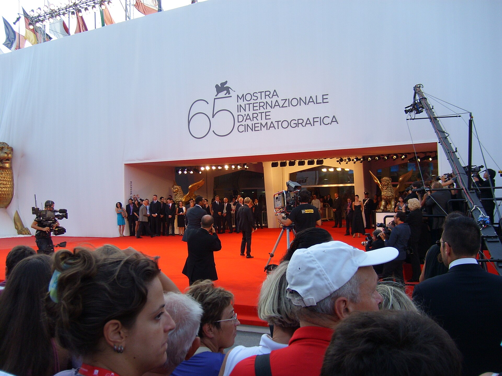

בעידן של רזולוציית 4K, צבעים רוויים ומסכי ענק, נדמה שהצבע כבש את הקולנוע לחלוטין — ובכל זאת, שורה של במאים מהשורה הראשונה בוחרים דווקא לוותר עליו. **קולנוע שחור לבן** חוזר בשנים האחרונות לחזית, לא כאילוץ טכני של פעם אלא כבחירה אסתטית מודעת, כמעט מתריסה. מ"רומא" של אלפונסו קוארון ועד "מאנק" של דייוויד פינצ'ר, ההימנעות מהצבע הפכה לסימן היכר של קולנוע שמבקש להיתפס כאמנותי, נצחי ומעל לזמן.

## למה במאים חוזרים לשחור לבן?

התשובה הקצרה: כי היעדר הצבע מחדד את כל השאר. כשאין ורוד, כחול או ירוק שמושכים את העין, הצופה מתרכז בקומפוזיציה, במשחקי האור והצל, ובהבעות הפנים. **הפריים הופך למופשט יותר, לתמציתי יותר.** במאים רבים מדברים על תחושת "זיכרון" שהשחור לבן מייצר — כאילו אנחנו צופים לא באירוע אלא בהד שלו.

יש בכך גם מימד של יוקרה. הקולנוע השחור לבן נושא איתו את מטען ההיסטוריה של המדיום: מ"האזרח קיין" של אורסון וולס ועד "רשימת שינדלר" של סטיבן ספילברג. במאי שבוחר בו כאילו מצהיר: אני משוחח עם הקלאסיקות.

## מ"רומא" ל"מאנק": הגל העכשווי

הרגע שבו המגמה פרצה למיינסטרים היה "רומא" (2018), יצירתו האישית של המקסיקני אלפונסו קוארון, שצולמה בשחור לבן דיגיטלי מלוטש עד כאב וזכתה בשלל פרסי אוסקר. קוארון הוכיח שהיעדר צבע יכול להיות דווקא עשיר ורגשי במיוחד — כל טיפת גשם וכל אריח רצפה מקבלים נוכחות.

בעקבותיו הגיעו אחרים. דייוויד פינצ'ר יצר את "מאנק" (Mank), מחווה לתור הזהב של הוליווד שצולמה בשחור לבן כדי לחקות את אסתטיקת שנות השלושים. רוברט אגרס ביים את "המגדלור" (The Lighthouse) בפורמט מרובע וכמעט קלאוסטרופובי, שהופך את השחור לבן לכלי אימה. וקנת' בראנה חזר לילדותו ב"בלפאסט", שבו הצבע שמור רק לרגעים של קולנוע בתוך הקולנוע.

### לא רק נוסטלגיה

חשוב להבחין: לא כל שימוש בשחור לבן הוא געגוע לעבר. אצל אגרס זו בחירה של ז'אנר; אצל קוארון זו בחירה של זיכרון פרטי; אצל פינצ'ר זו בחירה של פסטיש היסטורי. המשותף הוא שהצבע נתפס כמשהו שאפשר — ולפעמים כדאי — לוותר עליו.

## הסרטים שהחזירו את השחור לבן לזירה

| הסרט | הבמאי | מה מייחד את השחור לבן |
|------|--------|------------------------|
| רומא | אלפונסו קוארון | דימוי מלוטש שהופך זיכרון אישי ליצירה מונומנטלית |
| מאנק | דייוויד פינצ'ר | חיקוי מוקפד של אסתטיקת הוליווד הקלאסית |
| המגדלור | רוברט אגרס | פורמט מרובע ואפלה שמעצימים את האימה |
| בלפאסט | קנת' בראנה | ניגוד בין זיכרון בשחור לבן לקולנוע בצבע |

## איך זה מתחבר לקהל הישראלי?

גם הצופה הישראלי פוגש את המגמה הזאת בעיקר דרך הסינמטקים ופסטיבלי הקולנוע. הסינמטק בתל אביב ובירושלים מרבים להקרין רסטורציות של קלאסיקות שחור לבן לצד היצירות העכשוויות, וכך נוצר דיאלוג בין הדורות. פסטיבלים בינלאומיים כמו ונציה, קאן וברלין נוטים להעניק במה לסרטים שמעזים לוותר על הצבע — מה שמחזק את הקשר בין השחור לבן ובין תדמית ה"קולנוע האמנותי".

גם בקולנוע הישראלי אפשר לזהות ניצנים של הרצון להתנסות בפלטות מצומצמות ובאסתטיקה מינימליסטית, גם אם לא תמיד בשחור לבן מלא. הרצון לברוח מהאסתטיקה ה"טלוויזיונית" הרוויה, ולחזור אל דימוי שמרגיש קולנועי ונקי, משותף ליוצרים רבים.

## האם זו מהפכה או גחמה?

קשה לקבוע אם מדובר בשינוי עומק או בטרנד שיתפוגג. מצד אחד, השחור לבן נותר נישה — רוב הקהל עדיין מעדיף צבע, וחלק מהצופים חשים שהוא "מיושן". מצד שני, העובדה שדווקא הבמאים המבוקשים ביותר בוחרים בו שוב ושוב מלמדת שיש בו כוח שאינו תלוי אופנה. בעולם שמוצף בגירויים חזותיים, הוויתור על הצבע הפך להיות דווקא הבחירה הנועזת.

בסופו של דבר, החזרה אל **הקולנוע השחור לבן** מזכירה לנו אמת פשוטה: לפעמים, כדי לראות טוב יותר, צריך להוריד את הצבע.
