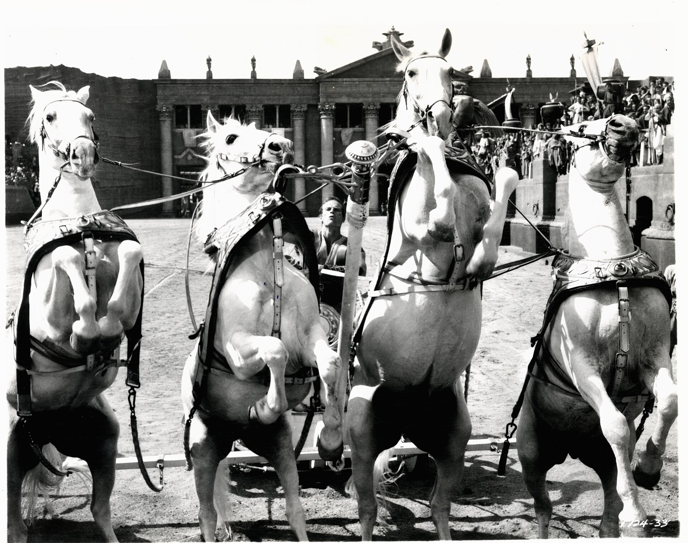

בשנים האחרונות, בתוך ים של סרטים רווי צבע, אפקטים דיגיטליים ותאורה זוהרת, קבוצה גדלה והולכת של יוצרים עושה בדיוק את ההפך: היא מוותרת על הצבע לחלוטין. **קולנוע שחור־לבן** חוזר לקדמת הבמה — לא בגלל מגבלה טכנולוגית כמו פעם, אלא כבחירה אמנותית נחרצת שמבקשת לזקק רגש, מבנה וזיכרון. מה מושך במאים בני זמננו אל המונוכרום, ולמה דווקא בעידן הרזולוציה הגבוהה הוא מרגיש רלוונטי מתמיד?

## למה קולנוע שחור־לבן חוזר דווקא עכשיו?

התשובה הקצרה: כי הוא בולט. כאשר כמעט כל סרט נראה חלק, צבעוני ומלוטש, סרט בשחור־לבן עוצר את העין. הוא מסמן מיד שמדובר ביצירה בעלת כוונה, כזו שמבקשת שנתבונן אחרת. אבל מעבר לאפקט הראשוני, הוויתור על הצבע הוא כלי דרמטי של ממש. הוא מפנה את תשומת הלב אל האור והצל, אל הבעות הפנים, אל ההרכב הפנימי של הקדר (הפריים).

הבמאי המקסיקני אלפונסו קוארון עשה זאת ביד אמן ב"רומא", יצירה אישית ואוטוביוגרפית שהמונוכרום הפך אותה לזיכרון חי. גם אלכסנדר פיין ("נברסקה") וטוד היינס בחרו בשחור־לבן כדי להעניק לסיפוריהם נופך של אגדה או של תיעוד היסטורי. אצל כולם, ההיעדר של הצבע הוא נוכחות בפני עצמה.

## מה השחור־לבן עושה לחוויית הצפייה?

כשמסלקים את הצבע, המוח משלים את החסר. אנחנו מתמקדים בטקסטורות, בקצב, במחוות. סצנה של גשם בשחור־לבן הופכת פתאום לפיסת שירה חזותית; פנים מיוזעות נראות כמו נוף. יש בכך גם ממד רגשי: המונוכרום מרחיק אותנו מעט מהמציאות המיידית ומקרב אותנו אל הזיכרון, אל החלום, אל האגדה.

במובן הזה, השחור־לבן אינו נוסטלגי בהכרח. יוצרים צעירים משתמשים בו כדי לספר סיפורים עכשוויים לחלוטין — על בדידות עירונית, על זהות, על משבר. השפה הישנה משרתת תוכן חדש.

### לא רק אסתטיקה — גם אמירה

לעיתים הבחירה במונוכרום היא הצהרה תרבותית. היא אומרת: הסרט הזה שייך למסורת של הקולנוע האמנותי, של אינגמר ברגמן ופדריקו פליני, של הגל החדש הצרפתי. זו קריאה אל צופה סבלני יותר, כזה שמוכן להתעכב. בעידן שבו התוכן נצרך במהירות ובגלילה אינסופית, זו כמעט פרובוקציה.

## הקולנוע הישראלי והמונוכרום

גם בישראל ניכרת סקרנות מחודשת כלפי השחור־לבן, בעיקר בקולנוע הקצר, הניסיוני והדוקומנטרי. הסינמטקים בתל אביב, בירושלים ובחיפה מקרינים מעת לעת קלאסיקות משוחזרות ברזולוציה גבוהה, וקהל צעיר מגלה מחדש את עוצמת הפריים הנקי מצבע. ההקרנות האלה, לצד רטרוספקטיבות של יוצרים גדולים, מזכירות שהמונוכרום מעולם לא נעלם — הוא רק חיכה.

## חמישה סרטי שחור־לבן שכדאי להכיר

הטבלה הבאה מרכזת יצירות מונוכרום עכשוויות ומופתיות, כנקודת פתיחה למי שמבקש להתחיל:

| הסרט | הבמאי | למה כדאי |
|------|--------|-----------|
| רומא | אלפונסו קוארון | זיכרון ילדות מזוקק לתמונות מהפנטות |
| נברסקה | אלכסנדר פיין | קומדיה־דרמה עדינה על משפחה וזִקנה |
| הסרט הלבן | מיכאל הנקה | מותחן היסטורי מצמרר על שורשי האלימות |
| פרנסס הא | נोआ באומבך | דיוקן ניו־יורקי קליל ומלנכולי |
| האי | רוברט אגרס | חוויה חושית סוחפת של בידוד וטירוף |

## האם זו מגמה שתישאר?

קשה לדעת אם השחור־לבן יהפוך לזרם מרכזי — סביר שלא. אבל דווקא בכך כוחו: הוא נשאר נדיר, מיוחד, בלתי צפוי. כל עוד יהיו יוצרים שמבקשים לחרוג מהמובן מאליו ולהחזיר לצופה את הריכוז והדהיון, המונוכרום ימשיך להבהב על המסך הגדול. בעולם רווי גירויים, לפעמים דווקא ההיעדר הוא זה שצועק הכי חזק.
