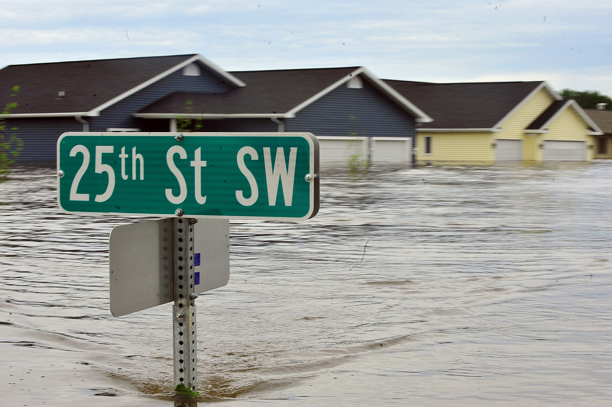

מה קורה כשהחרדה הגדולה של הדור — התחממות כדור הארץ — הופכת לחומר גלם ספרותי? התשובה נקראת **ספרות אקלים**, או בשמה הלועזי "קליי-פיי" (cli-fi), ז'אנר צומח שמעמיד את המשבר האקולוגי במרכז העלילה. בשנים האחרונות היא זולגת ממדפי המדע הבדיוני אל לב הזרם המרכזי, וכובשת מקום של כבוד ברשימות רבי המכר וגם בשיח הביקורתי הרציני.

## מה זה בעצם ספרות אקלים?

ספרות אקלים אינה בהכרח מדע בדיוני קלאסי. זהו מטריה רחבה של יצירות — רומנים, נובלות וסיפורים קצרים — שבהן שינויי האקלים אינם רקע דקורטיבי אלא כוח מניע של הסיפור. לעיתים מדובר בדיסטופיה עתידנית של ערים טובעות ובצורת אינסופית, ולעיתים בסיפור אינטימי לגמרי על משפחה שמתמודדת עם שרפה, הצפה או גל חום.

היופי של הז'אנר הוא שהוא **חוצה גבולות סוגתיים**. הוא יכול ללבוש צורה של מותחן פוליטי, של סאגה משפחתית, של ריאליזם קודר או של פנטזיה ספקולטיבית. מה שמאחד את היצירות הוא השאלה המטרידה: כיצד ייראו החיים על פני כדור ארץ משתנה, ומה זה עושה לנפש האדם?

## מי הסופרים שהובילו את המהפכה?

רבים רואים באמריקאי **קים סטנלי רובינסון** (Kim Stanley Robinson) את אבי הז'אנר בגלגולו העכשווי. הרומן שלו "משרד העתיד" נחשב לאבן דרך שהפכה את הדיון האקלימי ליצירה ספרותית שאפתנית. לצידו בולט **ריצ'רד פאוורס** (Richard Powers), שספרו "עולה מעל" ("The Overstory") — יצירה מונומנטלית על עצים ובני אדם — זכה בפרס פוליצר וקנה לז'אנר יוקרה ספרותית.

גם סופרים ותיקים ומוערכים תרמו את חלקם. מרגרט אטווד, שכבר נחשבת לנביאת הדיסטופיה בזכות "מעשה השפחה", עסקה בקריסה אקולוגית בטרילוגיית "מדאדם". הסופרת ההודית-אמריקאית אמיטב גוש אף כתב מסה שלמה, "ההסדר הגדול", שבה טען כי הספרות הרצינית כמעט ולא העזה להתמודד עם המשבר — ובכך, באופן פרדוקסלי, האיץ בעצמו את הגל.

## למה דווקא עכשיו?

התשובה פשוטה: החרדה האקלימית כבר אינה תיאורטית. גלי חום שוברי שיא, שרפות ענק ושיטפונות הפכו לחלק מהמציאות, וגם הקורא הישראלי — שחווה קיצים לוהטים יותר ויותר — מרגיש זאת על בשרו. הספרות, כדרכה, נענית לרוח התקופה ומעניקה מסגרת רגשית להתמודד עם מה שקשה לתפוס בכותרות החדשות.

יש כאן גם היגיון תרבותי עמוק יותר. במקום נתונים יבשים וגרפים, הספרות מציעה **הזדהות רגשית**: היא לוקחת את הקורא אל תוך חייה של דמות אחת, ובכך הופכת את המופשט למוחשי. זו אולי הסיבה שרבים רואים בז'אנר לא רק בידור אלא גם כלי של מודעות.

## מדריך קצר: מאיפה להתחיל?

הטבלה הבאה מציעה נקודות כניסה שונות לז'אנר, לפי הטעם והמצב רוח שאתם מחפשים:

| היצירה | היוצר/ת | הטון | למי שמחפש |
|---|---|---|---|
| עולה מעל | ריצ'רד פאוורס | אפי, לירי | ספרות יפה מונומנטלית |
| משרד העתיד | קים סטנלי רובינסון | ספקולטיבי, פוליטי | מבט רחב על העתיד |
| טרילוגיית מדאדם | מרגרט אטווד | דיסטופי, סאטירי | חובבי דיסטופיה |
| ההסדר הגדול | אמיטב גוש | מסה עיונית | מי שרוצה להבין את הז'אנר |

## האם זה עוד יגיע אלינו?

השוק הישראלי, כדרכו, מגיב במעט עיכוב למגמות עולמיות, אך סימני הז'אנר כבר כאן. תרגומים של פאוורס ואטווד זמינים בעברית, ופסטיבלי ספרות ומועדוני קריאה מתחילים להקדיש דיונים לשאלת האקלים והספרות. סביר להניח שבשנים הקרובות נראה גם יותר סופרים ישראלים שיעזו לגעת בנושא — מהנגב המדברי ועד חופיה המאוימים של הים התיכון.

ספרות אקלים אינה אופנה חולפת. כל עוד המשבר נמשך, הז'אנר ימשיך להתפתח, להתפצל ולשאול את השאלה הגדולה של זמננו — לא בשפת המדע, אלא בשפת הסיפור.
