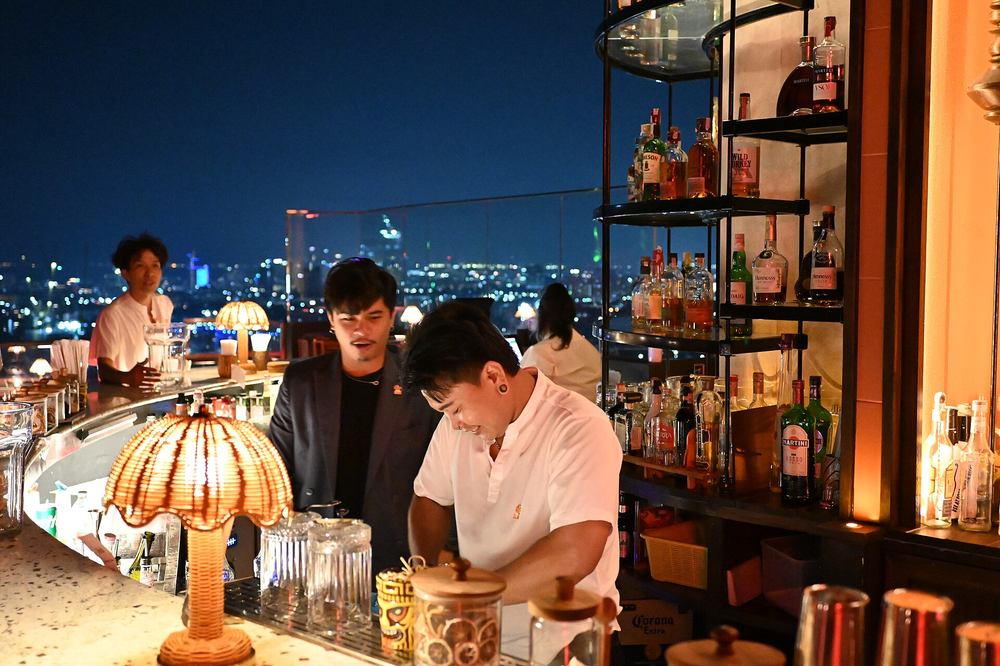

מי היה מאמין שדווקא הכוס הקטנה, זו שבה שוחים קוביית קרח ענקית וזרד רוזמרין, תהפוך לגיבורת הלילה הישראלי? **בארים לקוקטיילים** הפכו בשנים האחרונות לאחד המוקדים החמים בחיי הלילה — מקומות שבהם השתייה אינה אמצעי בלבד אלא חוויה קולינרית שלמה. במקום להזמין עוד סבב בירות, הקהל מבלה דקות ארוכות מול תפריט מוקפד, מתלבט בין משקה עם עשן לבין קוקטייל חמצמץ המבוסס על צמח מקומי.

התשובה הקצרה לשאלה "מה קורה בלילה כרגע" היא זו: תרבות השתייה עברה שדרוג. הבר הפך לבמה, הברמן הפך ליוצר, והקוקטייל הפך לחתימה.

## למה בארים לקוקטיילים כובשים את הלילה?

המעבר הזה אינו מקרי. הוא חלק ממגמה רחבה שבה הקהל הישראלי מחפש איכות על פני כמות. בדיוק כפי שעולם האוכל עבר ממנות גדולות למנות מוקפדות, כך גם השתייה: פחות אלכוהול בזול, יותר משקה אחד שמסופר בו סיפור. רבים רואים בכך תגובה ישירה לתרבות ה"שוטים" הרועשת של שנות האלפיים.

המיקסולוגיה — אמנות ערבוב המשקאות — הפכה למקצוע נחשק. ברמנים לומדים על אינפיוזיות, על סירופים ביתיים ועל האיזון העדין בין חמוץ, מתוק ומריר. חלקם אף מתייחסים לתפריט כאל תפריט טעימות עונתי, שמתחלף עם עונות השנה בדיוק כמו במטבח של שף.

### מהו בעצם קוקטייל בר טוב?

ההבדל בין פאב מזדמן לבין בר קוקטיילים אמיתי נמצא בפרטים הקטנים: הקרח החצוב ביד, הכוסות המצוננות מראש, הקליפות שנסחטות מעל המשקה כדי לשחרר שמנים אתריים. ההגשה איטית ומכוונת, והאווירה בדרך כלל אינטימית — תאורה נמוכה, מוזיקה שקטה יחסית, ובר שסביבו ניתן לשבת ולצפות במלאכה.

## מ'ספיקיזי' ועד בר השכונה

חלק מהמגמה קשור לגל ה'ספיקיזי' — אותם בארים נסתרים המוסתרים מאחורי דלת לא מסומנת או חנות תמימה. הקסם כאן הוא בתחושת הסוד, בקהילה הקטנה ובחוויית הגילוי. אך במקביל צומחת גם גישה נגישה יותר: בארים שכונתיים המציעים קוקטיילים ברמה גבוהה בלי יוקרה מוגזמת, במחיר סביר ובאווירה חמה.

תל אביב נותרה מרכז הכובד, עם ריכוז גבוה של בארים באזורי רוטשילד, פלורנטין והשוק. אך גם ירושלים, חיפה ובאר שבע רואות פריחה של מקומות המתמחים בתרבות השתייה — סימן לכך שהמגמה חצתה מזמן את גבולות הבועה התל אביבית.

## איך בוחרים לפי הרצון?

לא כל ערב דורש את אותו בר. הנה מדריך תמציתי שיעזור להתאים את המקום למצב הרוח:

| סוג הבילוי | מה מחפשים | הטיפ שלנו |
|---|---|---|
| דייט ראשון | אינטימיות, שקט, אווירה | בר ספיקיזי קטן עם תאורה נמוכה |
| ערב עם חברים | תפריט מגוון, אנרגיה | בר שכונתי עם ישיבה מרווחת |
| חגיגה מיוחדת | חוויה, ראוותנות | בר עם ברמן-כוכב ותפריט עונתי |
| אחרי מופע | קרוב לתיאטרון או לסינמטק | בר במרכז העיר עם שעות פתיחה מאוחרות |

## מגמות שכדאי להכיר

כמה מגמות בולטות מעצבות כרגע את עולם הקוקטיילים המקומי:

- **מקומיות (טרואר של קוקטייל):** שימוש בצמחי תבלין, פירות והדרים ישראליים, לצד ערק וליקרים מקומיים.
- **קיימות:** צמצום בזבוז — קליפות והדרים שנשארו הופכים לסירופ, ומרכיבים ממוחזרים חוזרים לכוס.
- **קוקטיילים ללא אלכוהול:** גל ה'מוקטיילים' צובר תאוצה, במקביל למגמת חיי הלילה המפוכחים.
- **חתימה אישית:** כל בר שואף ל'משקה חתום' משלו, בדיוק כפי שלשף יש מנת דגל.

מעבר לטרנד, יש כאן שינוי תרבותי עמוק יותר: הלילה הישראלי מתבגר. במקום למדוד את ההצלחה של הערב במספר הכוסות, מודדים אותה באיכות הרגע. **בארים לקוקטיילים** הפכו למרחב שבו אפשר לשבת, לדבר, ולהתענג על משקה אחד לאורך שעה שלמה — וזו, אולי, המהפכה האמיתית.

אז בפעם הבאה שתצאו לבלות, שקלו להחליף את הבירה השגרתית בכוס אחת מוקפדת. ייתכן שתגלו שהלילה נראה אחרת לגמרי מעבר לקצף הלבן.
