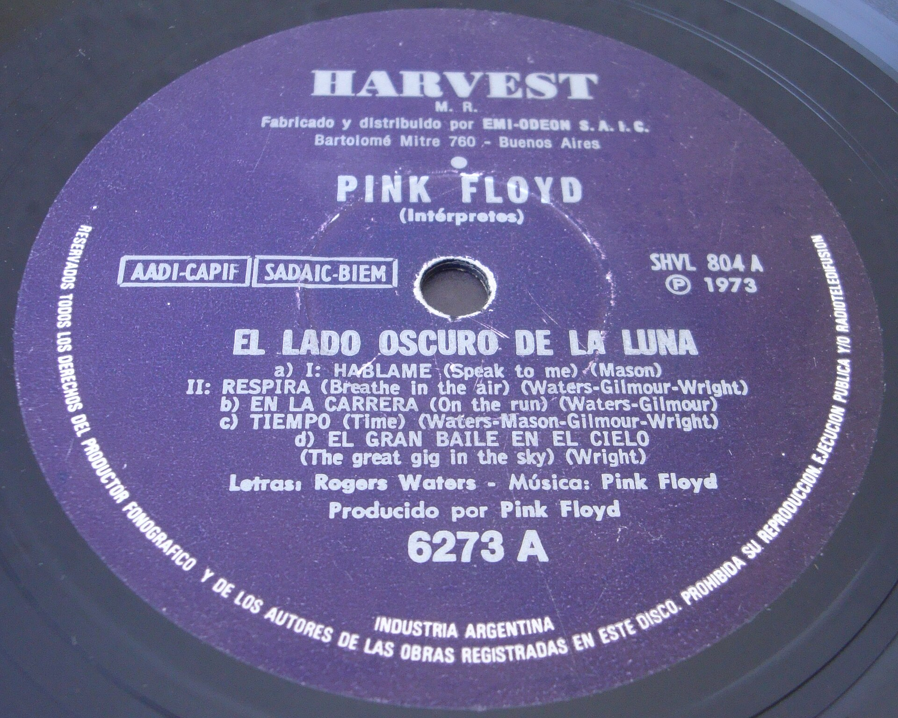
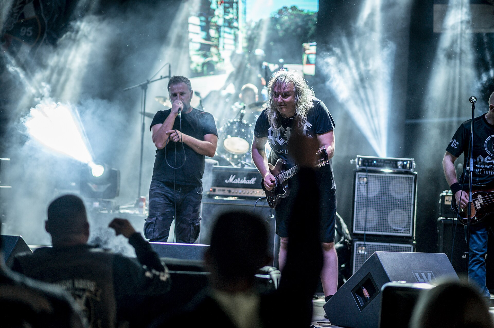

בעולם שבו האלגוריתם מתגמל סינגלים בני שתי דקות ומעודד דילוג מהיר בין שירים, קורה משהו מנוגד לאינטואיציה: **האלבום המושגי חוזר לחזית**. יותר ויותר אמנים בוחרים לוותר על מרוץ הסינגלים ולהשקיע ביצירה שלמה — אחת שנתפסת כמכלול, עם קו סיפורי, רעיון מרכזי או מסע רגשי שנפרש לאורך עשרות דקות. זו אמירה אמנותית, אך גם תגובה תרבותית לעידן הריכוז המתפורר.

## מהו בעצם האלבום המושגי?

אלבום מושגי (קונספט אלבום) אינו רק אוסף שירים שיצא באותו יום. זוהי יצירה שכל חלקיה נכתבים סביב ציר אחד: סיפור, דמות, תקופה בחיים או רעיון פילוסופי. הפורמט אינו חדש — ה"פינק פלויד" (Pink Floyd) עם "הצד האפל של הירח", ה"ביטלס" עם "סרג'נט פפר", ולהקות רבות אחרות הפכו אותו לאמנות בפני עצמה כבר בשנות השישים והשבעים. אך בעשור האחרון, דווקא כשהתרבות המוזיקלית התפצלה לרסיסים דיגיטליים, האלבום המושגי מקבל חיים חדשים.

### למה זה קורה דווקא עכשיו?

התשובה נעוצה בפרדוקס: ככל שהסטרימינג דחף את המוזיקה לכיוון של שירים בודדים, גדל הצורך של אמנים להצהיר על עומק וכוונה. האלבום השלם הפך למעין מרד שקט נגד תרבות ה"דלג לשיר הבא". אמנית שמוציאה יצירה מגובשת אומרת בעצם: "האזינו לי מתחילה ועד סוף, כפי שהתכוונתי".

## מי מוביל את המגמה בעולם?

כמה מהאמנים הבולטים בעשור האחרון הפכו את האלבום השלם למרכז הבמה. ביונסה (Beyoncé) הפכה עם "למונייד" את האלבום ליצירה חזותית-מוזיקלית אחת. קנדריק לאמאר (Kendrick Lamar) בנה ב"To Pimp a Butterfly" מסע פוליטי ואישי רצוף. "רדיוהד" (Radiohead) ממשיכים להתעקש על האלבום כמכלול אטמוספרי, וטיילור סוויפט (Taylor Swift) הוכיחה שאפשר למכור מיליונים גם כשמבקשים מהקהל להאזין ליצירה שלמה.

| אמן | אלבום מושגי בולט | הרעיון המרכזי |
|------|------------------|----------------|
| ביונסה | Lemonade | בגידה, זהות וכוח נשי |
| קנדריק לאמאר | To Pimp a Butterfly | זהות שחורה ומאבק חברתי |
| רדיוהד | OK Computer | ניכור בעידן הטכנולוגי |
| דיוויד בואי | The Rise and Ziggy Stardust | דמות בדיונית של כוכב רוק |
| פינק פלויד | The Wall | בידוד, טראומה ומחסום נפשי |

## ומה קורה בישראל?

גם בסצנה הישראלית ניכרת חזרה להערכת האלבום כיחידה שלמה. אמנים כמו אביב גפן, ברי סחרוף וקרן פלס נודעו לאורך השנים ביכולתם לבנות אלבום כמסע ולא כאוסף להיטים. בשנים האחרונות, יוצרים צעירים מהסצנה העצמאית — לצד אמנים ותיקים שממשיכים להוציא יצירות מגובשות — מקפידים על רצף, על סדר שירים מכוון ועל עטיפה שמספרת סיפור. הופעות ההשקה שבהן אמן מנגן אלבום שלם מתחילתו ועד סופו הפכו לאירוע נחשק, שמחזיר את חוויית ההאזנה הקולקטיבית.

### הוויניל כשותף למהפכה

לא במקרה, חזרת האלבום המושגי משתלבת עם התחייה של הוויניל. תקליט מחייב, כמעט פיזית, להאזין לצד שלם ברצף — אין דילוג קל, אין ערבוב אקראי. הפורמט האנלוגי מחזיר את הטקס: להוציא את התקליט, להניח את המחט, להתבונן בעטיפה הגדולה ולתת ליצירה לזרום. עבור רבים, זו בדיוק החוויה שהסטרימינג גזל.

## האם זו מגמה שתחזיק מעמד?

קשה לדעת אם האלבום המושגי יחזור למרכז התעשייה או יישאר נישה יוקרתית לאניני טעם. אך דבר אחד ברור: **האלבום המושגי מספק מה שהסינגל הבודד אינו יכול** — עומק, הקשר ותחושת מסע. בעידן שבו הקשב שלנו מתפורר לפיסות של שניות, ההזמנה לשבת ולהאזין ליצירה שלמה נשמעת כמעט רדיקלית. וזו, אולי, בדיוק הסיבה שהיא מרגשת מחדש.
