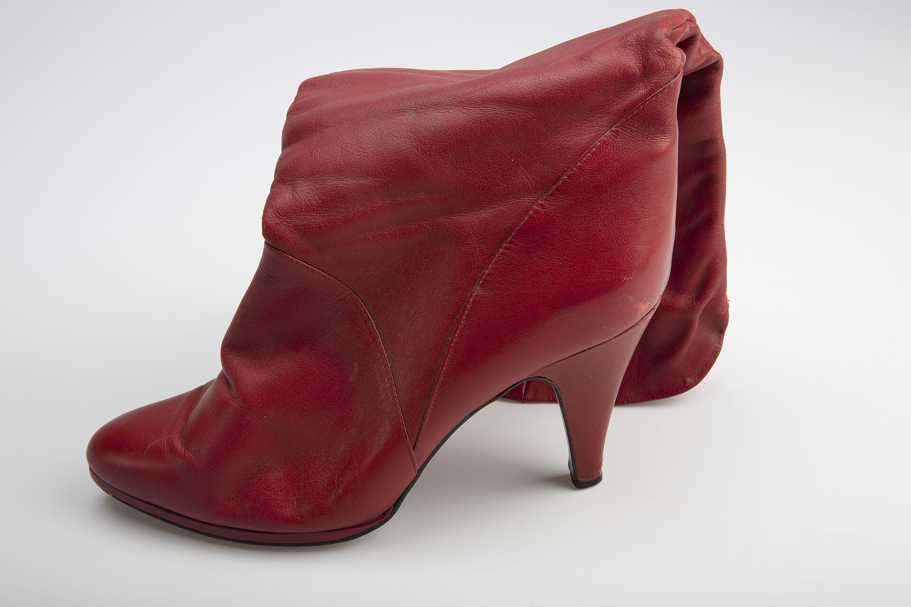

מי שיצא לבלות בתל אביב בשנים האחרונות בוודאי נתקל בתופעה שקשה להתעלם ממנה: **מופעי דראג** הפכו מאטרקציה שולית של מועדוני להטב"ק לאחת החוויות המדוברות והמבוקשות ביותר בחיי הלילה הישראליים. מלכות דראג בפאות ענק, איפור מוקצן ותלבושות מנצנצות שולטות היום לא רק ברחבות המסורתיות, אלא גם בברים שכונתיים, בפסטיבלים ובאירועים תאגידיים. זו כבר לא מחתרת — זו מיינסטרים.

## מאיפה הגיעה מהפכת הדראג?

הדראג אינו המצאה חדשה. שורשיו נטועים עמוק בתרבות הקברט של תחילת המאה העשרים ובמועדוני הלילה הקווירים של ניו יורק ולונדון. אבל הזינוק העצום בפופולריות בישראל קשור בעיקר לגל תרבותי עולמי, ובראשו תוכנית הריאליטי של רופול (RuPaul's Drag Race), שהפכה את אמנות הדראג לתופעת פופ גלובלית. פתאום, מה שנחשב בעבר לקוד סודי של קהילה מצומצמת הפך לשפה מוכרת, עם מונחים, כוכבים ומעריצים מכל הגילאים.

בישראל, המעבר הזה היה מהיר במיוחד. מלכות דראג מקומיות שצברו קהל מעריצים ברשתות החברתיות הביאו איתן קהל חדש — לא רק מהקהילה הגאה, אלא גם צעירים סטרייטים, חבורות רווקות וסקרנים שרוצים לטעום משהו אחר.

## למה מופעי דראג עובדים כל כך טוב על הרחבה?

הסוד טמון בשילוב הנדיר של בידור טוטאלי. מופע דראג טוב הוא לא רק חיקוי פלייבק — הוא הצגה שלמה שכוללת קומדיה, ריקוד, אלתור מול הקהל וכריזמה במבט. **הדראג הישראלי** פיתח סגנון ייחודי משלו: סאטירה פוליטית חדה, פזמונים בעברית מזמרת יווני ועד להיטי ים תיכון, והומור מקומי שקהל זר לא היה מבין.

האינטראקציה הישירה עם הקהל היא הלב הפועם. בניגוד להופעה שבה האמן על הבמה והקהל למטה, כאן הגבולות מיטשטשים: מלכת הדראג יורדת אל הקהל, מגייסת מתנדבים, מקנטרת בחיבה ומייצרת תחושה של אירוע חד-פעמי שאי אפשר לשחזר.

### לא רק תל אביב

אם בעבר הדראג היה כמעט בלעדית תל-אביבי, היום אפשר למצוא מופעים גם בחיפה, בירושלים ואפילו בערי פריפריה. פסטיבלי גאווה ברחבי הארץ הפכו את המלכות לכוכבות ראשיות, ואירועים תרבותיים ממוסדים החלו להזמין מופעי דראג כחלק מהתוכנית.

## איפה רואים דראג בישראל?

הנה מפת דרכים בסיסית לסוגי האירועים שתפגשו בסצנה:

| סוג האירוע | האווירה | קהל היעד |
|---|---|---|
| מופע מועדון קלאסי | לילי, אנרגטי, ריקודים עד השעות הקטנות | חובבי חיי לילה ותיקים |
| ברנץ' דראג | מוקדם, מבודח, אוכל ושתייה | קבוצות חברים, רווקות |
| דראג בפסטיבל | חגיגי, המוני, במה גדולה | קהל רחב ומשפחות גאות |
| מופע קברט אינטימי | תיאטרלי, מוקפד, מבוסס טקסט | חובבי פרפורמנס ותיאטרון |

כל פורמט מציע חוויה שונה: מהאדרנלין של רחבת המועדון בשעה שתיים בלילה ועד לברנץ' יום שישי עם קפה, קוקטייל ומנה גדושה של הומור.

## בין בידור לאמנות

מה שמרתק במיוחד הוא הדיון הגובר סביב מעמד הדראג כצורת אמנות. יותר ויותר יוצרים רואים במופע לא רק בידור לילי אלא פרפורמנס אמנותי לכל דבר — כזה שעוסק בזהות מגדרית, בהצגה עצמית ובגבולות שבין אמת לזיוף. סינמטקים ומוסדות תרבות החלו לארח ערבי דראג, וחלק מהמלכות חוצות אל עולמות התיאטרון והטלוויזיה.

המעבר הזה מלווה גם במתחים. יש הטוענים שהמסחור של הדראג — הכניסה שלו לברנצ'ים תיירותיים ולאירועי חברות — מרוקן אותו מהאופי הסאב-קולטורלי והפוליטי שממנו צמח. אחרים רואים בכך דווקא ניצחון: הוכחה לכך שהשוליים הפכו למרכז, ושהקהל הרחב מוכן לחבק ביטויים שפעם נדחקו לפינה.

## מה צופן העתיד?

הסימנים מצביעים על כך שמהפכת הדראג רק תלך ותתרחב. דור חדש של יוצרים צעירים מביא איתו סגנונות היברידיים — שילוב של דראג, מוזיקה אלקטרונית, וידאו-ארט ופרפורמנס ניסיוני. במקביל, הקהל הישראלי נעשה מתוחכם יותר ותובעני יותר, ומצפה לא רק לבוהק אלא גם לתוכן.

כך או כך, ברור דבר אחד: הלילה הישראלי כבר לא נראה אותו הדבר. הנצנצים, הפאות והכריזמה כבשו את הרחבה, וקשה לדמיין את חיי הלילה של המחר בלעדיהם.
