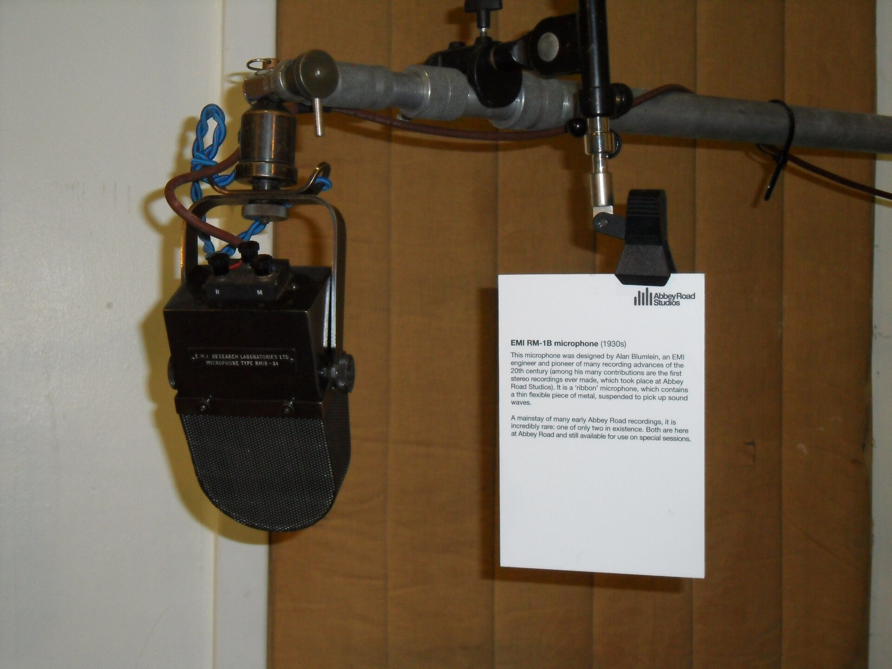

האזנה מהירה למצעדי ההשמעה של השנים האחרונות חושפת דפוס אחד שחוזר שוב ושוב: כמעט כל להיט שני נושא את המילה הקטנה "feat". הפיצ'רינג — אירוח של אמן בשיר של אמן אחר — חדל מלהיות אירוע חגיגי והפך לברירת המחדל של תעשיית המוזיקה. מה שהיה פעם דואט נדיר ומרגש הוא היום אסטרטגיה מחושבת, כלכלית ומוזיקלית כאחד. בכתבה הזו ננסה להבין למה הפיצ'רינג משתלט על המצעדים, מה זה אומר על הדרך שבה אנחנו מאזינים למוזיקה, ואיך התופעה נראית בזירה הישראלית.

## מה זה בעצם פיצ'רינג ולמה הוא בכל מקום?

פיצ'רינג הוא הופעת אורח של אמן אחד ביצירה של אמן אחר — לרוב קטע ראפ, פזמון או בית שמעניקים לשיר צבע וקהל נוספים. הפורמט קיים מאז ומעולם, מימי הדואטים הקלאסיים ועד לשיתופי הפעולה האגדיים בהיפ הופ של שנות התשעים. אבל בעשור האחרון הוא עבר מוטציה: מאירוע אמנותי הוא הפך למודל עסקי.

המנוע המרכזי הוא הסטרימינג. כשההצלחה נמדדת במספר ההשמעות, פיצ'רינג הוא חשבון פשוט: שני אמנים, שני קהלים, שיר אחד. מעריצים של האחד נחשפים לאחר, האלגוריתמים של ספוטיפיי ואפל מיוזיק דוחפים את השיר לשתי רשתות המלצות במקביל, והתוצאה היא טווח הגעה שאף אמן לא היה משיג לבדו. במובן הזה, הפיצ'רינג הוא לא רק מוזיקה — הוא כלי הפצה.

## איך הסטרימינג הפך את שיתוף הפעולה למטבע

בעידן שבו שיר בודד יכול להכפיל את הקהל של אמן בין לילה, ההיגיון ברור. אמן מבוסס מארח כוכב עולה ומעניק לו חשיפה; הכוכב העולה מביא אנרגיה רעננה וקהל צעיר. לעיתים זו עסקה הדדית מוצהרת, ולעיתים מהלך שנרקם בין חברות תקליטים כדי למקסם נתונים.

התופעה בולטת במיוחד בהיפ הופ, בטראפ וברגאטון, ז'אנרים שבהם האירוח הוא חלק מהדנ"א היצירתי. אמנים כמו דרייק בנו קריירה שלמה על רשת אינסופית של פיצ'רינגים, ובמקביל אמניות פופ מובילות למדו לנצל את הפורמט כדי להישאר רלוונטיות בין אלבום לאלבום. הפיצ'רינג הפך לשפה משותפת שחוצה ז'אנרים.

### היתרונות — ולמה זה עובד

- **חשיפה כפולה**: כל אמן מביא את הקהל שלו, והשיר נהנה משתי בסיסי מאזינים.
- **רעננות**: מפגש בין סגנונות מייצר צליל שאי אפשר להשיג לבד.
- **הימור מבוזר**: אם השיר מצליח, שני הצדדים מרוויחים; אם לא, הסיכון מתחלק.
- **דלק לאלגוריתם**: פלטפורמות הסטרימינג מתעדפות תוכן שמושך קהלים מגוונים.

## הפיצ'רינג הישראלי: מהמזרחית ועד הראפ

גם בישראל הפיצ'רינג מזמן חדל להיות תופעת שוליים. הזירה המקומית אימצה אותו בהתלהבות, ובמיוחד בצומת שבין המוזיקה המזרחית להיפ הופ — מפגש שהפך לאחד הפסקולים המזוהים ביותר של התרבות הצעירה בישראל. ראפרים המתארחים אצל זמרי מיינסטרים, וזמרות פופ שמזמינות אמני אנדרגראונד, יצרו שפה חדשה שמטשטשת את הגבולות בין הגבוה לפופולרי.

התוצאה היא שוק שבו שיתוף פעולה נכון יכול להפוך שיר ללהיט חוצה מגזרים תוך ימים. אמנים ותיקים מגלים קהל חדש, וכוכבי רשת צעירים זוכים ללגיטימציה מהזרם המרכזי. זהו מנגנון שמזין את עצמו, ומסביר מדוע קשה כיום למצוא מצעד ישראלי בלי שרשרת של אירוחים.

## טבלה: סוגי פיצ'רינג ומה הם משיגים

| סוג שיתוף הפעולה | המטרה העיקרית | דוגמה אופיינית |
|---|---|---|
| ותיק מארח עולה | להזרים קהל צעיר ורלוונטיות | זמר מיינסטרים עם ראפר מתפרץ |
| מפגש בין ז'אנרים | ליצור צליל חדש וחציית קהלים | פופ פוגש מזרחית או טראפ |
| שני כוכבים גדולים | אירוע תקשורתי ומקסום השמעות | דואט על של שני שמות מובילים |
| שיתוף בין-לאומי | פריצה לשווקים חדשים | אמן מקומי עם כוכב זר |

## הצד האפל: מתי פיצ'רינג הופך לעסקה

מול היתרונות ברור גם המחיר. כאשר כל שיר שני נבנה סביב שיקול שיווקי, נוצרת תחושה של נוסחה. חלק מהאזנים מזהים שירים שנשמעים כמו טבלת אקסל: שני שמות שחוברו כדי למקסם נתונים, בלי כימיה אמיתית ובלי סיבה אמנותית. הבית של האורח מרגיש לעיתים כמו הדבקה, קרע בזרימה של השיר במקום המשך טבעי שלו.

יש גם שאלה של זהות. כשאמן מבלה חלק ניכר מזמנו כאורח בשירים של אחרים, מיטשטש הקול הייחודי שלו. הקהל מתקשה לזכור מי בעצם האמן ומהו הסאונד שלו, כשהוא נודד בין עשרות רצועות של אחרים. במובן הזה, הפיצ'רינג הוא סם משכר: מנה מדודה מרעננת, מנת יתר מדללת.

## אז לאן זה הולך?

הפיצ'רינג לא הולך לשום מקום — הוא הפך לתשתית של תעשיית המוזיקה העכשווית. אבל כמו בכל מגמה, ההבחנה בין השימוש הטוב לרע תלויה בכוונה. שיתוף פעולה שנולד ממפגש אמיתי בין שני עולמות מוזיקליים עדיין מסוגל להצית — בין שני זמרים ישראלים שמחברים מזרח ומערב, ובין כוכבים בין-לאומיים שפורצים גבולות. השאלה שתישאר רלוונטית היא לא כמה אירוחים יש בשיר, אלא האם מאחוריהם מסתתרת יצירה — או רק חשבון.
