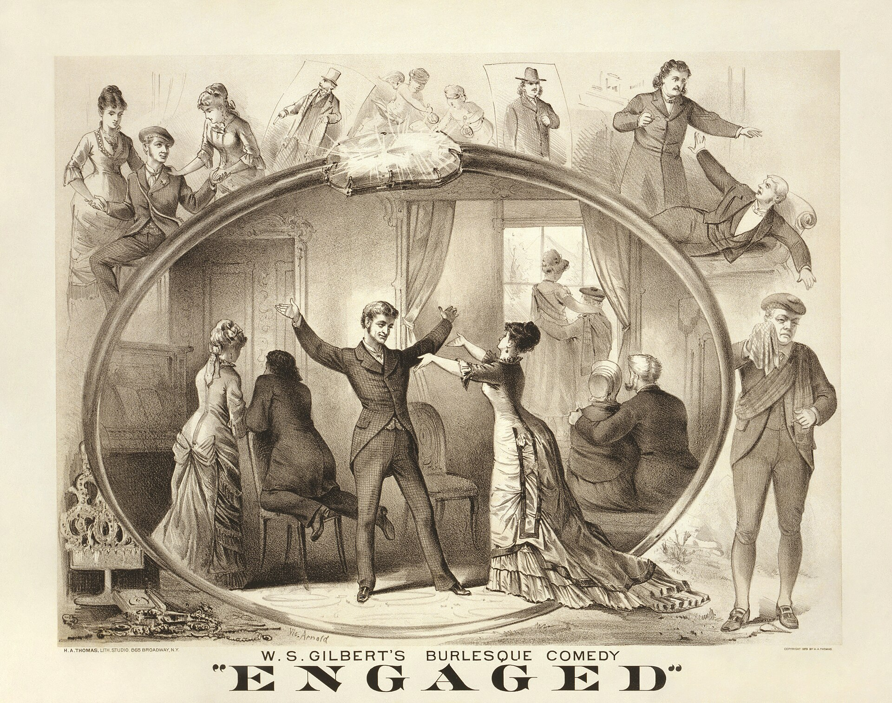

יש רגע קטן, ממש בפתיחה של כל מופע אימפרוב, שבו כל האולם עוצר את הנשימה: השחקנים עומדים על במה ריקה, מבקשים מילה אחת מהקהל, ומאותו רגע הכול פתוח. **תיאטרון אלתור** — או בשמו הלועזי, אימפרוב — הוא צורת תיאטרון שנוצרת במלואה בזמן אמת, בלי תסריט, בלי בימוי מוקדם ובלי רשת ביטחון. ובשנים האחרונות הוא הפך מתחביב של יודעי-דבר לאחת התופעות המדוברות בבמה הישראלית.

התשובה הקצרה לשאלה "מה זה בעצם": מופע שבו כל דמות, עלילה ושורת מחץ נולדים על הבמה, לרוב על בסיס הצעה מהקהל, ולעולם לא יחזרו על עצמם בדיוק כך שוב.

## למה דווקא עכשיו תיאטרון האלתור פורח?

העלייה של תיאטרון האלתור לא מנותקת מהרוח התקופתית. בעידן שבו הכול מוקלט, ניתן להשהיה, לצפייה חוזרת ולעריכה, האימפרוב מציע בדיוק את ההפך: אירוע חד-פעמי שאי אפשר לצלם מחדש. מי שהיה באולם ראה משהו שאיש אחר לא יראה שוב.

זה גם ז'אנר שמדבר אל קהל צעיר. הוא מהיר, מצחיק לעיתים קרובות, לא מתנשא, ומזמין את הצופים להיות שותפים פעילים ולא צרכנים פסיביים. הקרבה הזו בין הבמה לאולם — קרבה שהתיאטרון הממוסד לפעמים מתקשה לייצר — היא חלק גדול מהקסם.

### מהיכן הגיע הז'אנר

שורשי האימפרוב המודרני נטועים בעבודתה של המורה והבמאית ויולה ספולין (Viola Spolin) בשיקגו של אמצע המאה הקודמת, שפיתחה "משחקי תיאטרון" ככלי אילתור. מכאן צמחו מוסדות אגדיים כמו "סקנד סיטי", שהפכו את האלתור לחממה של קומיקאים. בישראל הגיע הגל בגלים: תחילה כסדנאות ואולפני משחק, אחר כך כמופעי מרתף אינטימיים, וכיום כהפקות שלמות שמוכרות אולמות.

## איך זה עובד? הכללים של חוסר-הכללים

דווקא בגלל שאין תסריט, לתיאטרון האלתור יש עקרונות עבודה מדויקים. השחקנים לומדים אותם שנים בדיוק כמו כל מלאכה בימתית:

- **"כן, ו..."** — העיקרון המפורסם ביותר: מקבלים כל הצעה של השותף ומוסיפים עליה, במקום לחסום אותה.
- **הקשבה מוחלטת** — מי שמתכנן מראש את השורה הבאה שלו, כבר הפסיד את הסצנה.
- **ביטחון בכישלון** — הרגעים ה"תקועים" הם לרוב המצחיקים והאנושיים ביותר.
- **בניית דמות מהירה** — קול, יציבה ומערכת יחסים נבנים בשניות.

## מהם הפורמטים המרכזיים?

האימפרוב הוא לא דבר אחד. יש בו סוגות שונות, מהמהיר והקומי ועד הארוך והדרמטי:

| פורמט | אורך אופייני | מה קורה בו | למי מתאים |
|---|---|---|---|
| שורט-פורם | קטעים קצרים | משחקי אלתור מהירים על בסיס הצעות קהל | מתחילים ומשפחות |
| לונג-פורם | מופע שלם רציף | סיפור או מערכת מלאה שנבנית בזמן אמת | חובבי דרמה ועלילה |
| מיוזיקל אלתור | מופע שלם | מחזמר שלם עם שירים שמולחנים על המקום | אמיצים במיוחד |
| מונו-אימפרוב | קצר-בינוני | שחקן יחיד שבונה עולם שלם לבד | מעריצי וירטואוזיות |

## תיאטרון אלתור מול תיאטרון מסורתי

קל לחשוב שהאלתור הוא "תיאטרון קליל", אבל זו טעות. ההבדל אינו ברמת הרצינות אלא באופי הסיכון. בהצגה מבוימת, כל טעות היא סטייה מהנכון; באימפרוב, הטעות היא חלק מהיצירה. השחקנים אינם מגלמים דמות שנכתבה עבורם — הם ממציאים אותה, מפרנסים אותה ומחסלים אותה בתוך אותו הערב.

זה גם משנה את חוזה הצפייה. הקהל יודע שהוא צופה בלידה חיה, על כל הסיכונים שבה, ולכן הסלחנות והמעורבות שלו גבוהות בהרבה. הצחוק בא לא רק מהבדיחה אלא מעצם הפלא שהיא נולדה מכלום.

## אז לאן זה הולך מכאן?

רבים רואים באימפרוב לא רק ז'אנר בפני עצמו אלא בית ספר לכל אמן במה: שחקנים, במאים ואפילו סופרים לומדים בו להקשיב, להעז ולוותר על שליטה. יש הרואים בגל הנוכחי אופנה חולפת, אבל דומה שהצורך האנושי הבסיסי שהוא ממלא — להיות באותו חדר עם משהו שקורה עכשיו, פעם אחת בלבד — לא ייעלם במהרה.

מי שעוד לא ניסה, שווה להזמין כרטיס לערב אחד של אלתור. במקרה הרע תצחקו; במקרה הטוב תראו משהו שאיש מלבד האולם הזה לא יראה לעולם.
