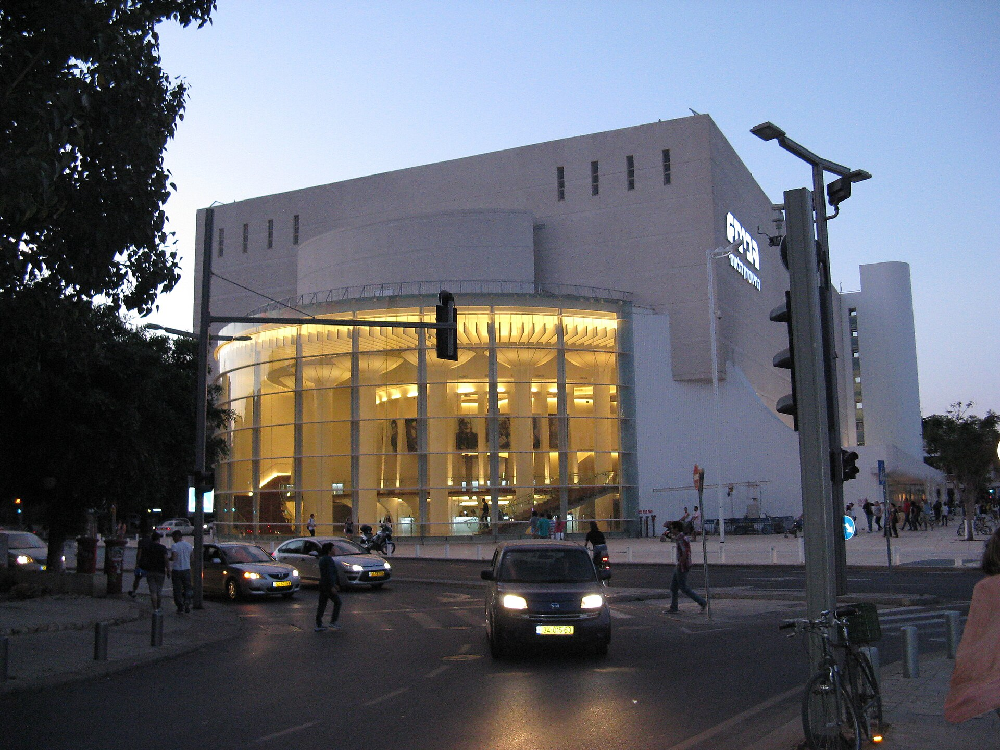

יש רגע אחד, קצת לפני שהאורות כבים, שבו אפשר לחוש אותו באוויר: המחזמר הישראלי חזר. לא כנוסטלגיה מאובקת ולא כמחווה מנומסת, אלא כז'אנר חי, רועש ומלא ביטחון עצמי, שממלא שוב אולמות מתל אביב ועד הפריפריה. אחרי שנים שבהן נחשב לבן חורג של התיאטרון ה"רציני", התיאטרון המוזיקלי המקומי מצא את קולו — ואת הקהל שלו.

התשובה הקצרה לשאלה "למה עכשיו": שילוב של געגוע לחוויה חיה ומשותפת אחרי שנים של מסכים, דור חדש של יוצרים ומבצעים שגדלו על מחזות זמר, ותיאטראות מבוססים שמוכנים שוב להשקיע בהפקות ראווה. התוצאה היא גל שקשה להתעלם ממנו.

## מאיפה בא המחזמר הישראלי?

כדי להבין את התחייה, צריך לחזור אחורה. המחזמר הישראלי מעולם לא היה יבוא נטו של ברודוויי. עוד בשנות השישים והשבעים נולדו כאן יצירות מכוננות: "קזבלן" של יגאל מוסינזון ודן אלמגור, שהפך את יהורם גאון לאייקון; "מלכת אמבטיה" הסאטירי של חנוך לוין; ומאוחר יותר עיבודים מקומיים שנשאו חותם ישראלי מובהק. אלה לא היו חיקויים — הם דיברו עברית, שרו על מתחים חברתיים מקומיים, וניגנו על מנעד רגשי שהקהל הכיר.

המורשת הזאת היא הקרקע שעליה צומח הגל הנוכחי. כשיוצר צעיר היום ניגש לכתוב מחזמר, הוא נשען על שרשרת שלמה של קלאסיקות מקומיות, ולא רק על "שיקגו" או "הרמלטון".

## למה דווקא עכשיו הקהל שר שוב?

המחזמר הישראלי פורח כי הוא עונה על צורך עמוק: הרצון לשבת באולם מלא, עם זרים גמורים, ולחוות משהו יחד בזמן אמת. בעידן שבו כמעט כל בידור מגיע דרך מסך אישי, החוויה של תזמורת חיה, שירה קבוצתית ומחיאות כפיים סוחפות הפכה למותרות מבוקשות.

יש לכך גם צד מעשי. תיאטראות מבוססים גילו שהפקה מוזיקלית מצליחה יכולה למשוך קהל רחב ומגוון — משפחות, צעירים, מנויים ותיקים — ולהחזיק בלוח ההצגות לאורך זמן. הפקת ראווה היא הימור יקר, אבל כשהיא מצליחה, היא הופכת למנוע כלכלי ותרבותי כאחד.

### דור חדש של יוצרים ומבצעים

גורם מכריע נוסף הוא ההון האנושי. גדל כאן דור של שחקנים־זמרים שיודעים לעשות הכול: לשחק, לשיר ולרקוד ברמה גבוהה. בתי ספר למשחק ולמחזמר, לצד תוכניות טלוויזיה שחשפו כישרונות רבים, יצרו מאגר עשיר של מבצעים שמסוגלים לשאת הפקה מוזיקלית שלמה על כתפיהם.

## איפה רואים את זה? המוסדות שמובילים

התיאטראות הגדולים בישראל אימצו את הז'אנר בזרועות פתוחות. הבימה, התיאטרון הלאומי, מעלה מדי עונה הפקות מוזיקליות לצד הרפרטואר הקלאסי. התיאטרון הקאמרי בתל אביב ידוע זה שנים באהבתו למחזות זמר גדולים. תיאטרון גשר משלב מוזיקליות עשירה בשפה בימתית ייחודית, ותיאטרון הפרינג' והמוסדות הפריפריאליים מוסיפים גרסאות נועזות ואינטימיות יותר.

| מאפיין | המחזמר הקלאסי (שנות ה-60-70) | המחזמר הישראלי העכשווי |
|---|---|---|
| מקור | יצירות מקור מקומיות ועיבודים | שילוב מקור, עיבודים ולהיטים בינלאומיים |
| הפקה | צנועה יחסית, דגש על טקסט ושירה | ראוותנית, תפאורה ואפקטים מורכבים |
| מבצעים | שחקנים־זמרים בודדים בולטים | דור רחב של מבצעים רב־תחומיים |
| קהל | קהל תיאטרון מסורתי | קהל רחב, בין־דורי ומשפחתי |

## האם זו אופנה חולפת או שינוי עומק?

השאלה המתבקשת היא אם מדובר בגל חולף. הסימנים מרמזים דווקא על שינוי מבני. כשמוסדות התרבות המרכזיים משקיעים בתשתית של הפקות מוזיקליות, כשקהל חדש ומגוון מגלה את הז'אנר, וכשנוצרת שרשרת אספקה יציבה של יוצרים ומבצעים — קשה לראות את זה נעלם.

עם זאת, האתגר האמיתי אינו במילוי אולמות אלא בעומק. הסכנה של הז'אנר תמיד הייתה שהראווה תבלע את התוכן, שהזיקוקים יחליפו את הסיפור. המחזמר הישראלי הטוב ביותר — מ"קזבלן" ואילך — תמיד ידע לשלב בין בידור סוחף לבין אמירה מקומית חדה. אם היוצרים העכשוויים יזכרו את זה, לא רק שהקהל ימשיך לשיר איתם — הוא גם ייצא מהאולם עם משהו לחשוב עליו.

בינתיים, כדאי פשוט לקנות כרטיס, לשבת בשורה טובה, ולתת לעצמכם להיסחף. הבמה שרה שוב, ולפעמים זו בדיוק הסיבה הטובה ביותר לצאת מהבית.
