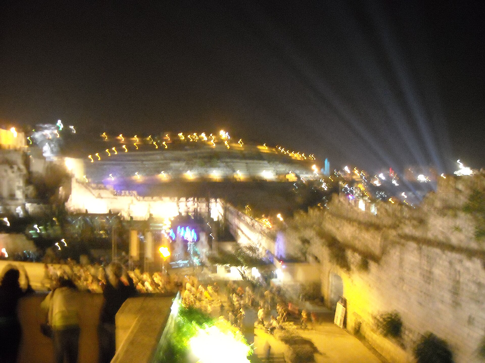

מהי בעצם אמנות האור, ולמה כולם מדברים עליה? **אמנות האור** היא זרם עכשווי שבו האור עצמו — ניאון, נורות לד, לייזר או הקרנת וידאו — הופך לחומר הגלם המרכזי של היצירה, במקום הצבע, הבד או השיש המסורתיים. בשנים האחרונות היא הפכה לאחת המגמות המדוברות ביותר בעולם המוזיאונים, כשחדרים שלמים מוצפים בזוהר צבעוני והופכים את הצופה מצופה פסיבי לחלק בלתי נפרד מהעבודה.

התופעה אינה חדשה לגמרי — כבר בשנות ה-60 חלוצים כמו דן פלאווין (Dan Flavin) הציבו נורות פלואורסצנט פשוטות בגלריות והכריזו עליהן כאמנות. אך מה שהיה אז מחווה מושגית נועזת הפך היום לחוויה המונית, שמושכת תורים ארוכים וממלאת אולמות שלמים.

## למה דווקא עכשיו פורחת אמנות האור?

התשובה קשורה בעידן הדיגיטלי בדיוק כמו בהיסטוריה של האמנות. מיצבים זוהרים הם "צילומיים" מטבעם — הם נראים מרהיבים במסך הטלפון, ומתפשטים ברשתות החברתיות במהירות שאף תערוכת ציור קלאסית מתקשה להשיג. מוזיאונים, שנאבקים על תשומת הלב של דור צעיר, מצאו באמנות האור מגנט קהל אידיאלי.

מעבר לשיווק, יש כאן גם מהפכה חווייתית. במקום לעמוד ממרחק מכובד מול תמונה ממוסגרת, המבקר נכנס **לתוך** היצירה — מוקף בהשתקפויות, בערפל צבעוני ובקצב משתנה של פעימות אור. זו אמנות שמדברת אל הגוף והחושים, לא רק אל העין המנתחת.

### הכוכבים הגדולים של הז'אנר

כמה שמות הפכו לשם דבר. האמריקאי **ג'יימס טורל** (James Turrell) מקדיש קריירה שלמה לחקר תפיסת האור והחלל, ועבודותיו — חדרים שבהם גבולות הקירות כמעט נמוגים — נחשבות לחוויה כמעט רוחנית. הדני-איסלנדי **אולפור אליאסון** (Olafur Eliasson) הפך את אולם הטרבין בטייט מודרן בלונדון לשמש ענקית זוהרת בעבודתו "פרויקט מזג האוויר". והבריטית **טרייסי אמין** (Tracey Emin) הפכה את כתב היד הזוהר בניאון להצהרה רגשית אישית.

גם קולקטיב האמנים היפני **טימלאב** (teamLab) הפך לתופעה עולמית עם חללים דיגיטליים אינסופיים של פרחים, גלים ואור נושם, שמושכים מיליוני מבקרים ברחבי העולם.

## טבלה: יוצרי אור מרכזיים וסוג העבודה

| אמן/קולקטיב | מדיום מרכזי | חוויה אופיינית |
|---|---|---|
| ג'יימס טורל | אור וחלל | חדרי תפיסה מדיטטיביים |
| אולפור אליאסון | אור טבעי ומלאכותי | מיצבים סביבתיים ענקיים |
| טרייסי אמין | ניאון | כיתוב רגשי אישי |
| דן פלאווין | פלואורסצנט | מינימליזם מושגי |
| טימלאב | הקרנה דיגיטלית | חללים אימרסיביים אינסופיים |

## מה קורה בישראל?

גם בזירה המקומית ניכר עניין גובר. **פסטיבל האור בירושלים**, שהפך למסורת שנתית, מציף את סמטאות העיר העתיקה במיצבי אור וידאו ומושך קהל עצום מדי קיץ. במוזיאון תל אביב לאמנות ובמוזיאונים אחרים משולבים מעת לעת מיצבי אור וטכנולוגיה, ואמנים ישראלים צעירים מרבים להתנסות בשילוב של אור, וידאו וחלל.

העניין הישראלי אינו מקרי: זהו קהל שאוהב חוויות, פסטיבלים וטכנולוגיה, ואמנות האור מספקת את שלושתם במכה אחת.

## אמנות אמיתית או מלכודת סלפי?

לצד ההתלהבות, המגמה מלווה גם בביקורת. מבקרי אמנות שואלים אם מיצב שכל תכליתו להצטלם היטב הוא אכן אמנות, או בסך הכול אטרקציה. יש הרואים בגל ה"תערוכות האימרסיביות" — במיוחד אלה המקרינות יצירות של ואן גוך או קלימט על קירות ענק — מסחור זול של האמנות, שמחליף התבוננות אמיתית בגירוי חושי מיידי.

המגינים על הז'אנר טוענים ההפך: אמנות האור פותחת את שערי המוזיאון לקהלים שמעולם לא הרגישו שייכים, ומחזירה לאמנות את ממד הפליאה והקסם. האמת, כמו תמיד, נמצאת ככל הנראה איפשהו באמצע — בין הזוהר השטחי לבין רגעים של יופי צרוף שרק אור יכול לייצר.

כך או כך, ברור דבר אחד: אמנות האור אינה תופעה חולפת. היא מאירה כיוון חדש שבו המוזיאון הופך לחלל חי, נושם ומהבהב — וקשה שלא להימשך אל הזוהר.
