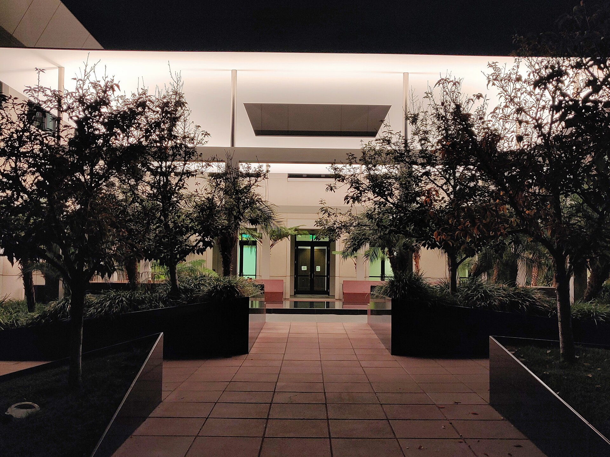

מה הופך אור פשוט ליצירת אמנות? זו בדיוק השאלה שאמנות האור מנסה לענות עליה — וזוכה בתשובה מרהיבה. אמנות האור, זרם שבו האור עצמו הוא חומר הגלם המרכזי ולא רק כלי להאיר יצירה אחרת, הפכה בשנים האחרונות לאחת המגמות המדוברות באמנות העכשווית ולמגנט קהל של ממש במוזיאונים ברחבי העולם.

במקום צבע על בד או ברונזה מפוסלת, האמנים כאן עובדים עם ניאון, מנורות פלואורסצנט, קרני לייזר, השתקפויות וערפל. התוצאה היא חוויה שקשה לתפוס בתמונה בודדת — צריך להיכנס אל תוכה, לעמוד בחלל ולתת לעיניים להסתגל.

## מהי אמנות האור ואיך היא נולדה?

השורשים של אמנות האור נטועים בשנות ה-60, עם עלייתה של תנועת 'לייט אנד ספייס' (Light and Space) בקליפורניה. אמנים כמו רוברט אירווין החלו לחקור כיצד אור וחלל משפיעים על התפיסה האנושית. במקביל, האמן האמריקאי דן פלאווין הפך צינורות פלואורסצנט תעשייתיים סטנדרטיים ליצירות מינימליסטיות זוהרות, ובכך ניתק את האור מכל תפקיד מעשי.

מאז, אמנות האור התפתחה לכיוונים רבים — מהחדרים המדיטטיביים והכמעט-רוחניים ועד למיצבים אינטראקטיביים ענקיים שמגיבים לתנועת הצופים.

## מי היוצרים שמובילים את התחום?

כמה שמות בולטים במיוחד עיצבו את פני הז'אנר, וכל אחד מהם מביא גישה שונה לחלוטין:

- **ג'יימס טורל** — אולי האמן המזוהה ביותר עם התחום. חדרי ה'גנצפלד' שלו עוטפים את הצופה באור אחיד עד שהתחושה של עומק וגבול מיטשטשת לחלוטין. פרויקט חייו, 'רודן קרייטר', הוא הפיכת לוע הר געש כבוי במדבר אריזונה ליצירת אמנות אסטרונומית.
- **אולפור אליאסון** — האמן הדני-איסלנדי שהציב שמש מלאכותית ענקית בטייט מודרן בלונדון והפך את ההמונים לצופים שוכבים על הרצפה. עבודתו משלבת אור, ערפל, מים ותופעות טבע.
- **דן פלאווין** — החלוץ שהוכיח שאובייקט תאורה יומיומי יכול להיות פסל.
- **טיים ורגון (טרקווין)** ואמני הקולקטיב היפני **טימלאב** — שהביאו את אמנות האור אל העידן הדיגיטלי עם חללים אינטראקטיביים שלמים.

## למה דווקא עכשיו? מגמת האור בעידן האינסטגרם

אי אפשר להתעלם מכך שהפריחה של אמנות האור מתרחשת בדיוק בעידן הרשתות החברתיות. המיצבים הזוהרים הם 'אינסטגרמיים' באופן מושלם — הם מזמינים צילום, שיתוף ותיוג. מוזיאונים, שמחפשים כבר שנים דרכים למשוך קהל צעיר, מצאו באמנות האור נכס אסטרטגי.

כאן בדיוק מתחילה גם המחלוקת. מבקרים מסוימים טוענים שחלק מהמיצבים הפכו ל'אמנות למען הסלפי' — חוויות ראווה שטחיות שמעדיפות רושם מיידי על עומק. אחרים משיבים שהאור תמיד עורר יראה, מהקתדרלות הגותיות ועד לוויטראז'ים, ושאין פסול בכך שאמנות מרגשת ומזמינה.

## אמנות האור בישראל

גם בישראל ניכרת התעניינות גוברת בעבודות אור, וידאו ומיצב. מוסדות כמו מוזיאון תל אביב לאמנות ומוזיאון ישראל מציגים מעת לעת עבודות המשלבות אור ומדיה חדשה, ופסטיבלים עירוניים כמו פסטיבל האור בירושלים הפכו אירוע קבוע שממלא את סמטאות העיר העתיקה במיצבים זוהרים ומושכים עשרות אלפי מבקרים.

הסצנה המקומית של אמנים צעירים מגלה עניין הולך וגובר בשילוב טכנולוגיה, וידאו ותאורה — סימן לכך שהמגמה העולמית מהדהדת גם כאן.

## מדריך מהיר: סוגי מיצבי האור

| סוג המיצב | המאפיין המרכזי | דוגמה בולטת |
|---|---|---|
| חדר גנצפלד | טבילה באור אחיד שמטשטש עומק | ג'יימס טורל |
| תופעת טבע מלאכותית | שמש, ערפל ומים בחלל סגור | אולפור אליאסון |
| פסל ניאון | אובייקטי תאורה תעשייתיים | דן פלאווין |
| חלל דיגיטלי אינטראקטיבי | הקרנות שמגיבות לצופה | קולקטיב טימלאב |
| מיצב לייזר | קרני אור חדות בחלל | אנתוני מקול |

## אז מהפכה או אופנה חולפת?

האמת, כנראה, נמצאת באמצע. אמנות האור אינה תופעה חדשה — היא ממשיכה מסורת בת עשורים של חקר תפיסה, חלל ותודעה. מה שהשתנה הוא היקף החשיפה והדרך שבה הקהל צורך אותה. גם אם חלק מהמיצבים נועדו בעיקר לרשת, הטובים שבהם עדיין מצליחים לעשות את מה שאמנות גדולה עושה: לעצור אותנו לרגע, ולגרום לנו לראות את העולם — ואת האור — אחרת.
