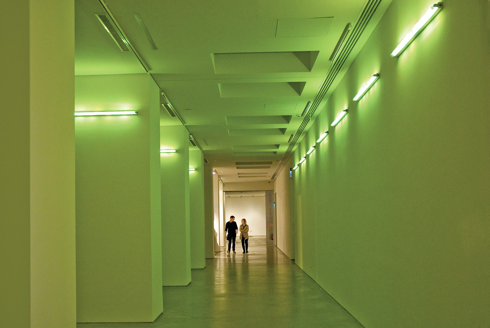

מה הופך קרן אור פשוטה ליצירת אמנות? **אמנות האור** — הזרם שבו הניאון, הלד, הלייזר וההקרנה הם חומר הגלם עצמו ולא רק תאורה — הפכה בשנים האחרונות לאחת התופעות המדוברות באמנות העכשווית. במקום להתבונן בציור תלוי על קיר, המבקר נכנס אל תוך חלל רווי צבע, מאבד תחושת עומק ולעיתים אף את תחושת הזמן. זו אינה אמנות שמתבוננים בה — זו אמנות שחיים בתוכה.

## למה אמנות האור כובשת דווקא עכשיו?

התשובה נעוצה במפגש בין טכנולוגיה זמינה לבין רעב של הקהל לחוויה. מסכי הלד הזולים, בקרי התאורה החכמים ומקרני הלייזר הפכו נגישים ליוצרים, ובמקביל התרגל הצופה בן זמננו לצרוך תרבות דרך גירוי חושי עז. **אמנות האור** מספקת בדיוק את זה: רגע של השתאות שקשה להעביר בתמונה, גם אם כולם מנסים לצלם אותו.

יש בכך גם אירוניה. הזרם שנתפס לעיתים כ"אמנות אינסטגרמית" שואב את שורשיו דווקא ממסורת מושגית ורצינית, שביקשה לבחון את עצם תפיסת הראייה שלנו. האור אינו קישוט — הוא הנושא.

## מי הניח את היסודות?

כבר בשנות השישים החל האמריקאי דן פלאווין (Dan Flavin) לתלות נורות פלואורסצנט תעשייתיות בגלריות, והפך חפץ יומיומי לפיסול מופשט של צבע וזוהר. במקביל פיתח ג'יימס טורל (James Turrell) את מה שכינה "אמנות התפיסה" — חללים שבהם האור הופך מוחשי כמעט כמו חומר, עד שקשה לדעת היכן נגמר הקיר ומתחיל האוויר. פרויקט חייו, מכתש הרודן קרייטר שאותו הוא מעצב כמצפה אור ענק, נחשב לאחד המיזמים השאפתניים בתולדות האמנות.

הזרם התל אביבי והבינלאומי מוסיף לרשימה את יוצאי תנועת ה"לייט אנד ספייס" מקליפורניה, וכן אמנים ישראלים שעבדו עם ניאון וטקסט מואר כאמצעי פיוטי ופוליטי כאחד.

## אולפור אליאסון: כשהאור נעשה אירוע המוני

אם יש שם אחד שהפך את **אמנות האור** לתופעה עולמית, זהו האמן הדני-איסלנדי אולפור אליאסון (Olafur Eliasson). המיצב שלו "The Weather Project" בטייט מודרן בלונדון, שבו שמש מלאכותית ענקית זרחה מעל אלפי מבקרים ששכבו על הרצפה, נחשב לאחד מרגעי המפתח של האמנות במאה ה-21. אליאסון אינו מסתפק באפקט: הוא מבקש לגרום לנו לשים לב לאופן שבו אנחנו רואים, מרגישים ומשתפים אחרים בחוויה.

## מה כדאי לראות? מדריך מהיר

הטבלה הבאה מסכמת כמה מכיווני העבודה המרכזיים בזרם, למי שרוצה להבין את השדה לפני הביקור הבא בגלריה:

| סוג העבודה | חומר האור | חוויית הצופה |
|---|---|---|
| פיסול ניאון | שפופרות ניאון וטקסט מואר | קריאה, אירוניה, נוסטלגיה |
| חדרי אור | הצפת צבע רציפה | טבילה חושית ואיבוד אוריינטציה |
| מיצבי לייזר | קרני לייזר בחלל אפל | תחושת נפח וקווים במרחב |
| מיפוי וידאו | הקרנה על מבנים | הפיכת אדריכלות ליצירה חיה |

## ואיפה פוגשים את זה בישראל?

הקהל הישראלי אינו צריך לטוס רחוק. מוזיאון תל אביב לאמנות מציג מעת לעת עבודות מדיה ואור במסגרת התצוגות העכשוויות שלו, ומרחבי אמנות עצמאיים בדרום תל אביב מארחים מיצבים ניסיוניים. גם המרחב הציבורי הישראלי מתמלא בהדרגה בעבודות אור — בפסטיבלים עירוניים כמו פסטיבל האור בירושלים, שבו רחובות העיר העתיקה הופכים למסך ענק להקרנות ולמיצבים זוהרים, נהנים אלפי מבקרים מאמנות שיוצאת מהמוזיאון אל הרחוב.

### האם זו אמנות "אמיתית" או רק ראווה?

זו אולי השאלה שמלווה את הזרם מיום היווסדו. מבקרים טוענים שחלק מהעבודות מסתפקות באפקט מרהיב ותו לא, וכי הקהל בא לצלם ולא להתבונן. מנגד, המצדדים מזכירים שכל מדיום חדש — מהצילום ועד הווידאו — נחשד בתחילה בשטחיות. הטובות שבעבודות האור אינן רק יפות: הן משנות את האופן שבו אנחנו תופסים חלל, זמן ונוכחות.

## אז לאן זה הולך?

המגמה רק מתחזקת. ככל שהטכנולוגיה נעשית זמינה, כך יותר יוצרים צעירים בוחרים באור כשפה ראשית, ומוזיאונים מגלים שתערוכות אור ממלאות אולמות. **אמנות האור** מציעה משהו שהאמנות המסורתית מתקשה להתחרות בו בעידן המסכים: רגע פיזי, בלתי אמצעי, שבו אנחנו נעצרים באמצע החיים כדי פשוט להתבונן באור. וזה, אולי, כוחה הגדול ביותר.
