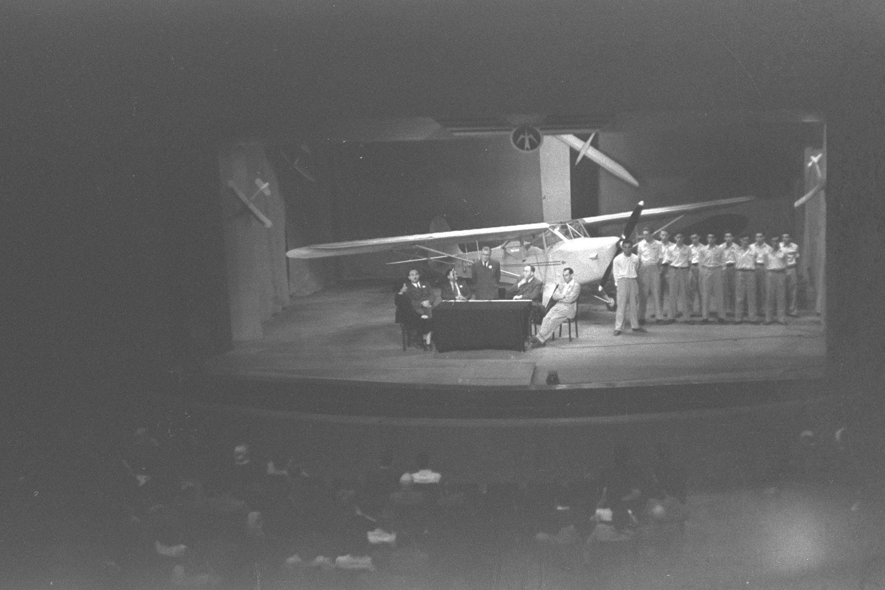

האם המחזה הישראלי המקורי חוזר לקדמת הבמה? התשובה, כך נראה, חיובית: אחרי עשור שבו שלטו עיבודים לרומנים, מחזות זמר מיובאים וקלאסיקות מתורגמות, **מחזאות ישראלית חדשה** מתפרצת מחדש אל הבמות — צעירה, נועזת, אישית ולא פוחדת להתעמת עם המקום שבו היא נכתבת.

מדובר בשינוי מגמה של ממש. במקום להישען על טקסטים בדוקים מחו"ל, תיאטראות הרפרטואר והעצמאיים כאחד פותחים דלת לכותבים בני שלושים וארבעים, שמביאים איתם שפה בימתית אחרת: פחות ריאליזם סלוני, יותר קטיעות, הומור שחור, ותנועה חופשית בין הפרטי לפוליטי.

## מה מניע את הפריחה במחזאות הישראלית החדשה?

כמה כוחות פועלים כאן במקביל. ראשית, קהל שבע מסדרות סטרימינג מחפש דווקא בתיאטרון את מה שהמסך לא נותן — נוכחות חיה, נשימה משותפת, סיכון. שנית, דור הכותבים שצמח בבתי הספר למשחק ובמעבדות כתיבה למד שהמחזה אינו חייב לחקות את המציאות אלא יכול לפרק אותה.

רבים רואים בכך תגובה ישירה למציאות הישראלית הסוערת. כשהמציאות עצמה דרמטית עד כאב, הכותבים הצעירים בוחרים לא לברוח ממנה אלא להפוך אותה לחומר גלם — לעיתים בזעם, לעיתים באירוניה, ולעיתים ברוך מפתיע.

### מהפרטי אל הפוליטי

המאפיין הבולט של הגל הזה הוא הערבוב בין הביוגרפי לחברתי. מחזאים צעירים אינם מהססים להעלות על הבמה את סיפור המשפחה שלהם, את זהותם, את פצעי הדור — ומתוך הסיפור האישי מצליחים לגעת בשבר קולקטיבי. זו כתיבה שבה 'אני' הוא תמיד גם 'אנחנו'.

## מי הם הכותבים והבמות שמובילים את השינוי

המוסדות הגדולים הבינו את הפוטנציאל. **תיאטרון הבימה** ו**הקאמרי** מקדישים יותר משבצות להצגות מקור, ומרחיבים תוכניות ליווי לכותבים. במקביל, הזירה העצמאית — תיאטרון תמונע, הסמטה, וסצנת הפרינג' התל אביבית — ממשיכה לתפקד כמעבדה שבה נולדים הקולות הבאים.

ציון דרך מרכזי הוא **פסטיבל עכו לתיאטרון אחר**, שנחשב זה שנים למכרה זהב של יוצרים צעירים, ומשם צמחו לא מעט הצגות שהמשיכו לרפרטואר הממוסד. גם מפעלי כתיבה ותחרויות מחזאות מזרימים דם חדש למערכת.

| הצגה / כיוון | סוג | איפה לחפש |
| --- | --- | --- |
| מחזה מקור עכשווי | דרמה אישית־פוליטית | הבימה / הקאמרי |
| תיאטרון תיעודי־אישי | עדות ואוטוביוגרפיה | תיאטרון עצמאי, תמונע |
| קומדיה חברתית חדה | סאטירה מקומית | פסטיבל עכו, פרינג' |
| מונודרמה מקורית | הצגת יחיד | סצנת התל אביבית |

## למה זה חשוב לקהל הישראלי?

מעבר לחוויה האמנותית, יש כאן שאלה של ריבונות תרבותית. מחזה מקורי הוא מראה שבה חברה בוחנת את עצמה בזמן אמת — משהו שעיבוד לקלאסיקה זרה, מוצלח ככל שיהיה, אינו יכול לספק במלואו. כשהקהל שומע על הבמה את העברית של הרחוב, את המתחים של השכונה ואת ההומור המקומי, נוצר רגע של הכרה שאין לו תחליף.

יש בכך גם הימור כלכלי. הצגת מקור חדשה היא סיכון גדול יותר מהפקה בדוקה, אך דווקא ההצלחות של השנים האחרונות מוכיחות שקהל צמא לסיפור שנכתב עבורו, כאן ועכשיו.

## איך נכנסים לזה? המלצה קטנה לצופה

- עקבו אחרי תוכניות הכתיבה של הבימה והקאמרי — שם מבשילים הכותרים הבאים.
- אל תפחדו מהזירה העצמאית: כרטיס בתיאטרון קטן הוא לעיתים החוויה החדה ביותר.
- שריינו ביקור בפסטיבל עכו — זו הדרך הטובה ביותר לפגוש את הדור הבא לפני שכולם מדברים עליו.
- תנו הזדמנות למחזאים לא מוכרים; לא כל הצגה תצליח, אבל דווקא שם קורה החדש.

המחזאות הישראלית החדשה אינה מבטיחה מופת בכל ערב, אבל היא מבטיחה משהו נדיר לא פחות: תיאטרון חי שמסרב להיות דקורטיבי. אחרי שנים של ייבוא, נדמה שהבמה הישראלית שוב לומדת לדבר בקולה שלה — ושווה מאוד להקשיב.
