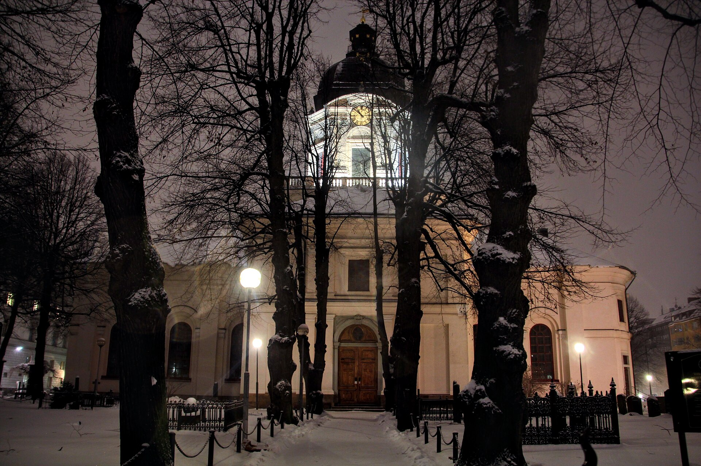

יש משהו מנחם באופן מוזר בלשקוע בלילה חורפי בסטוקהולם או אוסלו, עם רוצח סדרתי מסתובב חופשי ובלש שבור אך עקשן על עקבותיו. **המותחן הנורדי** — או בשמו הלועזי "נורדיק נואר" — הפך בעשור האחרון לאחת התופעות הבולטות במדפי רבי המכר בישראל, וקהל הקוראים המקומי פשוט לא מצליח לגמול את עצמו מהקדרות הסקנדינבית הזו. התשובה הקצרה לשאלה מדוע: הז'אנר מציע הרבה יותר מתעלומה בלשית — הוא מציע מראה חברתית, פסיכולוגיה אפלה ואווירה שאין לה תחליף.

## מה הופך את המותחן הנורדי לכל כך ממכר?

בניגוד למותחן האמריקאי הקצבי, שדוהר לעבר הפתרון, המותחן הנורדי לוקח את הזמן. הוא שוקע בבוץ, בשלג ובנפש. הבלשים כאן אינם גיבורי-על — הם אנשים עייפים, אלכוהוליסטים לעיתים, גרושים לרוב, נאבקים בדמונים פנימיים לא פחות מאשר ברוצחים. דמותו של הארי הולה, הבלש של הסופר הנורווגי יו נסבו (Jo Nesbø), הפכה לאייקון בדיוק משום שהיא כה פגומה ואנושית.

מעבר לכך, הפשע הנורדי הוא כמעט תמיד תירוץ. מתחת לפני השטח מסתתרת ביקורת חברתית נוקבת על מדינת הרווחה הסקנדינבית המושלמת-לכאורה — על האלימות המגדרית, הגזענות, השחיתות והבדידות שרוחשות מאחורי החזית המהוגנת. סטיג לרסון (Stieg Larsson), בטרילוגיית "מילניום" שלו, הפך את הביקורת הזו לזעקה של ממש.

## מאיפה הכול התחיל?

רבים רואים בזוג הסופרים השוודי מאי שוואל ופר ולה, שכתבו בשנות השישים והשבעים את סדרת הבלש מרטין בק, את אבות הז'אנר. אך הפריצה הגדולה לתודעה העולמית הגיעה מאוחר יותר. הנינג מנקל (Henning Mankell) ובלשו קורט ולנדר סללו את הדרך בשנות התשעים, וסטיג לרסון פוצץ את הסכר בתחילת שנות האלפיים עם "נערה עם קעקוע דרקון", שהפך לתופעה עולמית — ולאחת מסדרות הספרים הנמכרות בכל הזמנים.

מאז זרם המבול: יו נסבו מנורווגיה, קמילה לקברג ולארס קפלר משוודיה, ארנלדור אינדרידסון מאיסלנד, ויו קבו-סורנסן מדנמרק. בישראל, הוצאות כמו כתר, מודן וידיעות ספרים דואגות לתרגם את הכותרים החדשים כמעט במקביל לצאתם באירופה.

## מי מוביל את הגל? טבלת היכרות

| סופר/ת | מדינה | דמות/סדרה מרכזית | הסגנון |
|---|---|---|---|
| יו נסבו | נורווגיה | הארי הולה | אפל, אלים, פסיכולוגי |
| סטיג לרסון | שוודיה | ליסבת סלנדר ("מילניום") | ביקורת חברתית פמיניסטית |
| הנינג מנקל | שוודיה | קורט ולנדר | מלנכולי, חברתי |
| קמילה לקברג | שוודיה | סדרת פיֶלבקה | פשע בקהילה קטנה |
| ארנלדור אינדרידסון | איסלנד | הבלש ארלנדור | אווירתי, מינימליסטי |

## למה דווקא הקהל הישראלי מתחבר לזה?

זו שאלה מסקרנת, שכן קשה לדמיון מקומות רחוקים יותר זה מזה מבחינת אקלים ומזג — מהשלג הנורווגי ועד השרב הישראלי. ובכל זאת, נראה שהניגוד הוא בדיוק המשיכה. עבור קורא ישראלי, המותחן הנורדי הוא בריחה אקזוטית לעולם קר, שקט ומסודר, שגם בו — מסתבר — הכול אפשר להתפרק.

יש גם קרבה עמוקה יותר: העיסוק הנורדי בטראומה, באובדן, בזיכרון ובאלימות שמתחת לפני השטח מהדהד לחברה הישראלית שמכירה היטב את המתח בין נורמליות לחרדה. ולבסוף, פשוט מדובר בכתיבה טובה — עלילות מהודקות, דמויות מורכבות ומתח שלא מרפה.

### לא רק על הנייר

אי אפשר להפריד את הצלחת הספרים מהעיבודים המצליחים. הסדרה הדנית-שוודית "הגשר", הסדרה "הרצח" (Forbrydelsen) והעיבודים הקולנועיים ל"מילניום" הפכו את האסתטיקה הנורדית — התאורה הקרירה, הסוודרים, המכוניות הישנות — לשפה ויזואלית מזוהה. בישראל, רבים מגלים את הספרים אחרי שצפו בסדרות, ואז חוזרים לספרים כדי לקבל את הגרסה המלאה והאפלה יותר.

## לאן הז'אנר הולך מכאן?

המותחן הנורדי כבר מזמן חרג מגבולות סקנדינביה והוליד גלים מקבילים: "טרטן נואר" סקוטי, מותחנים אירים ואפילו ניסיונות ישראליים לפתח מותחן מקומי בעל עומק חברתי דומה. הדור החדש של הסופרות והסופרים הנורדים ממשיך לדחוף את הגבולות — עם עיסוק גובר בפשעי אקלים, בהגירה ובעולם הדיגיטלי.

מה שבטוח: כל עוד יש קוראים שמחפשים תעלומה חכמה שגם אומרת משהו על העולם, הפשע הסקנדינבי ימשיך למכור. הקור, כך מסתבר, פשוט לא יוצא מהאופנה.
