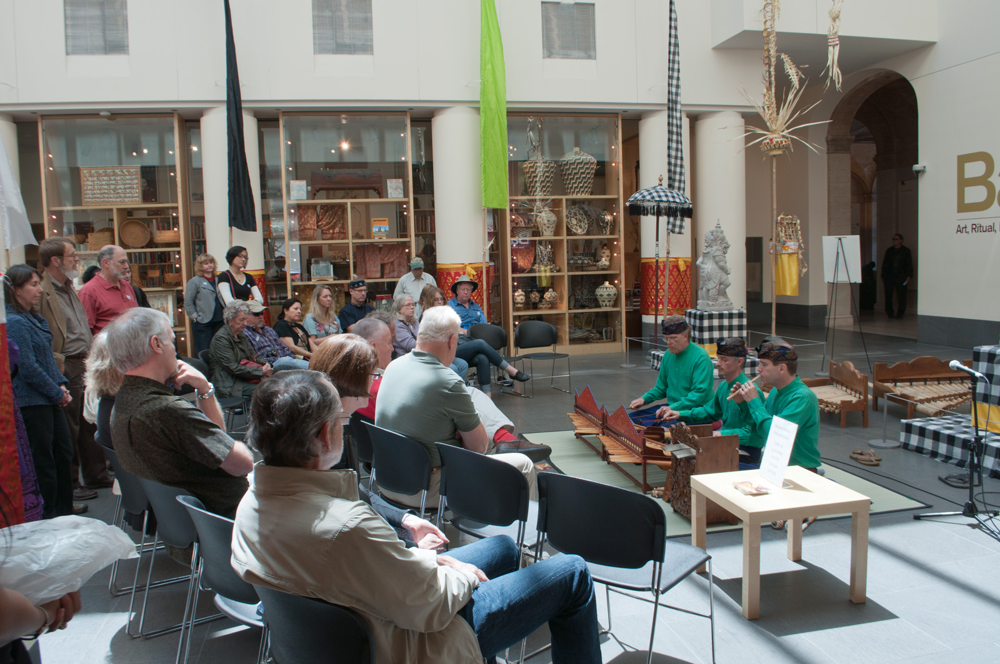

מה הופך רגע חולף — נשימה, מבט, מגע — ליצירת אמנות? זו בדיוק השאלה שעומדת בלב **אמנות המיצג**, ז'אנר שבו גוף האמן, הזמן והנוכחות עצמה הם החומר. אין בד, אין שיש, אין מסגרת: יש אדם חי, קהל, ורגע שלא יחזור. בשנים האחרונות נדמה שהמדיום הזה, שנחשב פעם לשולי ולפרובוקטיבי, חוזר בגדול אל לב המוזיאונים והגלריות — בישראל ובעולם.

## מהי בעצם אמנות המיצג?

אמנות המיצג (פרפורמנס) היא צורת ביטוי חזותית שבה הפעולה החיה מחליפה את האובייקט. במקום להשאיר אחריו ציור או פסל, האמן מציג פעולה מתמשכת — לעיתים דקות, לעיתים שעות ואף ימים — מול קהל. השורשים נטועים בתנועות האוונגרד של המאה ה-20, מהדאדא ועד תנועת "פלוקסוס", אך רבים רואים בשנות ה-70 את תור הזהב שבו הגוף הפך למרכז היצירה.

מה שמייחד את המדיום הוא היעדר התיווך: אין מסך, אין עריכה, אין הפרדה בטוחה בין היוצר לצופה. הצופה הופך לעד, ולעיתים אף למשתתף פעיל. דווקא בעידן שבו כמעט כל חוויה מתווכת דרך מסך, יש משהו רדיקלי בנוכחות פיזית משותפת בחלל אחד.

## מרינה אברמוביץ' והחזרה הגדולה

אי אפשר לדבר על התחייה הזו בלי להזכיר את **מרינה אברמוביץ'** (Marina Abramović), האמנית הסרבית שכונתה "סבתא של אמנות המיצג". המיצג שלה "האמן נוכח" שהוצג במוזיאון לאמנות מודרנית בניו יורק (מומה) הפך לאירוע תרבות של ממש: אברמוביץ' ישבה שעות מול מבקרים, אחד-אחד, במבט שקט ועוצמתי. התור שהשתרך והדמעות של המשתתפים הפכו את הרעיון המופשט של "נוכחות" לחוויה מוחשית שדיברה אל מיליונים.

ההצלחה הזו סימנה מפנה. מה שנתפס בעבר כתחום סגור לחובבי אמנות עכשווית, הפך לשיחה תרבותית רחבה. מוזיאונים גדולים החלו להקדיש אגפים שלמים למיצג חי, ואמנים צעירים ראו במדיום דרך לגעת בשאלות של זהות, מגדר, סבל וזמן — בלי המסחור שמלווה את שוק האמנות המסורתי.

## למה דווקא עכשיו?

כמה כוחות מזינים את הגל הזה. ראשית, עייפות מהמסך: אחרי שנים של צריכת תרבות דיגיטלית, קהל רעב לחוויה גופנית ובלתי אמצעית. שנית, המיצג מציע אמנות שאי אפשר לשכפל או למכור בקלות — אמירה אמנותית וכלכלית כאחד. שלישית, הנושאים שהמדיום נוגע בהם, מ**זהות** ועד **טראומה**, מדברים אל רוח הזמן.

| מאפיין | אמנות מסורתית | אמנות המיצג |
|---|---|---|
| החומר | בד, צבע, שיש, ברונזה | הגוף, הזמן, הנוכחות |
| משך קיום | קבוע, מתמשך | חד-פעמי, חולף |
| יחס לקהל | צפייה מרוחקת | מפגש ישיר, לעיתים השתתפות |
| תיעוד | האובייקט עצמו | צילום, וידאו, עדות |
| שוק | מכירה ואספנות | קשה לשכפל ולסחור |

## המיצג בישראל: בין הבמה לגלריה

גם בישראל המדיום צובר תאוצה. מוסדות כמו **מוזיאון תל אביב לאמנות** ו**הביאנלה לאמנות** מארחים מדי פעם מיצגים חיים, ואמניות ואמנים מקומיים משלבים גוף, מרחב וקהל בעבודותיהם. הזירה הישראלית, שתמיד נעה בין הפוליטי לאישי, מוצאת במיצג כלי חד לעסוק בזיכרון, בגבולות ובמרחב הציבורי.

המפגש בין עולם התיאטרון לעולם האמנות הפלסטית מיטשטש כאן במיוחד. בעוד התיאטרון נשען על טקסט ודמות, המיצג האמנותי נשען על פעולה ומושג — הבדל דק אך מהותי, שהופך כל אירוע כזה לחוויה שקשה לסווג ולכן קל להתאהב בה.

## התיעוד: החולף שהופך לנצחי

הפרדוקס הגדול של המדיום הוא שהיצירה החולפת זקוקה לתיעוד כדי לשרוד. הצילום והווידאו הפכו לחלק בלתי נפרד מחיי המיצג — לעיתים התצלום המפורסם הוא כל מה שנשאר מפעולה בת שעות. כך נוצר מתח מרתק בין הרגע החי, שאי אפשר להחזירו, לבין הדימוי הקפוא שממשיך להתקיים בספרי אמנות ובתערוכות. דווקא הפער הזה, בין החוויה לזיכרונה, הוא חלק מהקסם.

בסופו של דבר, אמנות המיצג מזכירה לנו משהו פשוט ונדיר: שאמנות יכולה לקרות כאן ועכשיו, בין שני בני אדם, ולהיעלם. ואולי דווקא משום שהיא חומקת מבין האצבעות, היא נוגעת עמוק כל כך.
