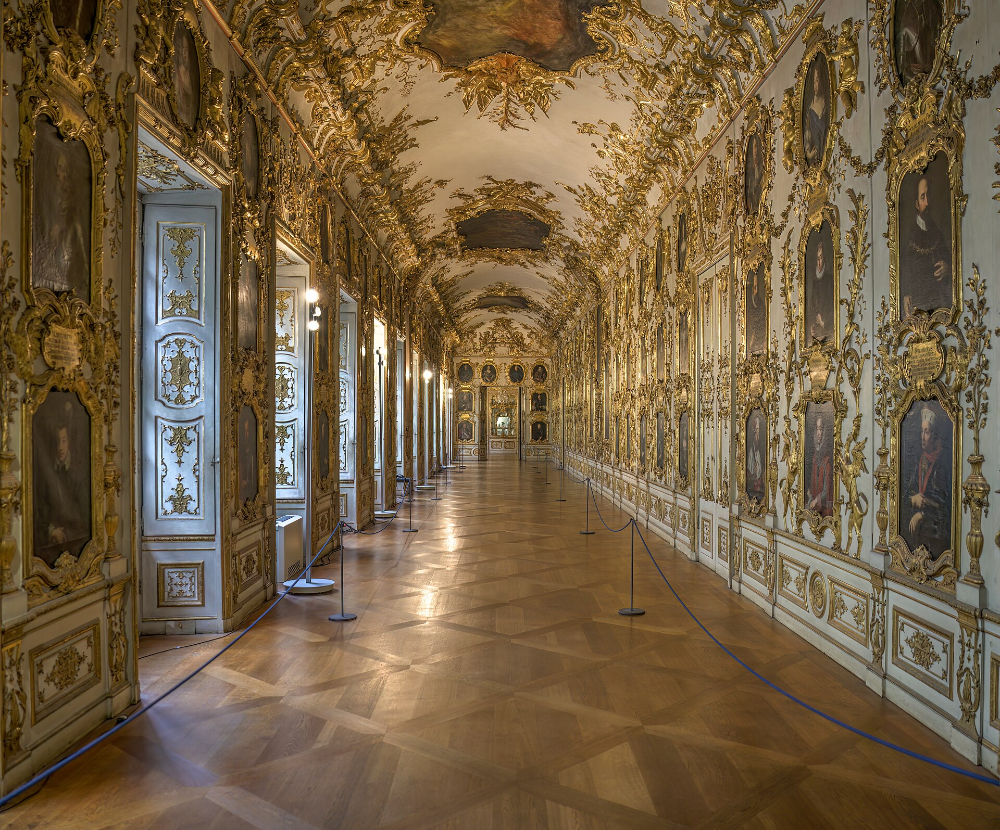

מהי אמנות המיצג ולמה כולם מדברים עליה שוב? **אמנות המיצג** (פרפורמנס) היא צורת יצירה שבה הגוף החי של האמן הופך לחומר הגלם, והיצירה מתרחשת בזמן אמת מול קהל — ללא בד, ללא כן, וללא אפשרות ל"אנדו". בשנים האחרונות, דווקא כשהעולם שקוע במסכים ובבינה מלאכותית, חוזרת אמנות המיצג לחזית הגלריות והמוזיאונים ומציעה את הדבר היחיד שאי אפשר לשכפל בלחיצת כפתור: נוכחות.

זו אינה תופעה חדשה — שורשיה נטועים בשנות השישים והשבעים — אך העניין המחודש בה מרתק. בעידן שבו כל חוויה ניתנת להסרטה, לעריכה ולשיתוף, המיצג עומד כמעט כמחאה שקטה: אתה חייב להיות שם, עכשיו, אחרת פספסת.

## למה דווקא עכשיו?

התשובה קשורה ישירות לעייפות מהדיגיטלי. אחרי שנים של תערוכות אינסטגרם, סלפי מול יצירות ותצוגות שנועדו בעיקר להצטלם, גובר צימאון לחוויה שלא ניתנת לתיווך. אמנות המיצג נותנת בדיוק את זה — מפגש בלתי אמצעי, לעיתים לא נוח, בין אדם לאדם.

יש בכך גם היגיון כלכלי-תרבותי: בזמן ששוק האמנות מוצף ביצירות דיגיטליות ובהדפסים, המיצג הוא נכס נדיר מעצם הגדרתו. הוא קורה פעם אחת, נושם, ונעלם. הנדירות הזו הפכה אותו לאובייקט תשוקה של אוצרים ומוסדות שמחפשים להחזיר את ההילה האבודה של "הרגע החד-פעמי".

## מרינה אברמוביץ': האם ומלכת הז'אנר

אי אפשר לדבר על אמנות המיצג בלי להזכיר את מרינה אברמוביץ' (Marina Abramović), האמנית הסרבית שרבים רואים בה את סבתא-רבתא של התחום. העבודה הנודעת שלה "The Artist Is Present", שבמסגרתה ישבה שעות ארוכות מול מבקרים במוזיאון לאמנות מודרנית בניו יורק והחליפה איתם מבטים בשתיקה, הפכה לרגע מכונן שהחזיר את המיצג לתודעה הרחבה.

כוחה של אברמוביץ' טמון בפשטות הרדיקלית: ללא אביזרים, ללא טכנולוגיה, רק גוף וזמן וקהל. היא הוכיחה שהמדיום יכול לרגש עד דמעות — צופים רבים פרצו בבכי מול המבט שלה — בלי אף פיקסל אחד.

### הדור החדש

בעקבותיה צמח דור שלם של אמנים שמרחיבים את השפה: יש המשלבים וידאו, מוזיקה חיה או קהל אינטראקטיבי, ויש החוזרים לגרסה המינימליסטית של גוף בחלל. המשותף לכולם הוא ההבנה שהסיכון — האפשרות שמשהו ישתבש, שהקהל יגיב בלתי צפוי — הוא חלק מהיצירה, לא תקלה בה.

## אמנות המיצג בישראל

גם בישראל ניכרת התעוררות. מוסדות כמו מוזיאון תל אביב לאמנות ומרכזי אמנות עצמאיים מארחים בשנים האחרונות מיצגים ואירועי פרפורמנס בהיקף גובר, ולצידם פועלת סצנה תוססת של אמנים צעירים שמציגים בחללים אלטרנטיביים, במחסנים ובגלריות עצמאיות בדרום תל אביב ובירושלים.

מה שמרתק בהקשר הישראלי הוא החיבור בין הגוף לפוליטי ולאישי — נושאים של זהות, זיכרון, גבולות ומגדר מוצאים בגוף החי במה ישירה ובלתי מצונזרת.

| סוג מיצג | מה מאפיין אותו | דוגמה מוכרת |
|---|---|---|
| מיצג סטטי | גוף בעמידה או ישיבה ממושכת, מבט ושתיקה | סגנון מרינה אברמוביץ' |
| מיצג נרטיבי | מספר סיפור או פעולה עם התחלה וסוף | פרפורמנס תיאטרלי |
| מיצג אינטראקטיבי | הקהל משתתף פעיל ומשפיע על המהלך | עבודות משתפות-קהל |
| מיצג חברתי-פוליטי | הגוף ככלי מחאה והצבעה על סוגיה | אמנות מגדר וזהות |

## הקהל כשחקן ראשי

אחד המאפיינים המסקרנים של אמנות המיצג הוא שהקהל כמעט לעולם אינו פסיבי. לעיתים הוא מוזמן לגעת, להתקרב, אפילו להשתתף; לעיתים הוא נדחף למקום לא נוח של עֵד. המבוכה, ההיסוס, ההחלטה אם להישאר או ללכת — כל אלה הופכים לחלק מהיצירה עצמה.

זו בדיוק העוצמה של המדיום: הוא מסרב לתת לך להישאר מאחורי הזכוכית. במקום להתבונן ביצירה, אתה נמצא בתוכה.

## אז לאן זה הולך?

העניין המתחדש באמנות המיצג אינו טרנד חולף אלא סימפטום עמוק יותר — הצורך האנושי בקִרבה אמיתית בעולם וירטואלי. ככל שהמסכים ישתלטו על עוד פינות בחיינו, סביר שדווקא ערכו של הגוף החי, הנוכח, הנושם באותו חדר איתנו, רק ילך ויעלה.

המיצג מזכיר לנו שאמנות אינה חייבת להיות מוצר. לפעמים היא פשוט רגע — שביר, בלתי חוזר, ואמיתי לגמרי.
