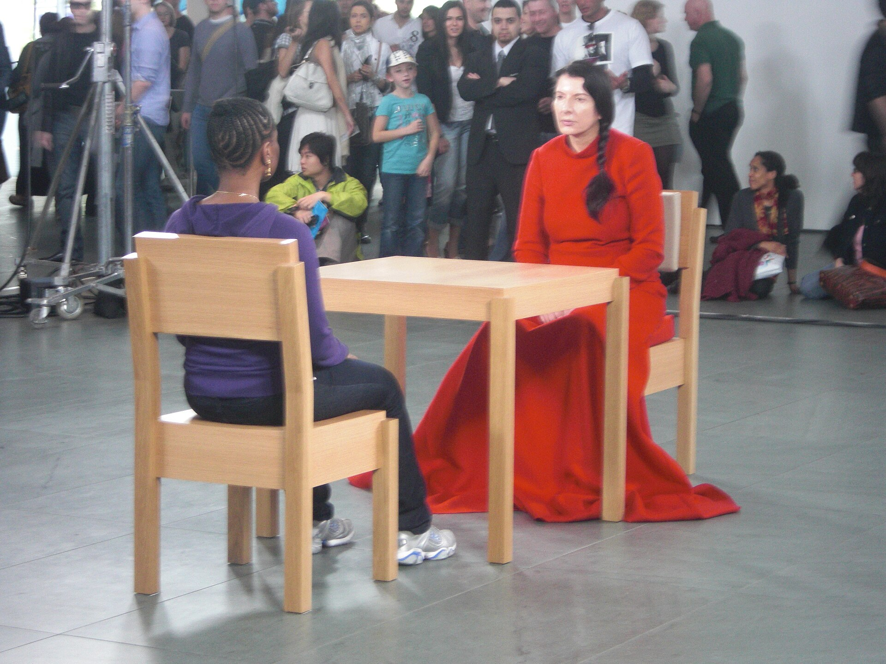

יש רגע שבו אתם עומדים מול אמן שמביט בכם בשתיקה מוחלטת, ומשהו בחדר משתנה. זו אמנות המיצג (פרפורמנס) — צורת אמנות שבה הגוף החי, הזמן והנוכחות הם החומר עצמו, ואין ביניכם לבין היצירה שום מסגרת, בד או זכוכית. בשנים האחרונות הז'אנר הזה, שנחשב פעם לשולי וקיצוני, חוזר בעוצמה אל מרכז הבמה של הגלריות והמוזיאונים בישראל ובעולם.

## מה זו בעצם אמנות המיצג?

בניגוד לציור או לפיסול, שנועדו להישאר, אמנות המיצג קורית פעם אחת ואז נעלמת. האמן משתמש בגופו כמדיום — בתנועה, בנשימה, במגע, לעיתים בסבל פיזי ממשי — כדי לברוא חוויה שמתקיימת רק בזמן אמת, בנוכחות הצופים.

השורשים נטועים בשנות השישים והשבעים, בתנועות כמו פלוקסוס ובאמנות הגוף. אבל מי שהפכה את הז'אנר לתופעה תרבותית רחבה היא מרינה אברמוביץ' (Marina Abramović), שמיצגיה ההיסטוריים — ובראשם "האמנית נוכחת" במוזיאון לאמנות מודרנית בניו יורק — הפכו למושג. רבים רואים בה את האם המייסדת של אמנות המיצג בתודעה העולמית.

## למה דווקא עכשיו?

התשובה הקצרה: ככל שהעולם הופך דיגיטלי ומתווך יותר, גובר הצמא לחוויה גופנית ובלתי אמצעית. אחרי שנים של מסכים, פילטרים ואווטארים, יש קסם מיוחד בעמידה מול אדם חי שנוכח כאן ועכשיו — בלי אפשרות לגלול הלאה.

כמה כוחות מזינים את החזרה הזו:

- **תגובת נגד לדיגיטל:** המיצג מציע את מה שהמסך לא יכול — נוכחות פיזית, סיכון וזמן אמיתי.
- **דור חדש של אוצרים:** מוסדות תרבות מחפשים לערער את הצפייה הפסיבית ולהפוך את הקהל למשתתף.
- **גבולות מיטשטשים:** התיאטרון, המחול והאמנות הפלסטית נפגשים, והמיצג יושב בדיוק בצומת הזה.
- **רשתות חברתיות:** באופן פרדוקסלי, דווקא התמונה מהמיצג מתפשטת ברשת ומזמינה עוד קהל לחוות את הדבר האמיתי.

## מי מובילים את הגל?

מעבר לאברמוביץ', שמות כמו טינו סגל (Tino Sehgal), שיוצר "מצבים" חיים בתוך המוזיאון בלי כל תיעוד, מגדירים מחדש את הז'אנר. בישראל פעלה שנים רבות אמנית המיצג תמר רבן, ודור צעיר של יוצרות ויוצרים ממשיך לחקור את הגוף, הזהות והמגדר דרך פעולה חיה.

### מה ההבדל בין מיצג לתיאטרון?

זו שאלה שחוזרת שוב ושוב. בתיאטרון יש בדרך כלל דמות, עלילה וטקסט; במיצג האמן הוא הוא עצמו, והפעולה אמיתית ולא מיוצגת. כשאמן חותך, נוגע או צם — זה קורה באמת. הגבול הזה בין אמנות לחיים הוא בדיוק המתח שהופך את הז'אנר למסעיר וללא-נוח.

## איפה פוגשים אמנות מיצג בישראל?

המיצג נוטה להופיע בפריצות קצרות — במסגרת תערוכות, לילות אמנות ואירועים חד-פעמיים — ולכן כדאי לעקוב אחר לוחות התוכניות. הנה מפת התמצאות כללית:

| מוסד / מרחב | סוג הפעילות | למי מתאים |
|---|---|---|
| מוזיאון תל אביב לאמנות | מיצגים במסגרת תערוכות ולילות אמנות | קהל רחב, מבט מוסדי |
| מרכז הגר לאמנות עכשווית, יפו | פרויקטים ניסיוניים ומיצגים | חובבי אוונגרד |
| חללים עצמאיים בדרום תל אביב | מיצג צעיר ופורץ גבולות | מחפשי חוויה חדה |
| פסטיבל ישראל | מפגש בין מחול, תיאטרון ומיצג | קהל פסטיבלים |

## איך צופים במיצג נכון?

הכלל הראשון: תשכחו מהמרחק המנומס של הגלריה. אמנות המיצג לרוב מזמינה אתכם להיות חלק — במבט, בקרבה, לעיתים בהחלטה אם להתערב או להישאר צופים. אין דרך "נכונה" אחת, אבל שווה להגיע בלי מסך בין העיניים ליצירה, ולתת לזמן לעשות את שלו. חלק מהעוצמה נובע דווקא מהאורך, מהחזרתיות ומהאי-נוחות.

וזה אולי הלב של החזרה הגדולה: בעולם שבו כמעט הכול ניתן לשכפול, לשמירה ולהרצה מחדש, אמנות המיצג מזכירה לנו שיש חוויות שקורות פעם אחת בלבד — ואם לא הייתם שם, פספסתם. דווקא הארעיות הזו הופכת אותה, בעיני רבים, לאחת מצורות האמנות החיוניות של הרגע הנוכחי.
