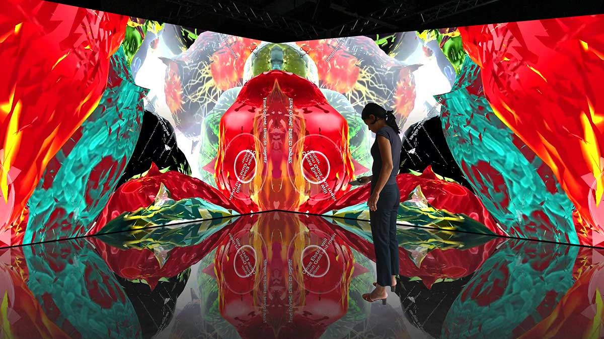
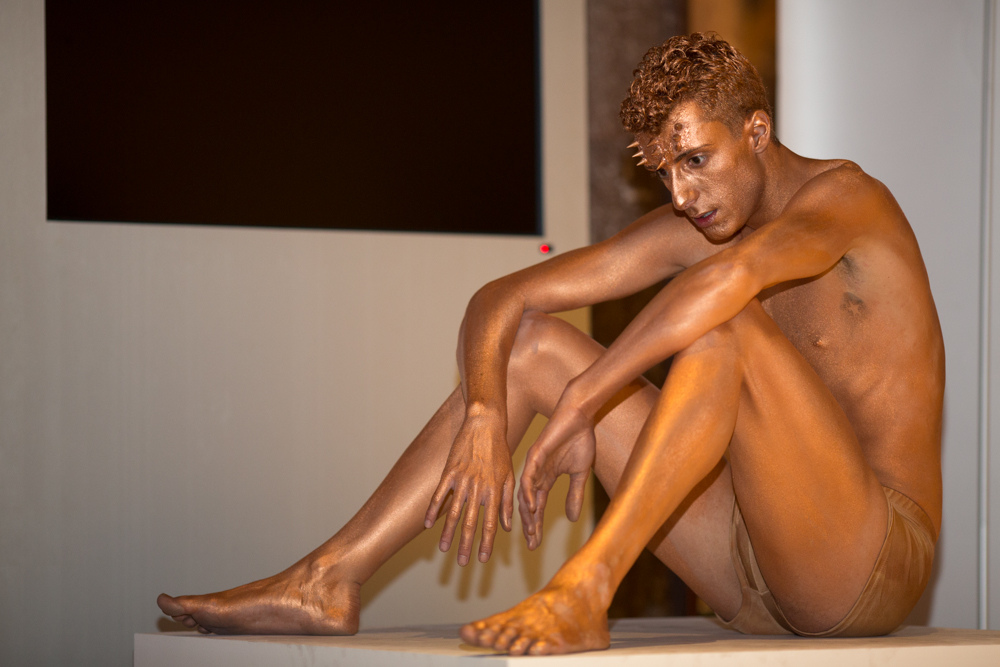

אמנות המיצג — אותה יצירה חיה שבה גוף האמן, הזמן והנוכחות עצמם הופכים לחומר הגלם — חוזרת בשנים האחרונות לתפוס מקום מרכזי בגלריות ובמוזיאונים בישראל ובעולם. בניגוד לציור התלוי על קיר או לפסל הניצב על כן, המיצג מתרחש כאן ועכשיו, פעם אחת, מול עיניו של קהל שהופך לעד ולעיתים אף למשתתף. בעידן שבו הכול ניתן לצילום, לשכפול ולשיתוף, דווקא הרגע החולף והבלתי ניתן לשחזור הוא שמצית מחדש את הסקרנות.

## מהי בעצם אמנות המיצג?

אמנות המיצג (פרפורמנס) היא צורת ביטוי שבה האמן משתמש בגופו, בקולו ובמרחב שסביבו כדי ליצור חוויה מתמשכת בזמן. לעיתים מדובר בפעולה של דקות ספורות, ולעיתים ביצירה שנמתחת על פני שעות או ימים. אין תפאורה מפוארת ולרוב אין עלילה במובן התיאטרלי — יש רק נוכחות, פעולה ומתח בין האמן לצופה.

השורשים נטועים בשנות השישים והשבעים, כשאמנים ביקשו לפרוץ את גבולות האובייקט המסחרי ולהחזיר לאמנות את החיוּת הגולמית. מאז התחום הבשיל, וכיום הוא נחשב לאחד הענפים החיים והמרגשים באמנות העכשווית.

## למה דווקא עכשיו הקהל מתמכר לרגע החי?

רבים רואים בגל המתחדש תגובה ישירה לעומס הדיגיטלי. כשמסכים מציפים אותנו בדימויים אינסופיים, המפגש הפיזי עם אמן חי — הנשימה, הזיעה, השתיקה המתוחה — מציע משהו שאי אפשר להוריד באפליקציה. הצופה נדרש להיות נוכח באמת, בגוף ובזמן.

לכך מתווספת המשיכה אל ה"בלתי ניתן לשכפול". בשוק אמנות שנשלט בשאלות של אספנות ומחיר, המיצג הוא כמעט מרד: יצירה שאי אפשר לתלות בסלון, שנעלמת ברגע שהיא מסתיימת ונשארת רק בזיכרון ובתיעוד חלקי. הפרדוקס הזה — יצירה שקיומה מותנה בהיעלמותה — הוא בדיוק מה שהופך אותה לנחשקת.

## מי מובילים את המהפכה?

הדמות המזוהה יותר מכל עם התחום היא האמנית הסרבית מרינה אברמוביץ' (Marina Abramović), שמופעי הסבל, הסיבולת והמפגש שלה הפכו לאיקוניים והכניסו את המיצג אל לב המוזיאונים הגדולים. עבודתה המפורסמת, שבה ישבה מול מבקרים אחד-אחד בשתיקה, הפכה לסמל של כוחו הרגשי של המפגש הישיר.

בישראל, סיגלית לנדאו נחשבת לאחת היוצרות הבולטות שמשלבות גוף, מיצג ווידאו בעבודות שנעות בין ים המלח לגלריות בעולם. לצידה פועל דור צעיר של אמניות ואמנים שמביאים את השפה הזו לחללים מקומיים, ממוזיאון תל אביב לאמנות ועד מוזיאון הרצליה לאמנות עכשווית והמדרשה.

| יוצר/ת | סימן היכר | היכן לפגוש |
|---|---|---|
| מרינה אברמוביץ' | מופעי סיבולת ומפגש ישיר | מוזיאונים בינלאומיים |
| סיגלית לנדאו | גוף, ים המלח ווידאו | גלריות בארץ ובעולם |
| דור צעיר מקומי | מיצג ניסיוני בחללים חלופיים | המדרשה, חללים עצמאיים |

## איפה רואים מיצג בישראל?

התחום נודד בין מוסדות ממוסדים לחללים עצמאיים. מוזיאון תל אביב לאמנות ומוזיאון הרצליה מקדישים יותר ויותר מקום לאירועי מיצג במסגרת תערוכות ולילות פתוחים. במקביל, פורחת סצנה עצמאית של חללים אלטרנטיביים, מחסנים ומרתפים בדרום תל אביב ובירושלים, שבהם מתקיימים ערבי פרפורמנס אינטימיים.

### איך צופים נכון?

- **הגיעו בראש פתוח:** אין עלילה או מסר חד-משמעי; תנו לחוויה לפעול.
- **היו נוכחים:** הניחו את הטלפון, גם אם מתחשק לצלם הכול.
- **כבדו את הגבול:** לעיתים תוזמנו להשתתף, ולעיתים תפקידכם הוא לצפות בלבד.
- **תנו לזמן לעבוד:** דווקא ההמתנה והשקט הם חלק מהיצירה.

## מהי משמעות התיעוד?

אחת השאלות המרתקות סביב אמנות המיצג נוגעת לחיים שאחרי הרגע. אם היצירה נעלמת, מה נשאר? צילומים, סרטונים ותיאורים — כולם רק שבר של החוויה המקורית. חלק מהאמנים מתייחסים לתיעוד כאל יצירה נפרדת בפני עצמה, ואחרים רואים בו רק תזכורת דהויה. הדיון הזה מזכיר לנו שהמיצג, בשונה מכל מדיום אחר, מסרב להיכנע לזיכרון המושלם של המצלמה.

בסופו של דבר, שיבתה של אמנות המיצג אל קדמת הבמה מספרת סיפור רחב יותר על הצורך האנושי בנוכחות אמיתית. בעולם רווי דימויים, יש משהו כמעט מהפכני בלעמוד מול אדם אחר ולחוות יחד רגע שלא יחזור.
