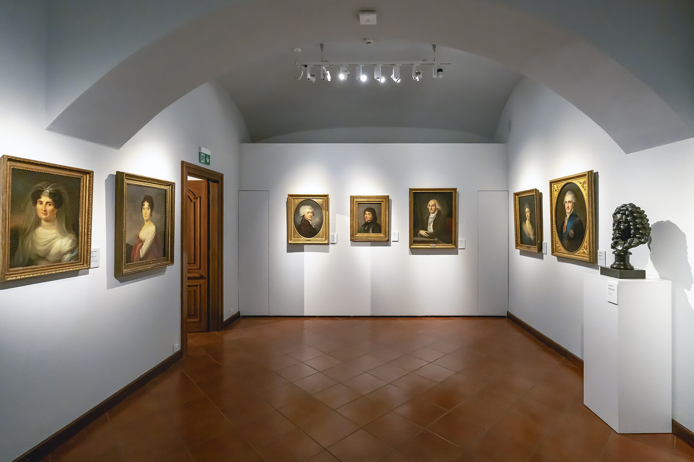
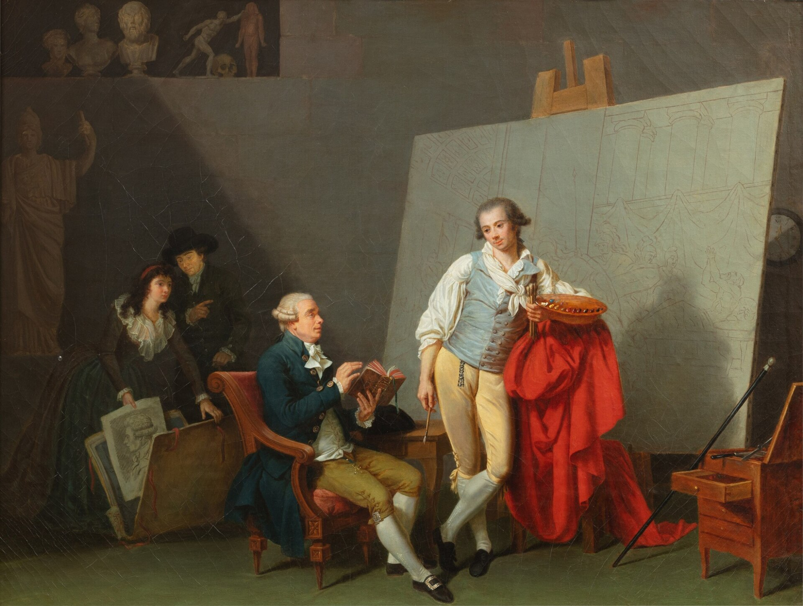

אחרי שנים שבהן נחשב הדיוקן המצויר לשריד מוזיאלי, שמור לחדרי היסטוריה מאובקים, **ציור דיוקן חוזר בעוצמה למרכז הבמה של האמנות העכשווית**. בגלריות בברלin — סליחה, בברלין — בלונדון ובתל אביב, פנים אנושיות מצוירות ביד שבות לתלות על הקירות, וקהל שלם, שגדל על מבול של סלפי ותמונות פרופיל, מגלה מחדש את הקסם של דמות שצוירה לאט, בסבלנות, על בד.

מדוע דווקא עכשיו? התשובה נעוצה, ככל הנראה, בעייפות מהדימוי הדיגיטלי. ככל שהפנים שלנו הופכות לנתון בר-עריכה — מסונן, ממורק, נבלע באלגוריתם — גובר הצורך בייצוג אנושי, פגום ואמיתי. הדיוקן המצויר מציע בדיוק את זה: מבט אחד, מתמשך, שמסרב להיעלם עם הגלילה הבאה.

## למה ציור הדיוקן חוזר דווקא עכשיו?

התחייה של ציור דיוקן אינה אופנה מקרית אלא תגובת נגד תרבותית. בעולם שבו כל אדם מפיק אלפי תדמיות של עצמו, המחווה של אמן היושב מול מודל שעות ארוכות נטענת במשמעות כמעט טקסית. הציור אינו מתעד רגע — הוא מזקק נוכחות.

אמנים בני זמננו, כמו הבריטית ג'ני סאוויל (Jenny Saville) והאמריקאי קהינדה ווילי (Kehinde Wiley), הפכו את הדיוקן לזירה של אמירה חברתית. ווילי, שצייר את הדיוקן הרשמי של הנשיא ברק אובמה, מציב דמויות שחורות בפוזות מלכותיות ששאולות מציורי אמן קלאסיים — ובכך כותב מחדש מי ראוי להיזכר על בד.

### הזהות במקום הדמיון

הדיוקן העכשווי כבר אינו עוסק בשאלה "עד כמה זה דומה". במקום זאת הוא בוחן זהות, מגדר, מוצא ושייכות. הפנים המצוירות הן שדה קרב פוליטי ורגשי, לא רק תרגיל בדמיון פיזי. זו בדיוק הסיבה שאוצרים צעירים נמשכים אליו: הוא מאפשר לדבר על האדם בלי לוותר על היופי של המדיום.

## המגמה בישראל: פיגורציה חוזרת לחזית

גם בישראל ניכרת חזרה לפיגורציה ולציור הדמות. מוסדות כמו מוזיאון תל אביב לאמנות ומוזיאון ישראל מקדישים בשנים האחרונות מקום גובר לאמנים שעובדים בציור ישיר, ואילו גלריות עצמאיות בדרום תל אביב מציגות דור חדש של ציירים צעירים שאינם מתביישים במכחול. רבים רואים בכך תיקון היסטורי: שיבה למלאכת יד אחרי עשורים של דומיננטיות מושגית ווידאו-ארט.

### מה מייחד את הדיוקן הישראלי?

הדיוקן המקומי נוטה להיות אינטימי ופחות ראוותני. הוא עוסק לא פעם במשפחה, בהגירה, בזיכרון ובנוף האנושי הישראלי הצפוף. יש בו חספוס מכוון, סירוב לגימור מבריק — כאילו הבד עצמו נושא צלקת.

## דיוקן קלאסי מול דיוקן עכשווי

| היבט | דיוקן קלאסי | דיוקן עכשווי |
|---|---|---|
| מטרה עיקרית | הנצחה ודמיון פיזי | חקר זהות ואמירה חברתית |
| דמות המצויר | אריסטוקרטיה, אנשי כנסייה | אנשים אנונימיים, קבוצות מודרות |
| סגנון | ריאליזם מלוטש | חופשי, לעיתים מופשט חלקית |
| הקשר | הזמנה אישית | ביקורת תרבותית ורשתות חברתיות |
| יחס לצילום | לפני עידן הצילום | בדיאלוג עם הדימוי הדיגיטלי |

## הדיוקן העצמי בעידן הסלפי

אי אפשר לדבר על שיבת הדיוקן בלי להתייחס לאח התאום הדיגיטלי שלו — הסלפי. במידה רבה, הדיוקן העצמי המצויר הפך לתשובה האמנותית לתרבות הסלפי. שם — רגע, סינון, פרסום; כאן — התבוננות ממושכת, ביקורתית, שאינה מחניפה. אמנים רבים משתמשים בכלים הדיגיטליים כחומר גלם, ומציירים דיוקנאות המבוססים על תמונות מסך, שיחות וידאו וצילומי מסך — ובכך גשר בין המסורת הקלאסית לחיים המקוונים.

## איפה לראות ציור דיוקן?

מי שסקרן לגבי המגמה ימצא נקודות מפגש רבות: תערוכות קבע ומתחלפות במוזיאון תל אביב לאמנות, מיצגי ציור בגלריות העצמאיות ברחוב הרצל וסביבות שוק לוינסקי, ותצוגות של בוגרי בצלאל והמדרשה לאמנות. גם בסינמטקים ובמרכזי תרבות מוקרנים בשנים האחרונות סרטים תיעודיים על ציירי דיוקן, המעידים על העניין המחודש.

השורה התחתונה: ציור הדיוקן אינו נוסטלגיה בלבד. הוא כלי חד וחי לבחון מי אנחנו בעידן שבו הפנים שלנו הפכו למטבע עובר לסוחר. אולי דווקא משום כך, מעולם לא הרגשנו צורך כה גדול להתבונן זה בזה — לאט, ובאמת.
