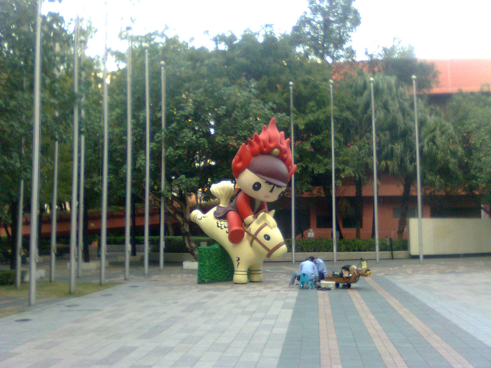
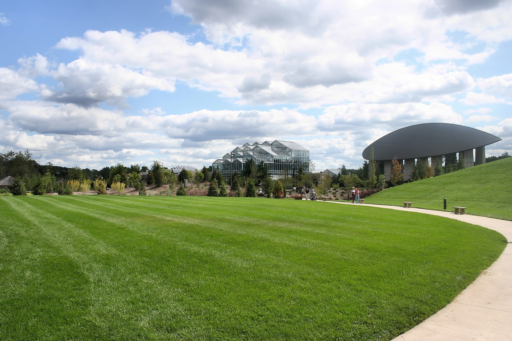

מהי אמנות פומבית ולמה כולם מדברים עליה שוב? זו אמנות שיוצאת מהקירות הלבנים של הגלריה אל הכיכר, השדרה ותחנת הרכבת — יצירה שאי אפשר לפספס בדרך לעבודה. בשנים האחרונות שבה **האמנות הפומבית** לתפוס מקום מרכזי במרחב העירוני הישראלי, כשערים כמו תל אביב, ירושלים וחיפה מזמינות פסלים, מיצבים וקירות ציור שמעצבים מחדש את חוויית ההליכה ברחוב.

## למה דווקא עכשיו?

החזרה אל הפיסול הפומבי אינה מקרית. גלי ההתחדשות העירונית, פיתוח מתחמי מגורים חדשים והרצון של רשויות למתג מרחבים ציבוריים יצרו ביקוש גובר ליצירות שממלאות את הריק. במקביל, קהל שבילה שנים מול מסכים מגלה מחדש את הכוח של אובייקט פיזי גדול, מוחשי, שאפשר לגעת בו ולהצטלם לצדו.

רבים רואים באמנות הפומבית תשובה לשאלה עתיקה: למי שייכת האמנות? כשהיצירה ניצבת בכיכר, היא אינה דורשת כרטיס כניסה, ידע מוקדם או קוד לבוש. היא פוגשת את הילד בדרך לגן ואת הפנסיונר על הספסל באותה מידה.

## הענקים שסללו את הדרך

כשמדברים על אמנות פומבית בישראל אי אפשר בלי שלושה שמות שהפכו לחלק מהנוף.

- **דני קרוון** — אמן הסביבה שיצר את "אנדרטת חטיבת הנגב" ליד באר שבע, עבודה מונומנטלית שהופכת בטון, מים ורוח לחוויה מרחבית. קרוון הבין שהצופה אינו עומד מול היצירה אלא מהלך בתוכה.
- **מנשה קדישמן** — הכבשים והדמויות הצבעוניות שלו, לצד מיצבי הפלדה הענקיים, הפכו למותג ויזואלי מזוהה. עבודותיו ניצבות בכיכרות ובפארקים ומשדרות חיוניות ונגישות.
- **יעקב אגם** — חלוץ האמנות הקינטית, שמזרקת האש והמים שלו בכיכר דיזנגוף בתל אביב הפכה לסמל עירוני. אגם הוכיח שאמנות פומבית יכולה לזוז, להשתנות ולהפתיע.

לצדם פועל דור צעיר של פסלים ואמני מיצב שמביא שפה עכשווית יותר — חומרים ממוחזרים, טכנולוגיה ואינטראקציה עם הקהל.

## מה בין פסל אנדרטי לאמנות רחוב?

חשוב להבחין: אמנות פומבית אינה בהכרח גרפיטי. בעוד אמנות הרחוב צומחת לרוב מלמטה, ביוזמה אישית ולעיתים בלתי חוקית, האמנות הפומבית הקלאסית מוזמנת ומתוקצבת בידי רשויות, מוזיאונים או קרנות. שתי המגמות נפגשות היום במרחב אחד ומעשירות זו את זו.

| סוג יצירה | מי מזמין | מאפיין בולט | דוגמה מוכרת |
|---|---|---|---|
| פסל אנדרטי | עירייה / קרן | קבוע ומונומנטלי | אנדרטת חטיבת הנגב |
| מיצב קינטי | מוסד תרבות | תנועה ואינטראקציה | מזרקת אגם, כיכר דיזנגוף |
| אמנות סביבה | רשות מקומית | שילוב בנוף | פארקים ושדרות |
| ציור קיר | קהילה / יוזמה | צבעוני ונגיש | קירות שכונת פלורנטין |

## איפה לפגוש אמנות פומבית בישראל?

מי שמחפש חוויה מרוכזת יכול לצאת למסלול. בתל אביב שווה לעצור בכיכר דיזנגוף, בשדרות רוטשילד ובקמפוסים אוניברסיטאיים שמארחים פסלים גדולים. בירושלים, גן הפסלים של מוזיאון ישראל מציג יצירות בין־לאומיות תחת כיפת השמיים. גם ערים כמו חיפה, הרצליה ואשדוד השקיעו בשנים האחרונות בפסלים שהפכו לנקודות ציון.

## הביקורת: לא הכל ורוד

לצד ההתלהבות יש גם קולות ביקורתיים. חלק מהיצירות המוזמנות סובלות ממה שמכונה "אמנות שדה תעופה" — אובייקטים דקורטיביים, נקיים מדי, שנועדו לרצות ולא לעורר. שאלת התחזוקה גם היא כואבת: פסל מוזנח, מכוסה חלודה או גרפיטי, עלול להפוך מנכס למטרד. וכמובן, יש הוויכוח הנצחי על התקציב הציבורי — האם כספי המסים צריכים לממן פסל, כשיש צרכים דחופים אחרים?

עם זאת, נדמה שהמגמה כאן כדי להישאר. עיר שמעזה להציב אמנות ברחובותיה אומרת משהו על עצמה: שהיא מאמינה שמרחב ציבורי יפה הוא זכות ולא מותרות.

## הזמנה לצאת החוצה

היופי באמנות הפומבית הוא שאין צורך לתכנן ביקור. היא שם, בדרך, מחכה שנרים את המבט מהטלפון. בפעם הבאה שתחצו כיכר או תמתינו בתחנה — עצרו רגע. ייתכן שאתם עומדים מול יצירה שלמה, חינמית ופתוחה לכולם.
