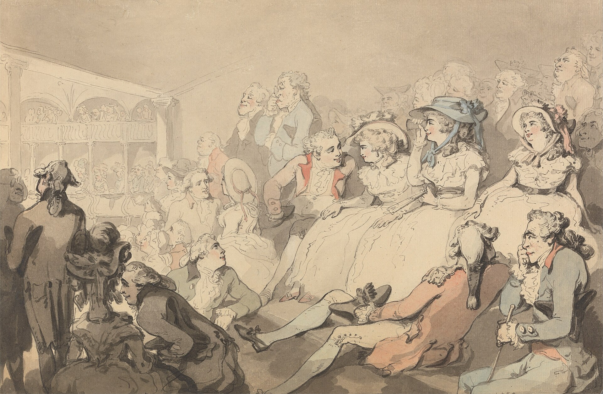

אם נדמה לכם שאתם כבר מכירים את העלילה עוד לפני שהאורות כבים — כנראה שאתם לא טועים. **עיבודי הבמה** הפכו בשנים האחרונות לאחת המגמות הבולטות בתיאטרון הישראלי: רומנים אהובים, רבי-מכר בינלאומיים ואפילו סרטי פולחן מטפסים מן המדף והמסך אל קרשי הבמה. התשובה הקצרה לשאלה "למה" היא שילוב של כלכלה, נוסטלגיה וסקרנות אמנותית — אבל התמונה המלאה מעניינת הרבה יותר.

## למה התיאטרון מתאהב דווקא בעיבודים?

הסיבה הראשונה פרקטית. בעולם שבו קשה יותר ויותר למשוך קהל מהספה אל האולם, שם מוכר הוא נכס. כשעל הכרזה מופיע שמו של רומן שכולם קראו או של סרט שהפך לאייקון, נוצר יתרון שיווקי מיידי. הצופה מגיע עם ציפייה, עם היכרות מוקדמת, ולעיתים עם געגוע.

אבל היה זה טעות לצמצם את הגל לשיקולי קופה בלבד. עבור במאים ומעבדים רבים, דווקא ההיכרות המוקדמת של הקהל היא המגרש המשחקים המרתק ביותר. כשכולם יודעים לאן העלילה הולכת, מוקד העניין עובר מ"מה קורה" ל"איך זה מוצג" — וכאן נכנס הקסם התיאטרלי.

### מה ההבדל בין לקרוא ספר לבין לראות אותו על הבמה?

ספר מתרחש בתוך הראש; הצגה מתרחשת בחלל משותף, בנשימה אחת עם השחקנים. עיבוד מוצלח אינו מנסה לשחזר את הרומן עמוד אחר עמוד, אלא לתרגם אותו לשפה אחרת לגמרי — שפה של גוף, קול, תאורה ומרחב. המעבד הטוב יודע מה לוותר, ולעיתים דווקא ההשמטות הן שהופכות את הטקסט הספרותי ליצירה בימתית חיה.

## מהיכן מגיעים החומרים?

מקורות ההשראה מגוונים, וכל אחד מציב אתגר אחר בפני היוצרים:

- **קלאסיקות ספרותיות** — יצירות מופת שהמעבד מבקש להחזיר לרלוונטיות עכשווית.
- **רבי-מכר עכשוויים** — ספרים שרכשו קהל עצום ומביאים איתם קהל מובנה.
- **עיבודי קולנוע** — הפיכת סרטים אהובים למופע בימתי, לרוב מהלך נועז שכן הקהל זוכר כל פריים.
- **עיבודים דוקומנטריים וביוגרפיים** — סיפורי חיים אמיתיים שהופכים לדרמה.

| סוג המקור | היתרון המרכזי | האתגר הגדול |
|---|---|---|
| קלאסיקה ספרותית | יוקרה והיכרות רחבה | שמירה על רעננות מול ציפיות |
| רב-מכר עכשווי | קהל מובנה וגדול | תרגום שפה פנימית לבמה |
| עיבוד קולנועי | זיהוי מיידי | התחרות בזיכרון הוויזואלי |
| סיפור אמיתי | עוצמה רגשית | נאמנות מול דרמטיזציה |

## איך זה נראה על הבמה הישראלית?

מוסדות מרכזיים כמו **תיאטרון הבימה** ו**התיאטרון הקאמרי** משלבים זה מכבר עיבודים ספרותיים לצד רפרטואר המקור שלהם, ותיאטרון **גשר** ידוע בזיקתו העמוקה לספרות. גם בשולי הזרם המרכזי, בתיאטראות הפרינג' ובפסטיבלים כמו **פסטיבל עכו**, ניכר עניין גובר בעיבוד טקסטים שאינם מחזאיים במקורם — פרוזה, שירה ואפילו מסות.

התופעה אינה ישראלית בלבד. בעולם, בתי תיאטרון מובילים כמו הלאומי הבריטי הפכו את העיבוד הספרותי לחלק בלתי נפרד מהרפרטואר, והצלחות בינלאומיות הוכיחו שקהל רחב מוכן לשבת שעתיים מול סיפור שהוא כבר מכיר — ובלבד שיופתע מחדש.

## האם העיבודים מאיימים על המחזה המקורי?

זו אולי השאלה הרגישה ביותר. מבקרים לא מעטים חוששים שהנהירה אל החומרים המוכרים באה על חשבון הדרמטורגיה המקורית — אותם מחזות חדשים שנכתבים במיוחד לבמה, מתוך הבנה עמוקה של שפתה. כשקל יותר לגייס תקציב להצגה המבוססת על רב-מכר, נוצר חשש שקולות מחזאיים חדשים יתקשו לפרוץ.

מנגד, יש הטוענים שהגבול מלאכותי. עיבוד מוצלח דורש כתיבה דרמטית מן המעלה הראשונה, והוא לעיתים מגרש אימונים מצוין ליוצרים צעירים. בסופו של דבר, בריאות של תרבות תיאטרלית נמדדת באיזון — ביכולת לתת מקום גם לעיבוד המרהיב וגם למחזה המקורי הנועז.

## מה כדאי לצופה לחפש בעיבוד טוב?

לפני שאתם קונים כרטיס, שווה לשאול: האם ההצגה מציעה **קריאה חדשה** של החומר, או רק ממחזרת אותו? עיבוד ראוי לשמו אינו איור של הספר, אלא דיאלוג איתו. הוא לוקח את מה שאהבתם, מפרק ומרכיב מחדש, ומחזיר לכם את הסיפור מזווית שלא חשבתם עליה. כשזה קורה — הרגע שבו יצירה מוכרת פוגשת את חיוּת הבמה — נולד משהו שאף מדיום אחר אינו יכול להעניק.

