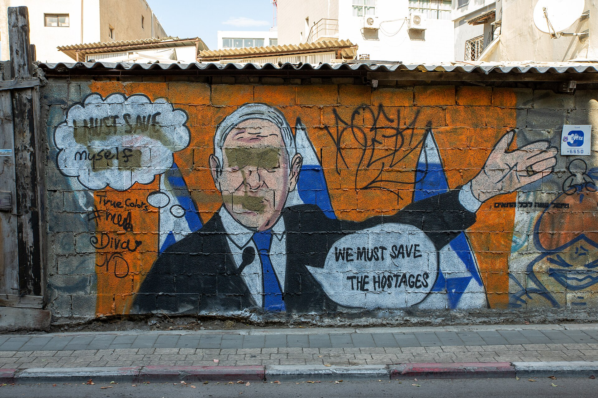

מי היה מאמין שקיר מתקלף בסמטה אחורית בפלורנטין יהפוך ליעד צילום מבוקש, ואפילו לפריט אספנות? **אמנות רחוב** עברה בעשור האחרון מסע מרתק: מוונדליזם שנמחק בהינף מברשת עירונית, אל מגמה תרבותית שמושכת סיורים מודרכים, כתבות במוספי סוף השבוע ואפילו רכישות של אספנים. זוהי אולי המהפכה הוויזואלית השקטה של המרחב הישראלי.

## מה הפך את אמנות הרחוב ללגיטימית?

במשך שנים נתפסה אמנות הרחוב כשולית, לא חוקית ומאיימת. השינוי הגיע ממספר כיוונים בו-זמנית. ראשית, ההצלחה העולמית של דמות כמו בנקסי (Banksy) הבריטי הוכיחה שגרפיטי יכול לשאת מסר פוליטי חד ולהימכר במיליונים. שנית, רשתות חברתיות מבוססות-תמונה הפכו כל יצירת קיר למוצר שיווקי אורבני — קיר טוב הוא היום גם רקע מושלם לצילום.

בישראל, המעבר הזה ניכר במיוחד. עיריות שבעבר מיהרו לצבוע מחדש קירות "מלוכלכים" מבינות כיום את הערך התיירותי והכלכלי של רובע אמנותי תוסס. הגרפיטי הפך מבעיה לנכס.

## פלורנטין: בירת הגרפיטי הישראלית

אי אפשר לדבר על אמנות רחוב בישראל בלי להתעכב על פלורנטין. השכונה הדרום-תל אביבית, על מחסניה, בתי המלאכה והקירות המתקלפים שלה, הפכה למעבדה חיה של יצירה עירונית. כמעט בכל סמטה מחכה הפתעה: סטנסיל פוליטי, דמות ילד ענקית, שכבות על גבי שכבות של יצירות שמכסות זו את זו כמו טבעות בגזע עץ.

לצד תל אביב, גם שכונות בחיפה התחתית ובאזורים מסוימים בירושלים הפכו למוקדי משיכה. כל אחת מהן מפתחת שפה חזותית משלה — מהפוליטי-חברתי ועד הפיוטי והמופשט.

### היוצרים שהובילו את המעבר

כמה יוצרים ישראלים הפכו לשמות מוכרים שחצו את הגבול מהרחוב אל עולם האמנות הממוסד. דד (Dede) ידוע בדמות הפלסטר האייקונית שלו, המופיעה על קירות ברחבי העיר ומגלמת רעיון של פצע וריפוי. נואו הופ (Know Hope) פיתח שפה רגשית ומינימליסטית של דמויות שבירות וטקסטים קצרים. אלה רק דוגמאות ליוצרים שהוכיחו כי אפשר לשמור על אותנטיות הרחוב גם כשעוברים לתערוכות בגלריות.

## מהקיר לגלריה: מתח או הזדמנות?

המעבר של אמנות רחוב אל תוך הגלריה הממוזגת מעורר ויכוח נוקב. יש הטוענים שברגע שהיצירה נתלשת מהקיר הציבורי ונמכרת, היא מאבדת את נשמתה — את הזמניות, את הסיכון, את הדיאלוג הישיר עם עוברי האורח. אחרים רואים בכך הכרה מתבקשת בערך האמנותי של הז'אנר, וגם דרך לגיטימית שבה יוצרים יכולים להתפרנס.

האמת, כמו תמיד, נמצאת אי-שם באמצע. רבים מהיוצרים ממשיכים לעבוד בשני המישורים במקביל: יצירות רחוב חופשיות וחולפות מצד אחד, ועבודות אולפן מכורות מצד שני.

## איפה לפגוש אמנות רחוב בישראל?

למי שרוצה לצאת מהמסך ולראות את הדברים במו עיניו, הנה מדריך תמציתי למוקדים הבולטים:

| מוקד | סגנון בולט | הכי כדאי |
|------|------------|----------|
| פלורנטין, תל אביב | גרפיטי, סטנסיל, מוראלים גדולים | סיור רגלי בסמטות בשעות אחה"צ |
| נמל תל אביב | יצירות מוזמנות בקנה מידה גדול | שילוב עם טיול שקיעה |
| חיפה התחתית | אמנות עירונית ומיצגי קיר | אווירה נמלית אותנטית |
| שכונות ירושלים | מסרים חברתיים ופוליטיים | ניגוד מרתק לעיר העתיקה |

## מה צופן העתיד?

המגמה רק צוברת תאוצה. מוסדות אמנות מרכזיים, בהם מוזיאון תל אביב לאמנות, מגלים עניין גובר בשפות עכשוויות ועירוניות, ופסטיבלים אורבניים מזמינים יוצרים לצייר קירות שלמים. במקביל, גל של סיורי אמנות רחוב מודרכים הפך את הגרפיטי לחלק בלתי נפרד מחוויית התיירות התרבותית בישראל.

ייתכן שבזה בדיוק טמון הקסם: אמנות הרחוב מזכירה לנו שהעיר עצמה היא גלריה פתוחה, שאין בה כרטיס כניסה ושמתחדשת בכל בוקר. השאלה הגדולה שנותרה היא האם ההכרה הממסדית תעשיר את הז'אנר — או תאלף אותו.
