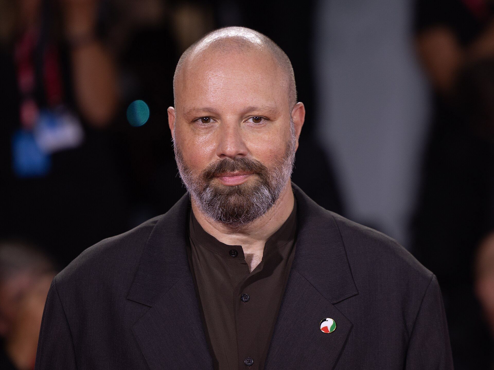

יורגוס לנתימוס (Yorgos Lanthimos) הוא ככל הנראה הבמאי שהצליח יותר מכל אחר בעשור האחרון להזיז את הגבול בין קולנוע הפסטיבלים המנוכר לבין הקהל הרחב. היווני שהחל את דרכו בסרטים קטנים, מטרידים ומצחיקים בצורה מבעיתה, מוצא את עצמו כיום בטקסי פרסים, עם כוכבי ענק ותקציבים שפעם לא היה מעז לחלום עליהם — ובלי לוותר על הזרות שהפכה אותו למותג. במילים אחרות: לנתימוס הפך את המוזר למרכזי.

השאלה המעניינת אינה רק איך זה קרה, אלא מה זה אומר על הטעם הקולנועי של התקופה. כשקהל רחב יוצא מרוצה מסרט שבו דמויות מדברות במשלב מלאכותי, מצייתות לחוקים אבסורדיים ומתנהגות כאילו הורכבו מחדש — משהו בציפיות שלנו מהמסך הגדול השתנה.

## מי זה יורגוס לנתימוס ומאיפה הוא הגיע?

לנתימוס צמח מתוך מה שכונה בעיתונות "הגל היווני המוזר" (Greek Weird Wave) — קבוצת יוצרים שפעלו על רקע המשבר הכלכלי החריף ביוון, וייצרו קולנוע קר, מנוכר ומלא אלימות מרומזת. פריצתו הבין-לאומית הגיעה עם "ניב" (Dogtooth), דרמה מטרידה על משפחה שכולאת את ילדיה מהעולם ומלמדת אותם שפה מעוותת. הסרט זעזע, הצחיק במקומות הלא-נכונים, וסימן קול חדש לגמרי.

משם הדרך הובילה מערבה. עם המעבר לאנגלית ולשחקנים בין-לאומיים, לנתימוס לא ריכך את החזון — הוא רק הלביש אותו בהפקה גדולה יותר. התוצאה היא אחד המעברים המרתקים בקולנוע העכשווי מיוצר שוליים לשם ממוסד.

## מה מייחד את הסגנון של לנתימוס?

מי שצפה בסרט אחד של לנתימוס מזהה מייד את הבא בתור. יש כאן חתימה ברורה:

- **דיאלוג שטוח ומלאכותי** — הדמויות מדברות כאילו קראו את המשפטים זו הראשונה, מה שיוצר ניכור והומור בו-זמנית.
- **עולמות עם חוקים משלהם** — חברות דיסטופיות או טקסים חברתיים שנראים הגיוניים לדמויות ואבסורדיים לצופה.
- **מצלמה שמתבוננת בקרירות** — עדשות רחבות, קומפוזיציות סימטריות ולעיתים עיוותי "עין הדג".
- **אכזריות רגשית עם הומור יבש** — הסרטים כואבים ומצחיקים באותה נשימה.

שיתוף הפעולה שלו עם השחקנית אמה סטון הפך לאחד הצמדים הפוריים בקולנוע העכשווי, לצד עבודה חוזרת עם שחקנים כמו קולין פארל ורייצ'ל וייס.

## איפה כדאי להתחיל? מדריך צפייה

לנתימוס אינו במאי "קל", ולכן סדר הצפייה חשוב. הטבלה הבאה ממפה את היצירות המרכזיות לפי מידת הנגישות שלהן לצופה חדש:

| הסרט | על מה | רמת אתגר | למי מתאים |
|------|-------|-----------|-----------|
| מסכנים יצורים | אודיסאה פמיניסטית פרועה על אישה שנולדה מחדש | בינונית | נקודת כניסה מצוינת |
| הלובסטר | דיסטופיה על רווקים שהופכים לחיות | בינונית-גבוהה | חובבי סאטירה |
| ניב | משפחה שכולאת את ילדיה מהעולם | גבוהה מאוד | הצופה האמיץ |
| הרוזנת המועדפת | דרמת חצר מלכותית עוקצנית | נמוכה יחסית | מי שאוהב דרמה תקופתית |
| סוגים של טוב לב | שלושה סיפורים מוזרים ואפלים | גבוהה | מעריצים ותיקים |

מי שרוצה כניסה רכה יבחר ב"הרוזנת המועדפת", דרמת חצר שנונה ונגישה יחסית. מי שמחפש את הלנתימוס ה"טהור" ילך ל"הלובסטר". ומי שרוצה את מה שכבש את הביקורת בשנים האחרונות יתחיל ב**מסכנים יצורים** — הסרט שהביא ליורגוס לנתימוס את הקהל הרחב ביותר בקריירה.

## למה דווקא עכשיו הקהל מתחבר למוזר?

העלייה של לנתימoס אינה מקרית. בעידן שבו סרטי גיבורי-על נוסחתיים החלו לעייף חלק גדול מהצופים, גובר הרעב ליצירות מקוריות, מסקרנות ובלתי צפויות. אולפנים עצמאיים ופסטיבלים כמו קאן, ונציה וברלין דחפו קדימה יוצרים בעלי חזון מובהק, ולנתימוס הפך לפנים של המגמה הזו.

גם בישראל ניכרת התופעה: הקרנות של סרטיו בסינמטקים ובפסטיבלי קולנוע מושכות קהל צעיר שמחפש חוויה אחרת, לא צפויה, כזו שממשיכה להדהד גם ימים אחרי הצפייה. הזרות כבר אינה מכשול — היא הפכה לחלק מהמשיכה.

## מה הלאה?

האתגר הגדול של לנתימוס יהיה לשמר את הקצה שלו גם כשהוא נע במרכז התעשייה. ההיסטוריה מלאה ביוצרים נועזים שהתמסדו ואיבדו את הניצוץ. אבל אם יש משהו שאפשר ללמוד מהקריירה שלו עד כה, זה שהוא מוכן לקחת סיכונים גם כשאין בכך צורך מסחרי. וזה בדיוק מה שהופך כל סרט חדש שלו לאירוע קולנועי שכדאי לסמן ביומן.
