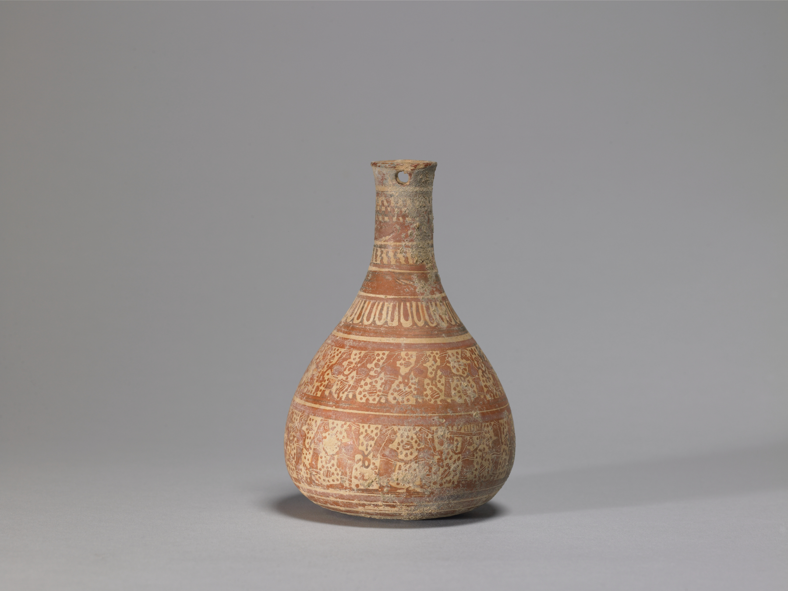

מה משותף למכשפה מהאי אֵיאיה, לאשת מלך ספרטה ולשבויות טרויה? כולן קיבלו לאחרונה את מה שנמנע מהן במשך אלפי שנים — קול משלהן. **מיתולוגיה פמיניסטית** היא אחת המגמות הבולטות בספרות העכשווית: גל של רומנים שמספרים מחדש את המיתוסים היווניים והקלאסיים מנקודת מבטן של הדמויות הנשיות שהושתקו, הודחקו או שימשו רק כתפאורה לגבורתם של גברים. התוצאה היא ספרות פופולרית, אינטליגנטית ומרגשת, שכובשת מדפי רבי־מכר גם בישראל.

## מה זה בעצם ז'אנר המיתולוגיה הפמיניסטית?

מדובר בסיפור מחדש (retelling) של מיתוסים מוכרים — לרוב יווניים — כשהעדשה מוסטת מהגיבור הגברי אל האישה שנותרה בשוליים. במקום אודיסאוס הערמומי, אנחנו שומעים את קירקה. במקום אכילס האמיץ, אנחנו מקשיבות לבריסאיס, השבויה שהפכה לשלל מלחמה. הרעיון פשוט אך רדיקלי: לקחת נרטיב בן אלפי שנים, שנכתב כמעט תמיד בידי גברים, ולשאול — ומה חשבה *היא*?

המהלך הזה אינו רק תרגיל אקדמי. הוא מחזיר סובייקטיביות לדמויות שהיו אובייקטים בלבד, והופך אותן מפרסים שמנצחים עליהם, מפתיינות מסוכנות או מנשים בוכיות — לבנות אדם מלאות.

## מי הסופרות שהובילו את הגל?

הדמות המזוהה ביותר עם הז'אנר היא **מדלין מילר** (Madeline Miller), חוקרת קלאסיקות אמריקאית. ספרה "שיר לאכילס" זכה בפרס אורנג' היוקרתי, אך פריצתה האמיתית הגיעה עם "קירקה" — מונולוג עוצמתי מפי המכשפה שאודיסאוס פוגש במסעו. מילר לוקחת דמות שוליים ומעניקה לה סאגה שלמה של גדילה, נטישה ועצמאות.

לצידה בולטת הבריטית **פאט בארקר** (Pat Barker), סופרת ותיקה ועטורת פרסים, שברומן "שתיקת הנשים" מספרת את סיפור מלחמת טרויה מפי בריסאיס והשבויות. גם **נטלי היינס** (Natalie Haynes), עם "אלף ספינות", ו**ג'ניפר סיינט** עם "אריאדנה", תרמו לגל. חשוב לזכור גם את מרגרט אטווד, שכבר ב"הפנלופיאדה" נתנה את קולה של אשת אודיסאוס — הרבה לפני שהמגמה הפכה לטרנד.

### למה דווקא עכשיו?

התזמון אינו מקרי. עלייתו של הז'אנר מתכתבת עם השיח הפמיניסטי העכשווי, עם תנועת מי־טו ועם רעב תרבותי לסיפורים שמעניקים קול למוחלשים. המיתוסים היווניים, שנחשבים לתשתית של הספרות המערבית, הם קרקע מושלמת: הם מוכרים דיים כדי ליצור עניין, ופתוחים דיים כדי להתמלא בפרשנות חדשה.

## מדריך קצר: מאיפה כדאי להתחיל?

למתלבטים, הנה מפה בסיסית של הכותרים המרכזיים בז'אנר, רבים מהם זמינים בעברית:

| הספר | הסופרת | הדמות במרכז | למי מתאים |
|---|---|---|---|
| קירקה | מדלין מילר | המכשפה קירקה | למתחילים — נקודת כניסה מושלמת |
| שיר לאכילס | מדלין מילר | פטרוקלוס ואכילס | לאוהבי סיפורי אהבה טרגיים |
| שתיקת הנשים | פאט בארקר | בריסאיס | למחפשים ספרות עמוקה ונוקבת |
| אלף ספינות | נטלי היינס | נשות טרויה | למי שרוצה יריעה רחבה |
| הפנלופיאדה | מרגרט אטווד | פנלופה | לקוראי הקלאסיקה של הז'אנר |

## האם זה עובד גם מעבר למיתולוגיה היוונית?

בהחלט. ההצלחה של המיתולוגיה הפמיניסטית פתחה דלת לכתיבה מחדש גם ממקורות אחרים — אגדות אירופיות, מיתוסים הודיים ומזרח־תיכוניים, ואפילו סיפורי המקרא. הרעיון של "לתת קול למי שהושתק" הפך למנוע יצירתי רחב, וניתן למצוא אותו כיום גם בספרות הפנטזיה ובעיבודים לבמה ולמסך.

## המחיר של ההצלחה

לצד ההתלהבות נשמעת גם ביקורת. יש הטוענים שהז'אנר הפך לנוסחה: קחו מיתוס מוכר, הפכו את הגיבורה לקורבן־שהפך־לחזק, הוסיפו כריכה מעוצבת בזהב, וקבלו רב־מכר. יש בכך אמת — לא כל ספר מצליח לרדת לעומק, ולעיתים ההסטה לנקודת המבט הנשית נעשית שטחית. ובכל זאת, קשה להתעלם מהערך: הז'אנר מכניס קוראות וקוראים חדשים לעולם הקלאסיקות, ומזכיר לנו שהסיפורים העתיקים אינם מאובנים — הם חיים, נושמים ומשתנים עם כל דור שמספר אותם מחדש.

בסופו של דבר, זהו כוחה של הספרות הטובה: להראות שהמיתוס אינו רק סיפור על אלים וגיבורים, אלא מראה שבה כל דור מוצא את פניו שלו.
