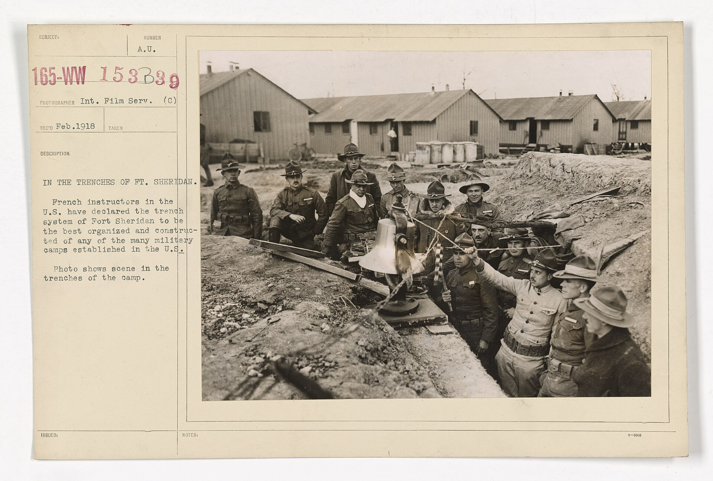

יש רגע בקולנוע שבו אתה שוכח לנשום — לא בגלל מה שקורה על המסך, אלא בגלל איך שהוא מצולם. **הלונג־טייק**, הצילום הרציף והארוך שמסרב להיחתך, הפך בשנים האחרונות לאחד הכלים המסקרנים ביותר בארגז הכלים של הבמאים. במקום לפרק סצנה לעשרות שוטים, המצלמה נעה, נושמת ורצה יחד עם הדמויות — והתוצאה היא חוויה כמעט פיזית של נוכחות בתוך הרגע.

הלונג־טייק (Long Take) אינו המצאה חדשה, אבל בעידן הדיגיטלי הוא חווה תחייה מרשימה. מ"חבל" של אלפרד היצ'קוק בשנות הארבעים ועד "1917" של סם מנדס, מדובר בטכניקה שהפכה מתעלול ראוותני לשפה רגשית שלמה.

## מהו בעצם לונג־טייק?

בפשטות, זהו שוט אחד ארוך שמצולם ברצף, ללא חיתוך גלוי. בעוד ששוט ממוצע בסרט הוליוודי מודרני נמשך שניות בודדות, לונג־טייק יכול להימשך דקות ארוכות — ולעיתים אף להעמיד פנים שסרט שלם צולם בנשימה אחת. הצופה מאבד את תחושת העריכה, ומרגיש שהוא נע בזמן אמת לצד הדמויות.

ההבדל מהותי: העריכה הקלאסית מפרקת ומרכיבה מחדש את המציאות, בעוד הלונג־טייק שומר על שלמותה. אין מפלט לחיתוך שיציל את השחקן שנתקע, ואין מנוחה לצופה שרוצה להסיט מבט.

## למה הלונג־טייק חזר לאופנה?

התשובה נעוצה בשילוב של טכנולוגיה ותשוקה. מצלמות דיגיטליות קלות, מייצבי סטדיקאם מתקדמים ורחפנים אפשרו תנועות שהיו פעם בגדר חלום. במקביל, כלי התפירה הדיגיטליים מאפשרים ל"הסתיר" חיתוכים בין שוטים כך שסרט שלם ייראה כרצף אחד בלתי נגמר.

אבל מעבר לטכני, יש כאן אמירה. בעידן שבו קליפים בני שניות שולטים ברשתות, הלונג־טייק הוא הצהרה של סבלנות. הוא דורש מהצופה להתמסר, ומהיוצר אומץ. אלפונסו קוארון, למשל, בנה קריירה שלמה על שליטה מופתית בזמן — סצנת הרכב ב"ילדים של גברים" עדיין נחשבת בעיני רבים לאחת מפסגות הז'אנר.

## הצילומים הרציפים שנחקקו בזיכרון

כמה יצירות הפכו את הלונג־טייק לחלק בלתי נפרד מזהותן. הנה כמה מהבולטות שבהן:

| היצירה | הבמאי | מה מיוחד בצילום |
|---|---|---|
| בירדמן | אלחנדרו גונזלס איניאריטו | הסרט כולו נראה כשוט אחד רציף |
| 1917 | סם מנדס | מצולם כשתי נשימות ארוכות בשדה הקרב |
| ילדים של גברים | אלפונסו קוארון | סצנת מרדף בזמן אמת שהפכה למופת |
| רומא | אלפונסו קוארון | תנועות מצלמה איטיות שסורקות את הזיכרון |
| חבל | אלפרד היצ'קוק | ניסיון מוקדם ליצור סרט ללא חיתוך גלוי |

כל אחת מהיצירות הללו משתמשת בטכניקה למטרה אחרת: אצל מנדס זו דחיסות המתח של המלחמה, אצל איניאריטו זו הקלסטרופוביה של אמן על סף התמוטטות, ואצל קוארון זו תחושת ההיסחפות חסרת המוצא.

## היתרון הרגשי: להכניס אותנו פנימה

מעבר לראווה, ללונג־טייק יש כוח פסיכולוגי אמיתי. כשאין חיתוך, אין מרחק ביטחון. הצופה כלוא בתוך הסצנה בדיוק כמו הדמות, וחווה את הזמן במלואו — כולל את השקט, ההמתנה והמתח שבין הרגעים. זו הסיבה שסצנות אימה או קרב מצולמות לעיתים בלונג־טייק: הן לא נותנות לנו לנשום.

יש בכך גם סיכון. לונג־טייק שנעשה סתם כדי להרשים עלול להרגיש כמו התפארות ריקה. הגדולים יודעים להשתמש בו כשהוא משרת את הסיפור, ולא כשהוא רק צועק "תראו כמה אנחנו מוכשרים".

## איפה לצפות ולהעריך את הטכניקה?

המקום הטוב ביותר לחוות לונג־טייק הוא על מסך גדול, שבו תנועת המצלמה נבלעת בגוף. הסינמטקים בתל אביב, ירושלים וחיפה מקרינים לא פעם קלאסיקות של היצ'קוק וקוארון במסגרת רטרוספקטיבות, ופסטיבלים בינלאומיים כמו פסטיבל הקולנוע בקאן ופסטיבל ונציה ממשיכים להיות מגרש משחקים לבמאים שאוהבים לאתגר את גבולות העריכה.

בפעם הבאה שתשבו מול סרט ותרגישו שמשהו "תופס" אתכם באופן בלתי מוסבר — שימו לב. ייתכן שהמצלמה פשוט מסרבת לחתוך, וגוררת אתכם פנימה, שוט אחד ארוך שאי אפשר לברוח ממנו.
