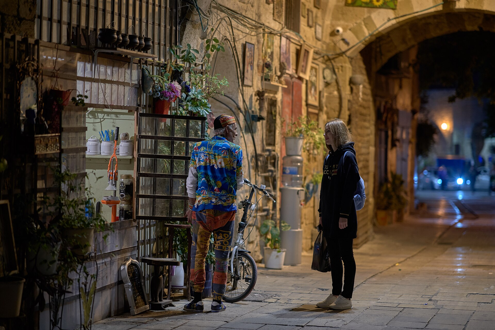

מה קורה כשמכבים את האורות באולם, מפרקים את השורות המרופדות ומזמינים אתכם לקום מהכיסא ולפסוע היישר אל תוך העלילה? זו בדיוק ההבטחה של **תיאטרון אימרסיבי** — ז'אנר סוחף שבו הצופה מפסיק להיות עד פסיבי והופך לשחקן, לבלש, לעד או אפילו לחשוד. במקום מבט חד-כיווני מהאולם אל הבמה, נוצרת חוויה מעגלית שבה גופו של הצופה, בחירותיו ותנועתו במרחב הם חלק בלתי נפרד מהיצירה.

המגמה, שצברה תאוצה עולמית בעשור האחרון, מחלחלת גם אל הבמות בישראל ומעוררת שאלות מרתקות על מהות הצפייה, על גבולות הפרטיות של הצופה ועל עתידו של התיאטרון בעידן שבו כולם רגילים לצרוך סיפורים דרך מסך.

## מה זה בעצם תיאטרון אימרסיבי?

המילה "אימרסיבי" (immersive) פירושה "טובל" או "עוטף", והיא מתארת בדיוק את המהות: הצופה שקוע כולו בתוך העולם הבדיוני. במקום מסך רביעי מדומיין שמפריד בין השחקנים לקהל, התיאטרון האימרסיבי מוחק אותו לחלוטין. לעיתים אתם נעים בין חדרים, לעיתים אתם מקבלים אוזניות המנחות אתכם, ולעיתים דמות אוחזת בידכם ומושכת אתכם אל פינה חשוכה כדי ללחוש לכם סוד.

המאפיינים המרכזיים של הז'אנר:

- **מרחב במקום במה**: ההצגה מתרחשת במבנה שלם — בית נטוש, מחסן, מלון, מוזיאון — ולא על במה אחת.
- **חופש תנועה**: הצופים בוחרים לאן ללכת ואחרי מי לעקוב, כך שכל אחד רואה סיפור מעט אחר.
- **חושים מרובים**: ריחות, מגע, טעמים ומרקמים הופכים לחלק מהדרמטורגיה.
- **חוויה חד-פעמית**: אין שתי הצגות זהות, וגם לא שני צופים שחוו את אותו ערב.

## מאיפה הגיעה המגמה?

רבים רואים בהפקה **"סליפ נו מור"** (Sleep No More) של הקבוצה הבריטית פאנצ'דראנק את נקודת המפנה. ההצגה, עיבוד אפל ל"מקבת" של שייקספיר שהתרחשה בבניין רב-קומות במנהטן, הפכה למופת של הז'אנר: הקהל, עטוי מסכות לבנות, שוטט בחדרים אפלוליים ורדף אחר שחקנים במסדרונות. ההצלחה חסרת התקדים העמידה את התיאטרון האימרסיבי במרכז השיח התרבותי והפכה אותו לתופעה בפני עצמה.

אבל השורשים עמוקים יותר. עוד בשנות השישים והשבעים חתרו יוצרים כמו יז'י גרוטובסקי ואנסמבל "הליווינג תיאטר" לפרק את היחסים המסורתיים בין השחקן לצופה. התיאטרון האימרסיבי של היום הוא, במובן מסוים, גלגול עכשווי ומלוטש של אותם ניסיונות אוונגרד.

## למה דווקא עכשיו?

לא במקרה פורח הז'אנר בעידן הנוכחי. בעולם שבו כל סיפור זמין בלחיצת כפתור, התיאטרון מחפש את מה שאף מסך לא יכול להציע: **נוכחות פיזית בלתי אמצעית**. כשדמות נושמת מולכם, כשאתם מריחים את הזיעה ואת האבק, נוצר חיבור רגשי שאלגוריתם לא מסוגל לשחזר.

התיאטרון האימרסיבי הוא גם תשובה לדור שגדל על משחקי מחשב ומציאות מדומה — דור שרגיל להיות סוכן פעיל בתוך הסיפור ולא רק צרכן שלו. במובן זה, הבחירה לתת לצופה אחריות על החוויה שלו היא לא גימיק אלא שינוי תפיסתי עמוק.

## תיאטרון אימרסיבי בישראל

בישראל הז'אנר עדיין בהתהוות, אך ניצניו ניכרים. **פסטיבל עכו לתיאטרון אחר** משמש זה שנים חממה לעבודות סביבתיות ומשתתפות, שבהן הקהל נודד בין חצרות העיר העתיקה. מוסדות ותיקים כמו **תיאטרון הבימה** ו**התיאטרון הקאמרי** משלבים אלמנטים אימרסיביים בהפקות נבחרות, וקבוצות עצמאיות מייצרות חוויות ייחודיות במרחבים לא שגרתיים — מבתי בד ישנים ועד מקלטים ציבוריים.

האתגר הישראלי כפול: מצד אחד תקציבים מצומצמים בהשוואה להפקות הענק בלונדון ובניו יורק, ומצד שני — קהל סקרן, חם ופתוח לחוויות, שמתאים בדיוק לרוח האינטראקטיבית.

## מדריך מהיר: סוגי חוויות אימרסיביות

| סוג החוויה | מה קורה בה | למי זה מתאים |
|---|---|---|
| שיטוט חופשי | הצופים נעים בחופשיות בין חדרים ועוקבים אחרי מי שירצו | סקרנים שאוהבים לגלות לבד |
| הצגה מודרכת באוזניות | קול מנחה מכוון אתכם במרחב פתוח | מי שמעדיף מסגרת ברורה |
| תיאטרון משתתף | הקהל מקבל תפקיד פעיל ומשפיע על העלילה | אמיצים שלא חוששים מזרקורים |
| ארוחה תיאטרלית | הצגה המשולבת בסעודה רב-חושית | זוגות וחובבי חוויות קולינריות |

## האם זה עתיד התיאטרון?

לא כדאי להיחפז ולהספיד את הבמה המסורתית. הכורסה האדומה, המסך העולה והמרחק המכובד בין השחקן לצופה עדיין מחזיקים קסם שלא ייעלם. אך התיאטרון האימרסיבי מזכיר לנו דבר יסודי: התיאטרון נולד כטקס חי, שיתופי ומשותף — ולא כצפייה שקטה בחושך.

בין אם מדובר במהפכה ובין אם באופנה חולפת, ברור שהמגמה כבר שינתה את השיחה על מהי חוויה תיאטרלית. ובפעם הבאה שתקבלו הזמנה לפסוע אל תוך ההצגה במקום לשבת מולה — כדאי לומר כן.
