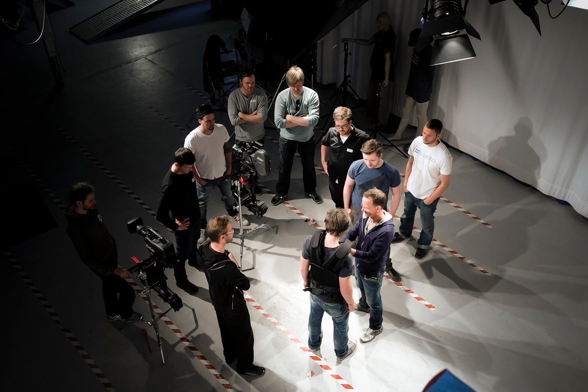

מה משותף לרוצח פסיכולוגי ברחובות ברלין, לחייל בריטי בשדות מלחמת העולם הראשונה ולשחקן ניו־יורקי שקורס על סף פרימיירה? כולם חיים על המסך בתוך **קולנוע בטייק אחד** — סרטים שנראים כאילו צולמו בנשימה אחת ארוכה, בלי חיתוך, בלי הפוגה, בלי רחמים. זו אולי המגמה הסגנונית המרתקת של הקולנוע העכשווי: המצלמה מפסיקה להיות עין נייטרלית והופכת לשחקנית ראשית, שנעה, נושמת ורודפת אחרי הדמויות.

התשובה הקצרה למי שתוהה מה כל ההתלהבות: הצילום הרציף מבטל את התיווך של העריכה ומכריח את הצופה לחוות את הזמן כפי שהדמויות חוות אותו — בזמן אמת, בלי מפלט. וזה, מסתבר, ממכר.

## מה זה בעצם קולנוע בטייק אחד?

בניגוד לקולנוע הקלאסי, שבנוי מעשרות ומאות חיתוכים המחברים זוויות שונות, סרט בטייק אחד שואף להיראות כרצף בלתי־נפסק. לפעמים מדובר בשוט אמיתי וארוך במיוחד; לרוב מדובר באשליה מתוחכמת — סדרת שוטים ארוכים שמאוחים יחד בעריכה דיגיטלית סמויה, כך שהתפר נעלם מהעין.

האפקט הרגשי זהה: תחושה של המשכיות, של נוכחות פיזית בתוך הסצנה. כשאין חיתוך שמאפשר לנו לנשום, המתח מצטבר. הזמן הקולנועי מתלכד עם הזמן שלנו.

### הישג טכני או תרגיל ראווה?

כאן מתחילה המחלוקת. יש הרואים בצילום הרציף פסגה של מלאכת מחשבת בימוית — כוריאוגרפיה מושלמת של שחקנים, תאורה, תפאורה ותנועת מצלמה, שבה כל טעות קטנה שולחת את כולם לחזרה מאפס. אחרים טוענים שזהו לעיתים גימיק ראוותני, שמסב את תשומת הלב אל הצורה על חשבון הסיפור. האמת, כמו תמיד, נמצאת אי־שם באמצע: הטכניקה מזהירה כשהיא משרתת את התוכן, ומעייפת כשהיא רק מתאמצת להרשים.

## הסרטים שהפכו את הצילום הרציף לאמנות

המגמה אינה חדשה לגמרי — כבר אלפרד היצ'קוק ניסה אותה ב"חבל" (Rope) עוד ב־1948, כשהסתיר את החיתוכים בגבו של שחקן. אבל בעשור וחצי האחרונים היא חזרה בגדול, מלוטשת בכלים דיגיטליים.

| הסרט | הבמאי | למה הוא חשוב |
| --- | --- | --- |
| בירדמן | אלחנדרו גונזלס איניאריטו | זכה באוסקר לסרט השנה ועיצב את הז'אנר מחדש |
| 1917 | סאם מנדס | הפך את הצילום הרציף לחוויית מלחמה קלאוסטרופובית |
| ויקטוריה | סבסטיאן שיפר | שוט אמיתי אחד, ללא איחוי, לאורך יותר משעתיים |
| התיבה הרוסית | אלכסנדר סוקורוב | מסע יחיד דרך מוזיאון ההרמיטאז' בשוט בודד |

"בירדמן" של איניאריטו, בליווי הצילום המופתי של עמנואל לובצקי, הוא אולי נקודת המפנה: הוא לקח את הטכניקה מהניסוי אל המיינסטרים והוכיח שאפשר גם לזכות בפרסים הגדולים. "1917" של סאם מנדס הוסיף לה ממד רגשי־היסטורי, כשהפך את שדה הקרב למסדרון אחד ארוך של אימה. "ויקטוריה" הגרמני, לעומת זאת, סירב לרמות: הוא צולם בשוט אמיתי ובלתי־נפסק, מעשה נסים לוגיסטי שמזכיר שלפעמים האשליה מיותרת.

## למה דווקא עכשיו הקהל מכור לזה?

בעידן של גלילה אינסופית, קליפים בני שניות והסחות דעת מכל מסך, יש משהו כמעט מרדני בסרט שמסרב לחתוך. הצילום הרציף דורש מאיתנו תשומת לב מלאה, נוכחות, סבלנות. הוא מציע חוויה הפוכה מזו של הטלפון — טוטאלית, שוטפת, בלתי־ניתנת לדילוג.

יש בכך גם אמירה על אותנטיות. בעולם רווי אפקטים דיגיטליים, שוט ארוך שבו הכול קורה "באמת", מול העיניים, מחזיר לקולנוע תחושת אמינות פיזית. אנחנו יודעים שאיש לא רימה אותנו בעריכה, ושהשחקנים באמת עברו את המסע הזה בגוף אחד.

### איך צופים בזה נכון?

המלצה קטנה: את הסרטים האלה כדאי לראות במסך גדול, רצוי בסינמטק או באולם קולנוע איכותי, ובלי הפסקות. חלק מהקסם הוא בדיוק ההתמסרות לזרימה. צפייה מקוטעת בבית, עם עצירות לקפה, פשוט הורגת את האפקט שלמענו נבנה כל הסרט.

## מה הלאה?

הצילום הרציף כבר חלחל גם לטלוויזיה — פרקים שלמים בסדרות מתח וסרטי אקשן משתמשים בו כדי להעצים סצנות קרב או מרדף. ככל שהכלים הדיגיטליים משתכללים, כך קל יותר להסתיר את התפרים, והפיתוי לבמאים רק גדל. השאלה היא אם המגמה תישאר כלי אמנותי מדויק, או תישחק לכדי אפקט שחוק. בינתיים, כל עוד יש במאים בקומתם של איניאריטו ומנדס, שווה לעצור את הגלילה — ולתת למצלמה לקחת אותנו למסע בנשימה אחת.
