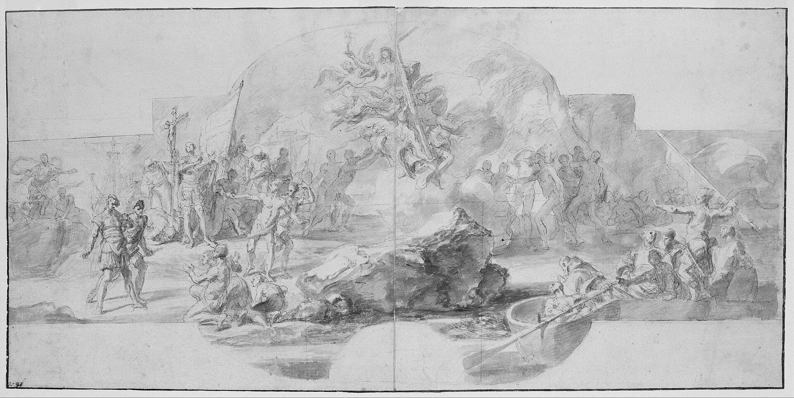

במשך עשרות שנים נחשב הציור הפיגורטיבי — זה שמצייר דמות, גוף או נוף מזוהה — כמעט למילה גסה בעולם האמנות העכשווית. המופשט, המושגי והמיצג תפסו את קדמת הבמה, והדיוקן נדחק לפינה כשריד שמרני. אבל בשנים האחרונות מתחולל היפוך: **הציור הפיגורטיבי חזר לחזית**, וגלריות ומוזיאונים מובילים מציגים גל של אמנים שמחזירים את הפנים האנושיות אל מרכז הבד.

התשובה הקצרה לשאלה "למה עכשיו" היא שהדמות חזרה להיות כלי רב-עוצמה לדבר על זהות, גוף, מוצא ושייכות — נושאים שמעסיקים את התרבות העכשווית יותר מתמיד. הציור הפיגורטיבי אינו חזרה נוסטלגית לעבר, אלא שפה מחודשת לשאלות בוערות של ההווה.

## מדוע הציור הפיגורטיבי חוזר דווקא עכשיו?

רבים רואים בתחייה הזו תגובה ישירה לעידן הדימוי הדיגיטלי. בעולם שמוצף בסלפי, בפילטרים ובדימויים שנוצרים בבינה מלאכותית, יש משהו כמעט מהפכני במגע היד, במשיכת המכחול ובזמן האיטי שנדרש כדי לצייר פנים. הציור הפיגורטיבי מציע נוכחות פיזית ורגשית שהמסך אינו יכול לספק.

גורם נוסף הוא הפוליטיקה של הייצוג. אמנים צעירים — רבים מהם מקהילות שבעבר לא זכו לנוכחות על קירות המוזיאון — משתמשים בדיוקן כדי להעמיד דמויות שנעדרו מההיסטוריה של האמנות. הציור הופך לאקט של הכרה: מי ראוי להיות מצויר, מי ראוי להיתלות על הקיר.

### מהמופשט אל הדמות

המעבר ניכר גם אצל אמנים ותיקים. דיוויד הוקני (David Hockney), שממשיך לצייר דיוקנאות ונופים בצבעוניות עזה גם בגיל מבוגר, הפך לגיבור תרבות מחודש, ותערוכות הענק שלו שוברות שיאי ביקורים. לצידו זכו אמנים כמו פיטר דויג לתשומת לב עצומה על ציור נרטיבי, אווירתי, שמערבב זיכרון ודמיון.

## מי מובילים את הגל הפיגורטיבי?

הזירה הבינלאומית מלאה בשמות שהפכו הציור הפיגורטיבי למרכז השיח. אמנים כמו קרי ג'יימס מרשל, שמעמיד דמויות שחורות במרכז קנבס גדול-ממדים, או ג'ני סאוויל, שמציירת גופים בשרניים ומונומנטליים, הפכו לדמויות מפתח. הביקוש ליצירותיהם במכירות הפומביות מעיד עד כמה השוק חזר לחבק את הדמות.

| אמן/ית | מוקד היצירה | למה זה מסקרן |
|---|---|---|
| דיוויד הוקני | דיוקנאות ונופים צבעוניים | חוגג את הראייה והשמחה שבצבע |
| קרי ג'יימס מרשל | דמויות שחורות מונומנטליות | מתקן היעדרות היסטורית מהמוזיאון |
| ג'ני סאוויל | הגוף האנושי בקנה מידה עצום | מאתגר תפיסות של יופי ובשר |
| פיטר דויג | ציור נרטיבי אווירתי | מטשטש גבול בין זיכרון לדמיון |

## מה קורה בישראל?

גם בזירה המקומית ניכרת התעניינות מחודשת בציור פיגורטיבי. מוזיאון תל אביב לאמנות והגלריות המובילות בעיר מקדישים תערוכות ליוצרים שחוזרים אל הדמות, אל הדיוקן ואל הנוף המקומי. הדיאלוג בין מסורת הציור הישראלי — משנות המדינה ועד היום — לבין השפה העכשווית יוצר שדה עשיר במיוחד.

האמנות הישראלית תמיד שמרה על זיקה חזקה לדמות ולסיפור, גם בתקופות שבהן העולם דהר אל המופשט. לכן הגל הנוכחי מרגיש כאן פחות כמו מהפכה ויותר כמו חזרה הביתה — הזדמנות לצייר את הפנים של החברה הישראלית, על מורכבותה, מתחיה וקהילותיה השונות.

### מדוע דווקא הדיוקן?

הדיוקן הוא אולי הז'אנר הטעון ביותר בחזרה הזו. לצייר אדם פירושו להתבונן בו לאורך זמן, להעניק לו נוכחות ולדרוש מהצופה מבט הדדי. בעידן של גלילה אינסופית, הדיוקן המצויר עוצר את הזמן ומכריח מפגש. אולי בכך טמון סוד הכוח שלו.

## איך צופים בציור פיגורטיבי בצורה מעמיקה?

- **התעכבו על המבט:** לאן מופנות עיני הדמות, ומה היחס שלה אל הצופה?
- **בחנו את המשיכה:** ציור חלק וריאליסטי מספר סיפור אחר מציור מרוח ואקספרסיבי.
- **שאלו מי מצויר:** נוכחותה של הדמות היא לרוב אמירה על ייצוג ועל כוח.
- **הקשר תרבותי:** בגדים, רקע ואביזרים טוענים את הדמות במשמעות היסטורית וחברתית.

החזרה של הציור הפיגורטיבי אינה מגמה חולפת אלא סימן לצורך עמוק — הרצון לראות את עצמנו, זה את זה, ואת בני האדם שסביבנו, דרך המבט האיטי, הקשוב והאנושי של המכחול. בעולם שמתרוקן מנוכחות פיזית, הדמות שבה אל הבד כדי להזכיר לנו מי אנחנו.
