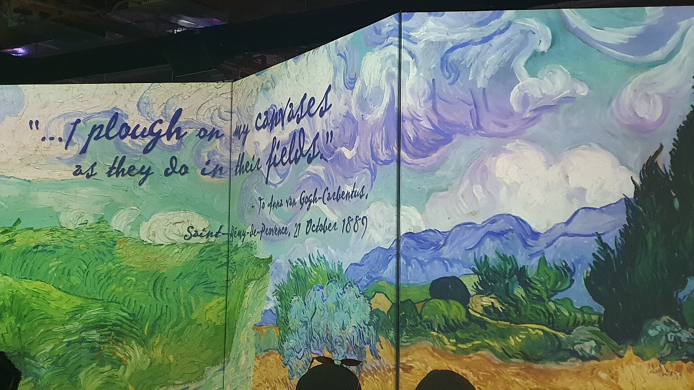

האמנות הסוחפת היא בדיוק מה ששמה מבטיח: תערוכה שבמקום להעמיד אותך מול תמונה תלויה על קיר, מכניסה אותך פנימה — אל תוך הצבע, הקו והתנועה. במקום לצעוד בין מסגרות בשקט מוזיאלי, אתה עומד באולם חשוך שכל קירותיו, הרצפה ולעיתים גם התקרה הופכים למסך ענק שנע, נושם ומשתנה. **אמנות סוחפת** הפכה בשנים האחרונות לאחת התופעות המדוברות בעולם התרבות החזותית, והיא ממשיכה לכבוש קהלים גם בישראל.

## מה זה בעצם אמנות סוחפת?

המונח מתייחס לחוויות אמנות אימרסיביות (immersive) — כאלה שמעטפות את הצופה בכל החושים. ההקרנה משתלטת על החלל כולו, פסקול מקיף ממלא את האוזניים, ולעיתים מתווספים בושם, ערפל או משטחים אינטראקטיביים שמגיבים למגע. התוצאה היא טשטוש מכוון של הגבול בין המבקר ליצירה: אתה כבר לא צופה מבחוץ, אתה חלק מהתמונה.

לב העניין הוא שינוי היחס בין הצופה לאמנות. במוזיאון מסורתי היצירה קבועה ואתה נע סביבה; באמנות סוחפת היצירה נעה סביבך, זורמת, מתפרקת ומתרכזת מחדש. זו חוויה גופנית לא פחות מאשר חוויה שכלית.

## מאיפה זה הגיע?

הגל הגדול פרץ עם סדרת התערוכות המוקרנות שהוקדשו לווינסנט ואן גוך (Van Gogh), שנדדו בין ערים רבות בעולם והפכו את "ליל כוכבים" ואת שדות החמניות לים נע של אור. במקביל, קבוצת האמנים היפנית טימלאב (teamLab) הרחיקה לכת והקימה מוזיאונים דיגיטליים שלמים בטוקיו, שבהם המבקרים מהלכים בתוך מפלים וירטואליים ושדות פרחים אינסופיים.

המגמה נשענת על שני זרמים שנפגשו: מצד אחד מסורת ארוכה של אמנות סביבתית ומיצבים (installations) של אמנים כמו יאיוי קוסאמה על חדרי המראות שלה; מצד שני קפיצת מדרגה טכנולוגית בהקרנה, בסאונד ובחיישנים. כשהמחיר של מקרנים איכותיים ירד והתוכנה השתכללה, פתאום כל אולם תעשייתי נטוש יכול היה להפוך לגלריה נעה.

## למה הקהל מתאהב?

הסוד הוא הנגישות. אמנות סוחפת מדברת גם אל מי שמעולם לא הרגיש בבית במוזיאון קלאסי. אין צורך בידע מוקדם, אין חרדת קודש מול יצירת מופת — יש רק חוויה שוטפת שקל להתמסר אליה. עבור משפחות עם ילדים, זוגות בדייט או קבוצות חברים, זהו בילוי חושי שמצטלם נהדר וזוכר את עצמו.

יש בכך גם ערך חינוכי אמיתי: רבים יוצאים מהתערוכה עם סקרנות אמיתית לגבי ואן גוך, קלימט או מונה, ורצון לראות את המקור. במובן זה, האמנות הסוחפת פועלת כשער כניסה — היא מזמינה קהל חדש אל עולם שנתפס בעבר כסגור ואליטיסטי.

## והביקורת?

לא כל מבקרי האמנות מתלהבים. הטענה המרכזית: חלק מההפקות הן ראווה טכנולוגית שמלבישה אנימציה נוצצת על יצירות מוכרות, בלי להוסיף פרשנות או עומק. במקום מפגש עם המכחול המקורי של האמן, מקבלים גרסה מוגדלת ונעה שלו — מרהיבה אך שטוחה. יש שמזהירים מפני "דיסנילנד של האמנות", חוויה שמעדיפה את הרגש הרגעי על פני ההתבוננות האיטית שיצירה גדולה דורשת.

מנגד, כשמדובר בקבוצות שיוצרות תוכן דיגיטלי מקורי — ולא רק מקרינות ציורים קיימים — הוויכוח משתנה. אז מדובר בז'אנר אמנותי חדש בפני עצמו, שראוי להישפט לפי כלליו שלו ולא כתחליף למוזיאון.

## אמנות סוחפת בישראל

גם בישראל הגיעו הפקות סוחפות לאולמות תצוגה גדולים ומרכזי אירועים, בעיקר בתל אביב ובאזורי התעשייה שהפכו למרחבי תרבות. מוסדות מבוססים כמו מוזיאון תל אביב לאמנות ומוזיאון ישראל בירושלים מתנסים אף הם באלמנטים דיגיטליים ואינטראקטיביים בתערוכות, כדי לדבר אל קהל צעיר יותר. הביקוש מעיד על צמא ישראלי לחוויות תרבות שהן גם אירוע חברתי.

### טבלת השוואה: תערוכה מסורתית מול אמנות סוחפת

| מאפיין | תערוכה מסורתית | אמנות סוחפת |
|---|---|---|
| מיקום היצירה | על הקיר, במרחק | סביב הצופה, בכל החלל |
| חוש מרכזי | ראייה, התבוננות | ראייה, שמיעה, לעיתים מגע |
| קהל יעד | חובבי אמנות | קהל רחב, כולל משפחות |
| קצב הביקור | איטי, מהורהר | דינמי, זורם |
| היתרון | מפגש עם המקור | חוויה עוטפת ונגישה |
| הביקורת | נתפס לעיתים כמרוחק | סכנת ראווה על חשבון עומק |

## אז שווה ללכת?

כן — אם מגיעים עם הציפייה הנכונה. אמנות סוחפת אינה מחליפה את הריגוש של לעמוד מול הבד המקורי, אבל היא מציעה משהו אחר לגמרי: חוויה קולקטיבית, חושית וזמינה שמצליחה לגעת גם באנשים שהמוזיאון הרחיק אותם. הכי חכם לשלב — לצאת מהתערוכה הסוחפת ואז לתכנן ביקור במוזיאון "אמיתי", כדי לפגוש את המכחול שמאחורי כל האור הזה.
