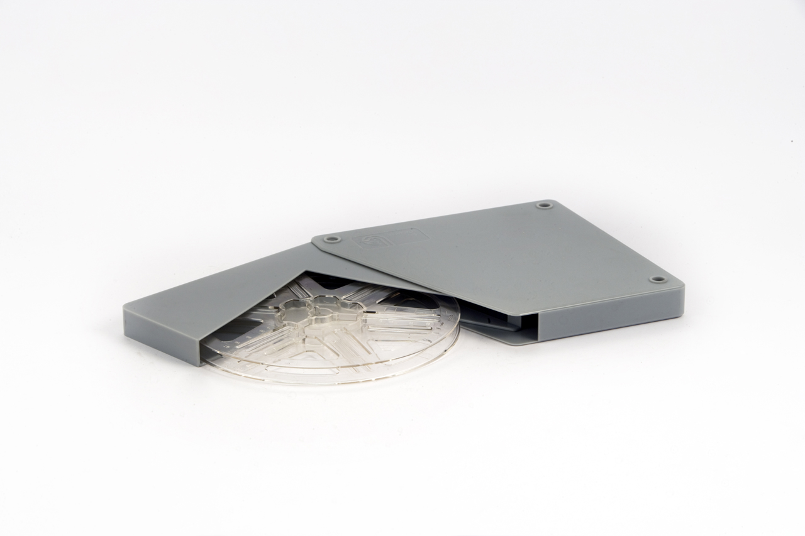

בזמן שכמעט כל סרט מסחרי מצולם היום במצלמות דיגיטליות, קבוצה קטנה ועקשנית של במאים בכירים בוחרת ללכת אחורה — אל גלילי הסלולויד. **צילום סרטים בפילם** הפך בשנים האחרונות לסמל סטטוס אמנותי, הצהרה על נאמנות למדיום, וגם לחוויה חושית שונה לגמרי בחדר האפל. מה עומד מאחורי התחייה הזו, ולמה היא מסקרנת גם את הקהל הישראלי?

## מה זה בכלל צילום סרטים בפילם?

עד לפני כשני עשורים, כל סרט קולנוע צולם על גלילי פילם פיזיים — רצועות רגישות לאור שעליהן נחרטת התמונה. המהפכה הדיגיטלית סחפה את התעשייה במהירות: המצלמות הפכו זולות יותר, גמישות יותר וקלות לעריכה. אבל דווקא בשל כך, החזרה אל הפילם קיבלה משמעות של בחירה מודעת. יוצרים שמצלמים היום על 35 מ"מ או על הפורמט הרחב של 70 מ"מ עושים זאת מתוך אמונה שהמרקם, הגרעיניות והעומק של התמונה האנלוגית פשוט לא ניתנים לחיקוי.

## מי מוביל את התחייה?

השם הבולט ביותר הוא כריסטופר נולאן (Christopher Nolan), שהפך את השימוש באימקס ובפילם רחב לחלק מחתימתו. סרטים כמו "דנקרק" ו"אופנהיימר" צולמו ברובם על פורמטים רחבים, ונולאן דוחף כבר שנים להקרנות פילם בבתי קולנוע נבחרים ברחבי העולם. לצידו עומד קוונטין טרנטינו (Quentin Tarantino), חובב סלולויד מוצהר, שאף רכש בית קולנוע בלוס אנג'לס כדי להבטיח הקרנות פילם.

גם פול תומאס אנדרסון, ופרנסיס פורד קופולה בפרויקטים מאוחרים, מזוהים עם המחויבות למדיום. אצל רבים מהם זה לא רק עניין טכני אלא עמדה תרבותית: שמירה על מלאכת הקולנוע כאומנות חומרית, לא רק כקבצים על כונן.

### למה דווקא עכשיו?

לא במקרה התחייה הזו קורית במקביל לחזרת הוויניל בעולם המוזיקה ולעניין המחודש בצילום אנלוגי בקרב צעירים. יש כאן געגוע רחב לחומריות — לתחושה שיצירה היא דבר פיזי שאפשר לגעת בו, לא רק זרם נתונים. ככל שהעולם הופך מהיר, נקי וחלק יותר, גובר הקסם של הפגמים: הגרעיניות, ריצוד האור, החום של הצבע.

## פילם מול דיגיטל: מה באמת ההבדל?

| היבט | צילום בפילם | צילום דיגיטלי |
|---|---|---|
| מרקם התמונה | גרעיני, חם, בעל עומק | חד ונקי, לעיתים "סטרילי" |
| טווח דינמי | גבוה מאוד באזורי אור | משתפר אך שונה באופיו |
| עלות והפקה | יקר, דורש מעבדות | זול וגמיש יחסית |
| חוויית עריכה | מורכבת ואיטית | מהירה ומיידית |
| תחושת "קולנוע" | נתפסת כאותנטית | תלוית עיבוד |

חשוב לומר: אין כאן "טוב" מול "רע". צלמים רבים מפיקים דיגיטלית תוצאות מרהיבות, ורבים מהצופים לא יבחינו בהבדל. אבל בהקרנת אימקס אמיתית על מסך ענק, ההבדל בחדות ובעומק יכול להיות מכה בטן של ממש.

## מה קורה בישראל?

גם בישראל אפשר לחוש את הגל. הסינמטקים בתל אביב, בירושלים ובחיפה מקדישים מדי פעם הקרנות מיוחדות בפילם, שמושכות קהל של חובבי קולנוע צמאים לחוויה המקורית. במקביל, גובר העניין בקרב צלמים וסטודנטים לקולנוע בצילום אנלוגי — כתרגיל, כאתגר וכהצהרה. עבור דור שגדל על סטרימינג בטלפון, ישיבה באולם חשוך מול הקרנת פילם היא כמעט מעשה מרדני.

## האם זו רק אופנה חולפת?

קשה לדעת. עלות הצילום בפילם גבוהה, מספר המעבדות בעולם הצטמצם, ורוב התעשייה נשארת דיגיטלית מטעמי יעילות. אבל כל עוד יוצרים בעלי שם ממשיכים להיאבק על המדיום — ולהצליח בקופות — נראה שהסלולויד לא הולך לשום מקום. אולי, כמו הוויניל, הוא לא יחזור לשלוט בשוק, אבל ימשיך להתקיים כאי של חומריות ואיכות בעולם דיגיטלי. ולפעמים, דווקא הבחירה ללכת אחורה היא הצעד הכי קדימה.
