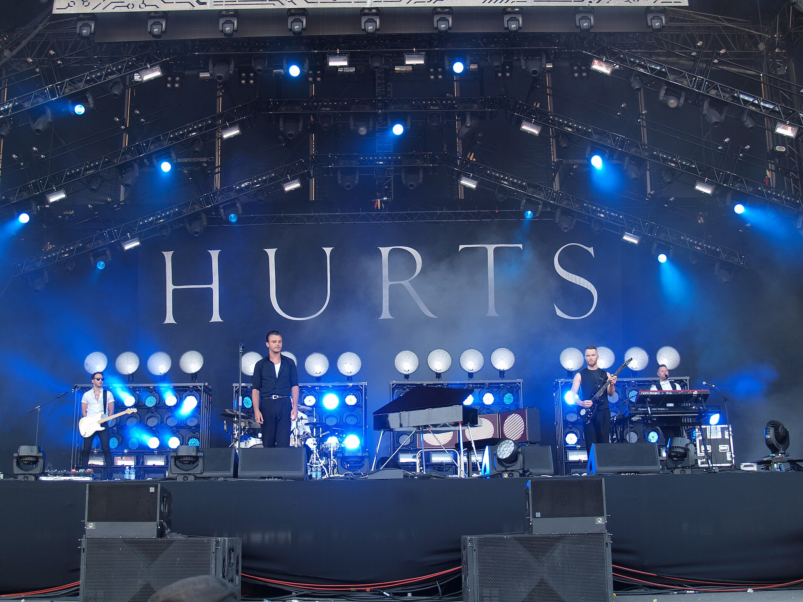

יש מי שהספיד את הג'אז שוב ושוב לאורך העשורים — יותר מדי מורכב, יותר מדי אנין, שריד של מועדוני עשן שהזמן חלף עליהם. ובכל זאת, **התחייה של הג'אז** היא אחת התופעות המפתיעות של המוזיקה בשנים האחרונות: דור חדש של נגנים, רבים מהם בשנות העשרים והשלושים לחייהם, מחזיר את הז'אנר אל קדמת הבמה — צעיר יותר, קצבי יותר, ופתוח לכל השפעה אפשרית.

התשובה הקצרה לשאלה "למה עכשיו?" היא שילוב של שלושה כוחות: סצנה לונדונית רותחת שהתפוצצה לתודעה העולמית, פלטפורמות סטרימינג שהנגישו את הז'אנר לאוזניים צעירות, ודור נגנים שגדל על היפ־הופ ואלקטרוניקה ולא רואה סתירה בין גרוב לאלתור. הג'אז של היום פחות עסוק בטהרנות, ויותר בתחושה.

## מה מניע את הגל החדש?

אם פעם הג'אז נתפס כמוזיקה ל"מבינים", הרי שהגל הנוכחי שובר את המחיצה הזו. ההתחייה של הג'אז נשענת על ערבוב חופשי של ז'אנרים: משוגר ולתפיל־הופ, ניחוחות אפרוביט וברוקן־ביט, ואפילו נגיעות של אלקטרוניקה עכשווית. התוצאה היא מוזיקה שאפשר לרקוד לצליליה, ולא רק להאזין לה בישיבה מכובדת.

לא פחות חשוב הוא הממד החברתי. הדור החדש של הנגנים מדבר על זהות, שורשים והגירה, ומחבר את הג'אז בחזרה לשורשיו כמוזיקת מחאה וקהילה. זה כבר לא נוסטלגיה — זו הצהרה עכשווית.

## הסצנה הלונדונית: מוקד הרעש

אי אפשר לדבר על התחייה של הג'אז בלי לונדון. הבירה הבריטית הפכה בשנים האחרונות למעבדה יצירתית סוערת, שממנה יצאו חבורות שהצליחו לגשר בין מועדוני הג'אז לרחבות הריקודים. ההרכב **עזרא קולקטיב** (Ezra Collective), למשל, זכה בהערכה רחבה על שילוב אנרגטי של אפרוביט וגרוב, ומופעיו הפכו לחגיגות של ממש.

מעבר לים, בקליפורניה, הסקסופוניסט **קמאסי וושינגטון** (Kamasi Washington) הוציא יצירות שאפתניות רחבות יריעה, וחיבורו לעולם ההיפ־הופ — בין היתר בעבודה עם קנדריק לאמאר — הביא את הג'אז לקהל שמעולם לא חשב שיאזין לו.

## איפה נכנסת ישראל לתמונה?

המפתיע מכל הוא שישראל מחזיקה בנתח מכובד לחלוטין מהמפה העולמית. שמות ישראליים נמצאים בחזית הג'אז הבינלאומי כבר שנים, וההתחייה הנוכחית רק חיזקה את מעמדם.

הנגן והמלחין **אבישי כהן** — הבסיסט — נחשב לאחד משגרירי הז'אנר הבולטים בעולם, עם שפה ים־תיכונית ייחודית שמערבבת מלודיות מזרחיות עם אלתור. הפסנתרן **שי מאסטרו** בונה קריירה בינלאומית מרשימה עם נגיעה לירית ומופנמת, ואילו החצוצרן **אבישי כהן** (בן שם זהה) מככב בהרכבים בינלאומיים ומקליט לחברת התקליטים היוקרתית ECM.

מאחוריהם צומח דור צעיר של בוגרי בתי הספר למוזיקה בתל אביב ובירושלים, שמחבר בין השפה הג'אזית לשורשים המזרחיים והים־תיכוניים — ויוצר צליל שהוא ישראלי במובהק אך מדבר אל העולם כולו.

## אלבומים ואמנים להתחיל מהם

למי שרוצה להיכנס אל תוך הגל, הנה נקודת פתיחה נוחה — מגוון של קולות שממחישים את קשת ההתחייה:

| אמן / הרכב | מוצא | סגנון בקצרה |
|---|---|---|
| עזרא קולקטיב | לונדון | אפרוביט וגרוב סוער |
| קמאסי וושינגטון | לוס אנג'לס | ג'אז רחב יריעה ורוחני |
| אבישי כהן (בסיסט) | ישראל | ג'אז ים־תיכוני מלודי |
| שי מאסטרו | ישראל | פסנתר לירי ומופנם |
| נובל פייס | לונדון | ניאו־סול וג'אז עדין |

## הג'אז החי חוזר למועדונים

ההתחייה אינה רק דיגיטלית. בתל אביב ובירושלים ניכרת פריחה של ערבי ג'אז חיים, סדנאות אלתור וג'אם סשנים ספונטניים, וקהל צעיר מגלה מחדש את חוויית הצליל שנוצר לנגד עיניו. הסינמטקים ומרכזי התרבות מארחים סדרות ג'אז, ופסטיבלים ייעודיים מושכים קהלים גדלים משנה לשנה.

היופי בגל הזה הוא שהוא לא מבקש להחזיר את העבר, אלא להמציא אותו מחדש. הג'אז של 2020 ואילך אינו מוזיאון — הוא שפה חיה, שמדברת אל דור שגדל על פלייליסטים אינסופיים וצמא לאותנטיות. ואולי זו בדיוק הסיבה שהוא חזר: בעולם רווי בהפקות מהוקצעות עד דק, אין דבר מרגש יותר מקבוצת נגנים שמקשיבים זה לזה ומאלתרים בזמן אמת.
