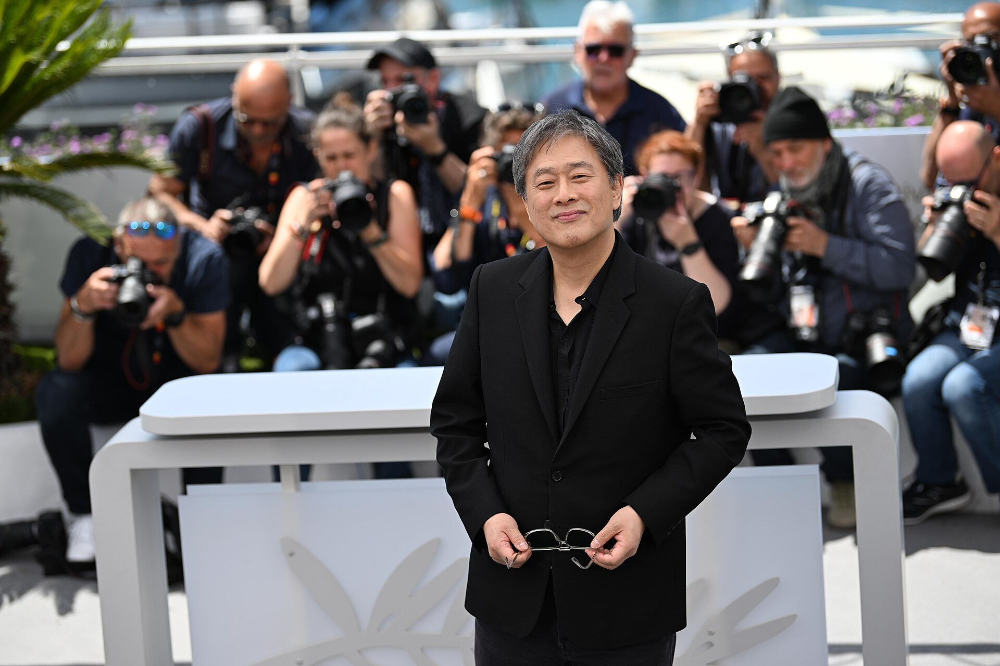

בעשור האחרון קרה משהו שנראה בלתי אפשרי: הקולנוע הקוריאני הפך מסוד שמור של חובבי סינמטק לזרם המרכזי של הקולנוע העולמי. אם פעם הצופה הישראלי הממוצע היה מתקשה לנקוב בשם במאי קוריאני אחד, היום שמות כמו בונג ג'ון-הו ופארק צ'אן-ווק מתגלגלים בשיחות סלון. **הרגע המכונן היה זכיית הסרט "פרזיטים" בארבעה פרסי אוסקר**, כולל הפרס לסרט הטוב ביותר — הפעם הראשונה בהיסטוריה שסרט שאינו דובר אנגלית זכה בפרס היוקרתי. אבל "פרזיטים" היה רק קצה הקרחון של גל תרבותי עמוק הרבה יותר.

## למה הקולנוע הקוריאני מרגיש שונה מכל דבר אחר?

הסוד של הקולנוע הקוריאני טמון בסירוב העיקש שלו לשחק לפי הכללים. בעוד הוליווד מקטלגת סרטים לתאים מסודרים — קומדיה, אימה, דרמה — היוצרים הקוריאנים מערבבים הכול בתוך יצירה אחת בלי לבקש רשות. "פרזיטים" מתחיל כקומדיה חברתית עוקצנית, הופך למותחן, ומסתיים כטרגדיה עקובה מדם — ואף רגע מזה לא מרגיש מאולץ.

המעברים החדים האלה בין רגש לזוועה, בין הומור לביקורת מעמדית, הם חתימת האצבע של הגל. הצופה אף פעם לא לגמרי בטוח לאן הסרט הולך, וזו בדיוק ההנאה. מאחורי הווירטואוזיות הזו עומד גם עומק חברתי: פערי מעמדות, לחצי ההצלחה, בדידות עירונית ואלימות מדוכאת — נושאים שהקולנוע הקוריאני נוגע בהם באומץ שלרוב חסר במיינסטרים המערבי.

## מי הם היוצרים שמובילים את המהפכה?

הגל אינו איש אחד אלא דור שלם של קולנוענים מבריקים, שכל אחד מהם מביא קול ייחודי:

- **בונג ג'ון-הו** — האמן שמאחורי "פרזיטים", "ממורי של רצח" ו"מפלצת". מומחה בערבוב ז'אנרים וביקורת חברתית עטופה במתח.
- **פארק צ'אן-ווק** — אמן הסגנון הוויזואלי, יוצר "אולד בוי" ו"העוזרת", שסרטיו הם ראווה של קומפוזיציה, נקמה ותשוקה.
- **לי צ'אנג-דונג** — הפואט של החבורה, שסרטו "בוער" נחשב לאחד הסרטים המדוברים של השנים האחרונות בפסטיבל קאן.
- **נה הונג-ג'ין** — מלך המותחנים האפלים, שיצר את "היללה", סרט אימה שהצליח להפחיד גם את הצופים המנוסים ביותר.

## מאיפה כדאי להתחיל? מדריך צפייה

הכניסה לעולם הקולנוע הקוריאני יכולה להיות מרתיעה בגלל שפע היצירות. הנה טבלה שתעזור לבחור נקודת פתיחה לפי המצב רוח:

| הסרט | היוצר | הז'אנר | למי מתאים |
|------|-------|--------|-----------|
| פרזיטים | בונג ג'ון-הו | מותחן חברתי | לכל צופה — נקודת כניסה מושלמת |
| אולד בוי | פארק צ'אן-ווק | מותחן נקמה | אוהבי עלילות מפותלות ואלימות סגנונית |
| בוער | לי צ'אנג-דונג | דרמה פסיכולוגית | מעריצי קולנוע איטי ועמוק |
| היללה | נה הונג-ג'ין | אימה | אמיצים בלבד |
| ממורי של רצח | בונג ג'ון-הו | מותחן בלשי | חובבי סיפורי פשע אמיתיים |

## איך הגיע הגל אל הצופה הישראלי?

החשיפה של הקהל הישראלי לקולנוע הקוריאני קרתה בכמה מסלולים מקבילים. **פלטפורמות הסטרימינג** הכניסו סרטים וסדרות קוריאניות ישר לסלון, וההצלחה האדירה של הסדרה "משחק הדיונון" פתחה את התיאבון לתרבות הקוריאנית כולה. במקביל, הסינמטקים בתל אביב, ירושלים וחיפה מקדישים מדי פעם מבחרים לקולנוע האסייתי, ופסטיבלים מקומיים משלבים יצירות קוריאניות בתוכניות שלהם.

מעניין לראות שהקהל הישראלי מתחבר במיוחד לשילוב הזה של רגש גדול וביקורת חברתית — משהו בטמפרמנט הישיר ובעיסוק בפערים חברתיים מהדהד גם כאן. הצופים לומדים במהירות שכתוביות אינן מחסום אלא שער.

## מה הלאה? הגל שלא נעצר

השאלה המעניינת היא האם הגל הקוריאני יישאר ייחודי או יתמסמס לתוך התעשייה העולמית. הסכנה קיימת: הוליווד כבר קונה זכויות לרימייקים, ויוצרים קוריאנים מקבלים הצעות לביים סרטים דוברי אנגלית. אבל בינתיים, כל עוד היוצרים שומרים על העצמאות היצירתית והאומץ הז'אנרי שלהם, **הקולנוע הקוריאני נותר אחד המרחבים המרתקים בקולנוע העכשווי** — מקום שבו אף אחד לא באמת יודע מה עומד לקרות בסצנה הבאה. וזו, בסופו של דבר, ההגדרה הטובה ביותר לקולנוע חי.
