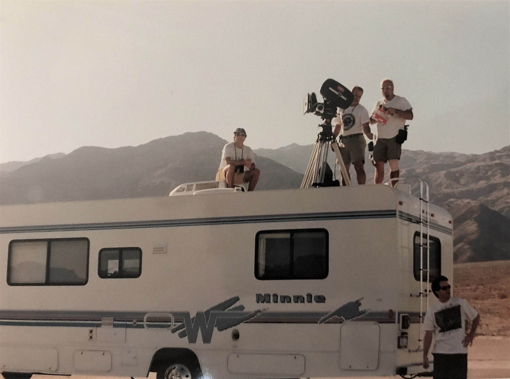

מי שיצא לאחרונה לצפות ב'אופנהיימר' של כריסטופר נולאן או ב'רוצחי הפרחים' של מרטין סקורסזה גילה תופעה שהפכה לכמעט מובנת מאליה: הסרטים ארוכים. שלוש שעות ומעלה על הכיסא הפכו בשנים האחרונות מחריגה נדירה לחלק ממה שנתפס כקולנוע 'רציני' ושאפתני. השאלה הגדולה היא לא רק כמה זמן אנחנו יושבים באולם — אלא מה זה אומר על האופן שבו הקולנוע תופס את עצמו כיום.

## למה הסרטים נהיים ארוכים?

התשובה הקצרה: שילוב של יוקרה אמנותית, כלכלה משתנה ותרבות צפייה חדשה. סרטים ארוכים משדרים היום מסר של חשיבות — כאילו האורך עצמו הוא הצהרה שהיצירה שלפנינו היא 'אירוע' ולא רק בידור של ערב. במאים בעלי מעמד, מאלפונסו קוארון ועד דני וילנב, זוכים לחופש יצירתי שמאפשר להם למתוח את הסיפור הרבה מעבר לגבולות המקובלים בעבר.

פרדוקסלית, דווקא עליית הסטרימינג האיצה את המגמה באולמות. כשכל סרט זמין בלחיצת כפתור בבית, האולפנים מבקשים להפוך את היציאה לקולנוע לחוויה מונומנטלית שאי אפשר לשחזר על הספה — ואורך הוא אחד הכלים לכך. מנגד, פלטפורמות כמו נטפליקס מעניקות ליוצרים כמו סקורסזה תקציב וחופש עריכה שאולפן מסורתי היה מהסס לאשר.

## מי מוביל את המגמה?

בראש המחנה עומדים מה שמכונה 'במאי מחבר' — יוצרים שהקהל בא לראות את החתימה שלהם לא פחות מאשר את הסיפור. כריסטופר נולאן הפך את המשך הזמן לחלק מהשפה הקולנועית שלו, סקורסזה מתעקש על נשימה אפית, וקוונטין טרנטינו בנה קריירה שלמה על סצנות מתוחות שמסרבות למהר. אלה יוצרים שהאורך אצלם אינו מקרי אלא אמצעי אמנותי מכוון.

### טבלה: סרטים ארוכים בולטים בשנים האחרונות

| הסרט | הבמאי | אורך משוער |
|------|--------|-------------|
| אופנהיימר | כריסטופר נולאן | כשלוש שעות |
| רוצחי הפרחים | מרטין סקורסזה | מעל שלוש שעות |
| האירי | מרטין סקורסזה | כשלוש שעות וחצי |
| היה היה בהוליווד | קוונטין טרנטינו | כשעתיים ו-40 דקות |
| דיונה: חלק שני | דני וילנב | כשעתיים ו-45 דקות |

*הנתונים הם הערכה כללית ועשויים להשתנות בין גרסאות ההפצה.*

## האם אורך שווה איכות?

כאן נדרשת זהירות. קל להתפתות ולחשוב שסרט ארוך הוא בהכרח עמוק יותר, אך ההיסטוריה של הקולנוע מוכיחה אחרת. לצד יצירות מופת שהאורך משרת אותן — שבהן כל דקה בונה מתח, דמות או אווירה — יש גם לא מעט סרטים שהיו מרוויחים מחצי שעה פחות. הפיתוי לוותר על חדר העריכה בשם השאפתנות האמנותית הוא מלכודת מוכרת.

הקהל, מצדו, מגיב באופן מפוצל. יש צופים שרואים בסרט ארוך הזמנה להתמכרות מלאה, מעין טקס שמצדיק כרטיס יקר וערב שלם. אחרים חשים שסף הריכוז שלהם, שהתרגל לתכנים קצרים וקצביים, פשוט לא בנוי לישיבה ממושכת בחושך. שאלת הפסקת האמצע חזרה אף היא לשיח, כשבמדינות שונות נשמעות קריאות להחזיר את ה'הפסקה' הקלאסית לסרטים הארוכים במיוחד.

## מה זה אומר על הקולנוע הישראלי?

גם בישראל אפשר לחוש את ההשפעה, גם אם במידה מרוככת. יוצרים מקומיים מרבים לצפות בסרטים ארוכים בסינמטק תל אביב ובפסטיבלים בינלאומיים, והשאיפה ל'קולנוע גדול' מחלחלת. עם זאת, מגבלות התקציב הישראליות שומרות לרוב על אורכים הדוקים יותר — מה שדווקא עשוי להיות יתרון אמנותי, שמכריח את היוצרים לזקק את הסיפור למהותו.

בסופו של דבר, עידן הסרטים הארוכים משקף מתח עמוק בין הקולנוע לבין העולם הדיגיטלי הקצבי שסובב אותו. האורך הוא גם מרד וגם הצהרה: ניסיון להזכיר לנו שיש ערך בשהייה ממושכת ביצירה אחת, בעולם שרגיל לגלול הלאה תוך שניות. השאלה אם המגמה תישאר איתנו או שתתכווץ בחזרה — תלויה, כמו תמיד, בקהל שממלא (או נוטש) את האולמות.
