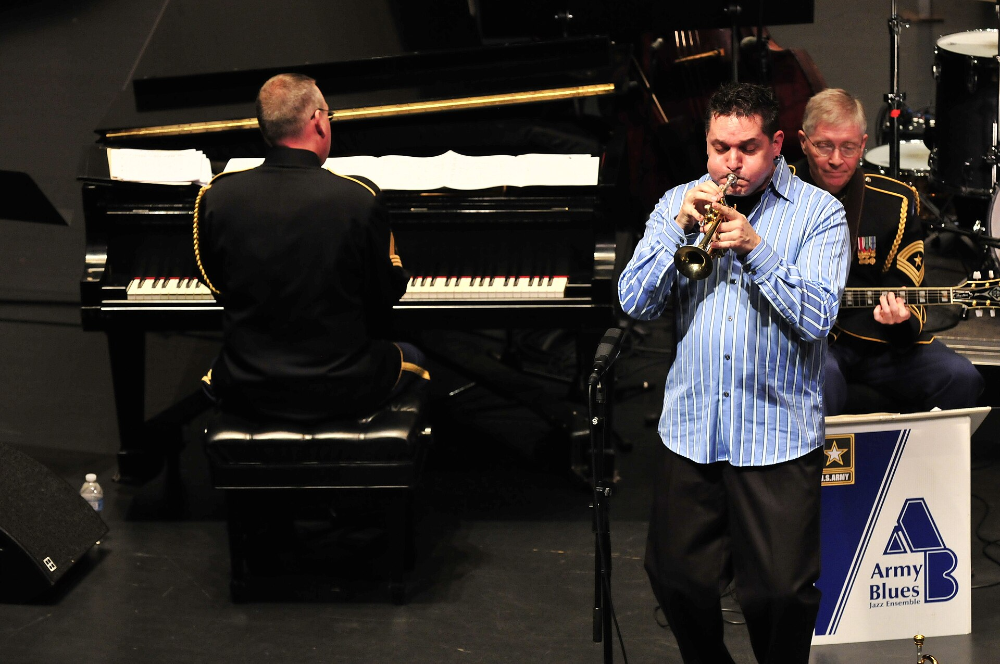

מי היה מאמין שדווקא מדינה קטנה במזרח התיכון תהפוך למעצמת ג'אז? ובכל זאת, **הג'אז הישראלי** הוא כיום אחד ממוצרי היצוא התרבותיים המוערכים ביותר של ישראל — נגנים מקומיים ממלאים מועדונים אגדיים בניו יורק, מופיעים בפסטיבלים היוקרתיים באירופה, ומקליטים לחברות התקליטים הגדולות בעולם. התשובה הקצרה לשאלה "למה עכשיו" היא שילוב נדיר של הכשרה מעולה, זהות צלילית ייחודית ודור של מוזיקאים חסרי מורא.

## מה הופך את הג'אז הישראלי לייחודי?

המפתח הוא ההכלאה. הנגנים הישראלים גדלו על ג'אז אמריקאי קלאסי — מיילס דייוויס, ג'ון קולטריין וביל אוונס — אבל הביאו איתם מטען צלילי שאין לאף אחד אחר. בתוך אלתור בסטנדרט אמריקאי פתאום נשזר מקאם מזרחי, ניגון חסידי או קצב ים-תיכוני. התוצאה אינה חיקוי אלא דיאלקט חדש, מוכר וזר בו-זמנית, שקהלים בחו"ל מזהים מיד כ"צליל ישראלי".

אבישי כהן — הקונטרבסיסט שהפך לשגריר הבולט של הסגנון — הוא דוגמה מובהקת. הבס העמוק שלו נושם לצד שירה בלדינו ובעברית, וההופעות שלו נעות בין וירטואוזיות ג'אזית לבין רגש עממי כמעט תפילתי. לצידו פועלים פסנתרנים כמו שי מאסטרו, שנחשב לאחד הפסנתרנים המרתקים של דורו, והקונטרבסיסט-מלחין עומר אביטל, שהחזיר את הצליל הים-תיכוני אל לב הסצנה של ניו יורק.

### הדור שגדל בין תל אביב לניו יורק

הרבה מהסיפור עובר דרך שתי כתובות: מחלקות הג'אז של רימון ותלמה ילין בישראל, ובית הספר האגדי **ברקלי** בבוסטון, שהיה נקודת מפגש לדור שלם של ישראלים. משם הדרך קצרה למועדונים כמו הוילג' ואנגארד ובלו נוט במנהטן, שם צעירים ישראלים ניגנו לצד ענקי הז'אנר וספגו את השפה מבפנים. כשהם חזרו הביתה — או נשארו שם — הם כבר דיברו ג'אז במבטא משלהם.

## מי הם השמות שחובה להכיר?

כדי להתמצא בסצנה, הנה מפת דרכים קצרה של כמה מהיוצרים הבולטים והצליל שכל אחד מהם מביא:

| אמן/ית | כלי / תפקיד | הצליל האופייני |
|---|---|---|
| אבישי כהן | קונטרבס, שירה | ג'אז עם שורשים ים-תיכוניים ולדינו |
| שי מאסטרו | פסנתר | לירי, מופנם, עתיר ניואנסים |
| עומר אביטל | קונטרבס, הלחנה | מזרח תיכון פוגש ביבופ |
| אנת כהן | קלרינט, סקסופון | חום, סווינג ומקצבים ברזילאיים |
| אבישי כהן (החצוצרן) | חצוצרה | אוונגרד, אלקטרוני, נועז |

חשוב לשים לב לבלבול נפוץ: ישנם *שני* אמנים בשם אבישי כהן — הקונטרבסיסט הוותיק והחצוצרן הנועז, המקליט לחברת איסיאמ הנחשבת. שניהם מובילים, וכל אחד מהם מייצג קוטב אחר של הסצנה.

## למה זה קורה דווקא עכשיו?

מעבר לכישרון, יש כאן גם תזמון תרבותי. העולם המערבי מחפש בשנים האחרונות אותנטיות וגיוון צלילי, ואחרי גל של פופ מיוצר-יתר, קהלים משתוקקים למוזיקה חיה, אנושית ובלתי צפויה. הג'אז הישראלי מספק בדיוק את זה: אלתור אמיתי, אנרגיה של להקה שמנגנת יחד בזמן אמת, וזהות שאינה מתנצלת. גם הרשתות עשו את שלהן — קליפים של הופעות חיות והקלטות אולפן זוכים לתפוצה שהייתה בלתי מתקבלת על הדעת בעבר.

לא פחות חשוב, נוצרה כאן קהילה. מוזיקאים ישראלים מנגנים זה בהרכבים של זה, מפיקים אלבומים משותפים ומזמינים חברים לפרויקטים. במקום תחרות, נבנתה מעין "נבחרת" שמחזקת את כולם ומנכיחה את הצליל הישראלי כמותג מוכר.

## איפה תופסים ג'אז ישראלי בשידור חי?

החדשות הטובות: לא צריך לטוס לניו יורק. הסצנה המקומית תוססת, ומועדונים כמו הגדה השמאלית בתל אביב, אירועי ג'אז בסינמטק ופסטיבלים ייעודיים מארחים לאורך השנה הן את השמות הגדולים והן את הדור הצעיר שכבר דופק על הדלת. פסטיבל הג'אז באדום שבנגב הפך לצליין של ממש עבור חובבי הז'אנר, ופסטיבל הג'אז בים האדום ממשיך למשוך קהל גדול.

ההמלצה שלנו: התחילו מאלבום אחד של אבישי כהן ואחד של שי מאסטרו, ואז חפשו הופעה חיה קרובה. הג'אז נועד להישמע באוויר, בחדר, כשהנגנים מקשיבים זה לזה בזמן אמת — וזה בדיוק הרגע שבו מתגלה הקסם.
