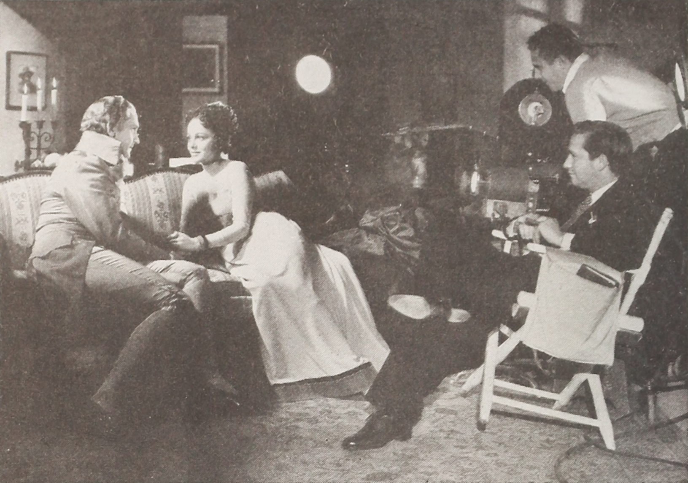

שלוש שעות. זהו כבר לא אורך חריג השמור לאפוסים היסטוריים, אלא המידה החדשה של הקולנוע העכשווי. **סרטים ארוכים** הפכו בשנים האחרונות למגמה בולטת בהוליווד ומחוצה לה: מ"אופנהיימר" של כריסטופר נולאן, דרך "רוצחי הירח המלא" של מרטין סקורסזה שנמתח מעבר לשלוש וחצי שעות, ועד דרמות פרסים שמסרבות להיפרד מהצופה. השאלה המסקרנת היא מדוע דווקא בעידן שבו סרטון של חמש עשרה שניות נחשב לארוך מדי, הקהל מוכן לשבת כל כך הרבה זמן באפלה.

## למה הסרטים נעשים ארוכים יותר?

התשובה הקצרה: כי האורך הפך למטבע של יוקרה. בעולם שבו הפלטפורמות הדיגיטליות מציעות אינסוף תוכן זמין ומקוטע, סרט באורך מלא הוא הצהרה. הוא אומר לצופה: זהו אירוע, לא עוד פריט ברשימת ההמתנה. בעבור במאים בעלי שם, הזכות למתוח סרט לשלוש שעות היא סימן לעצמאות יצירתית — הוכחה לכך שהאולפן נותן בהם אמון מלא ואינו מכתיב עריכה מסחרית.

ישנו גם היבט תמטי. **סרטים ארוכים** נוטים לעסוק בנושאים גדולים: היסטוריה, מוסר, אשמה, גורל לאומי. סקורסזה מבקש שנשב עם הפשע נגד בני האומה האוסאג' עד שנרגיש את המשקל המוסרי; נולאן מבקש שנצלול אל תודעתו של רוברט אופנהיימר עד לפיצוץ. האורך אינו מקרי — הוא כלי רטורי.

### הקולנוע כאירוע יוצא מהבית

מאז ההתאוששות של בתי הקולנוע, האולפנים מבינים שכדי להוציא אנשים מהספה הם צריכים להציע חוויה שאי אפשר לשכפל בבית. סרט אפי, ארוך ומרשים ויזואלית — רצוי בפורמט של שבעים מילימטר או אַיי־מקס — הוא בדיוק זה. הצפייה הופכת לטקס, למשהו שמצדיק כרטיס, פופקורן והפסקת שירותים מתוזמנת בקפידה.

## מי מוביל את הגל?

לא כל במאי זוכה לחירות הזו. מדובר במועדון מצומצם של יוצרים בעלי הון יצירתי שנצבר לאורך שנים. הנה כמה מן השמות הבולטים שהפכו את האורך לחלק מחתימתם:

| במאי/ית | סרט בולט | אורך משוער |
|---|---|---|
| כריסטופר נולאן | אופנהיימר | כשלוש שעות |
| מרטין סקורסזה | רוצחי הירח המלא | מעל שלוש וחצי שעות |
| גרטה גרוויג | נשים קטנות | מעל שעתיים |
| דניס וילנב | חולית | מעל שעתיים וחצי |
| קלואי ז'או | הנוודים | סביב שעתיים |

המשותף לכולם הוא מעמד שמאפשר להם לומר לא. הם אינם נכנעים לתכתיב לפיו סרט חייב להסתיים לפני שהקהל מאבד ריכוז, אלא מהמרים על כך שהקהל דווקא רעב לעומק.

## האם הקהל באמת רוצה את זה?

כאן מתחילה המחלוקת. מצד אחד, ההצלחה המסחרית של "אופנהיימר" הוכיחה שקהל רחב מוכן להתמסר לשלוש שעות של דיאלוגים צפופים ומתח פילוסופי. מצד שני, לא מעט מבקרים ואנשי מקצוע טוענים שהאורך הפך לעיתים לתירוץ להיעדר עריכה נוקבת. לא כל סצנה מרוויחה את מקומה, וישנם סרטים שהיו נהנים מקיצוץ של חצי שעה.

הטענה הביקורתית מעניינת במיוחד לאור הרגלי הצפייה החדשים. דור שגדל על תוכן קצר ומהיר אמור לכאורה לברוח מסרטים ארוכים — אך בפועל מסתמן פילוג. בעוד חלק מהצופים מעדיפים לצפות בבית עם אפשרות להשהות, אחרים מחפשים בדיוק את ההפך: ניתוק מלא, ללא טלפון, ללא הפרעות. הסרט הארוך הופך למרחב של מדיטציה מאולצת.

### ומה קורה בישראל?

גם בקרב הקהל הישראלי ניכרת סקרנות כלפי המגמה. הקרנות מיוחדות בסינמטק תל אביב ובקולנוע היוקרתי מושכות צופים שמחפשים חוויה קולנועית "רצינית", והדיון על אורך הסרט הפך לחלק בלתי נפרד מהשיחה סביב עונת הפרסים. עבור רבים, ההחלטה לשבת שלוש שעות היא כבר לא מטרד אלא בחירה מודעת.

## אז לאן זה הולך?

המגמה כנראה תימשך כל עוד היא משתלמת בקופות ובפרסים. אך יש בה גם סכנה: אם האורך יהפוך לברירת מחדל במקום לבחירה מדודה, הוא יאבד את הכוח שלו. הקולנוע הגדול באמת אינו זה שנמשך הכי הרבה זמן, אלא זה שגורם לנו לשכוח כמה זמן עבר. וזה, בסופו של דבר, המבחן האמיתי של כל סרט — ארוך או קצר.
