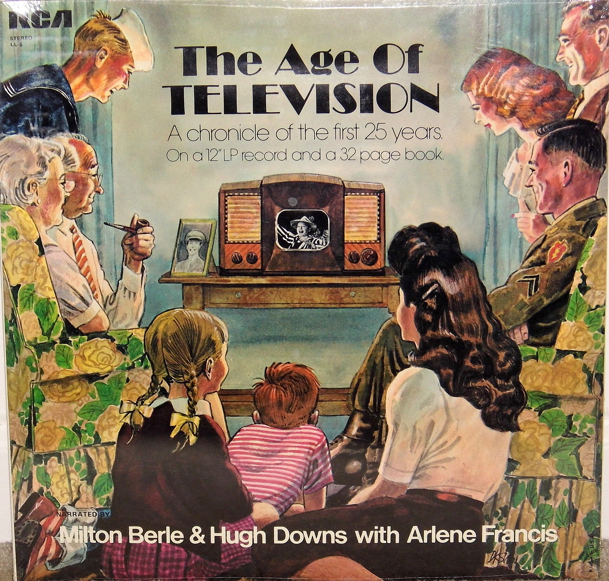

יש רגע קטן שבו האלגוריתם של יוטיוב מפתיע אתכם: פתאום, בין שני סרטונים, נדלק שיר יפני משנת 1984 עם באסים חלקלקים, מקצב דיסקו וקול נשי צלול שנשמע כמו קרן אור. ברוכים הבאים אל **הסיטי פופ** — הז'אנר היפני הנשכח שהפך בעשור האחרון לאחת מתופעות המוזיקה המסקרנות והמפתיעות ברשת, וכעת מוצא את דרכו גם אל אוזניהם של מאזינים ישראלים.

התשובה הקצרה לשאלה "מה זה בעצם": סיטי פופ הוא סגנון פופ יפני מלוטש ועשיר מסוף שנות ה-70 ותחילת ה-80, המשלב השפעות של פאנק, ג'אז חלק, דיסקו וסול מערבי. הוא נועד לפסקול חייהם של תושבי הכרך היפני המשגשג — מוזיקה של מכוניות מבריקות, מרפסות מול קו הרקיע של טוקיו וקיץ שלא נגמר.

## מה זה סיטי פופ ואיך הוא נשמע?

בניגוד לתדמית המינימליסטית שרבים מייחסים למוזיקה היפנית, הסיטי פופ הוא דווקא נדיב, מלא ומופק בקפידה אובססיבית. חשבו על שכבות של קלידים חמימים, גיטרות פאנק מנוקדות, סקסופון שמתפרץ בדיוק ברגע הנכון וקולות ליווי עשירים. אמנים כמו טאצואירו ימאשיטה (Tatsuro Yamashita), מריה טאקאוצ'י ואנרי (Anri) הפכו לעמודי התווך של הסגנון, שנשען על תפיסה של שפע והנאה צרופה.

הצליל הזה לא נולד בחלל ריק. הוא היה פסקול הבועה הכלכלית של יפן בשנות ה-80, תקופה שבה המדינה נראתה כאילו היא עומדת לכבוש את העולם. המוזיקה שיקפה את האופטימיזם הזה: נקייה, יקרה, בטוחה בעצמה ומלאת יופי.

## איך אלגוריתם החזיר ז'אנר לחיים?

כאן מתחיל הפרק המרתק באמת. במשך שנים הסיטי פופ היה כמעט בלתי נגיש מחוץ ליפן — התקליטים היו נדירים, יקרים ולא זמינים בשירותי הסטרימינג המערביים. ואז, איפשהו סביב אמצע העשור הקודם, האלגוריתמים של יוטיוב התחילו להמליץ באובססיביות על שיר אחד: **"פלסטיק לאב"** (Plastic Love) של מריה טאקאוצ'י.

השיר, שבזמן אמת כלל לא היה להיט גדול, צבר עשרות מיליוני צפיות והפך לתופעת רשת אמיתית. מאזינים צעירים ברחבי העולם, שלא נולדו כלל בתקופה שבה הוקלט, מצאו את עצמם שבויים בקסמו. סביב התופעה צמחה תרבות שלמה: ז'אנרים דיגיטליים כמו וייפורווייב (Vaporwave) ופיוצ'ר פאנק דגמו ועיבדו את הצליל הזה, ויצרו לו חיים חדשים לגמרי.

### למה דווקא עכשיו?

התשובה קשורה בנוסטלגיה — אבל נוסטלגיה מסוג מוזר. הדור שמאמץ את הסיטי פופ מתגעגע לתקופה שמעולם לא חווה. זו כמיהה לזוהר, לביטחון ולאסתטיקה של עולם אנלוגי מבריק, בעידן שבו הכל מרגיש לא יציב. הצליל האופטימי, הנקי והמלוטש מציע מפלט רגשי — סוג של חופשה בזמן.

## הסיטי פופ מגיע לישראל

גם המאזין הישראלי לא נותר אדיש. באמצעות פלייליסטים בספוטיפיי, ערוצי יוטיוב ותרבות הרשת, הצליל היפני חדר בהדרגה גם לכאן. אפשר לשמוע את ההשפעות שלו במסיבות בעלות אופי רטרו-פוטוריסטי בתל אביב, בפלייליסטים של בתי קפה ובקרב יוצרים מקומיים שמחפשים את החום האנלוגי של אותה תקופה. הסיטי פופ מתחבר היטב גם לגל חזרת הוויניל ולתשוקה הכללית לצלילים "אמיתיים" ומופקים בקפידה.

| שיר / אמן | שנה משוערת | למה להתחיל דווקא ממנו |
|---|---|---|
| "פלסטיק לאב" — מריה טאקאוצ'י | 1984 | שער הכניסה הקלאסי לז'אנר |
| "רַיד אוֹן טַיים" — טאצואירו ימאשיטה | תחילת שנות ה-80 | אנרגיה, מקצב ופופ מושלם |
| "ריממבר סאמר דייז" — אנרי | אמצע שנות ה-80 | קיץ, זוהר ונוסטלגיה |
| "סטיי וית' מי" — מיקי מטסובארה | 1979 | בלדה שהפכה ללהיט רשת נוסף |

## אז זו אופנה חולפת או כאן כדי להישאר?

יש הטוענים שהסיטי פופ הוא בסך הכל טרנד רשת נוסף שיתפוגג. אך העובדה שהתופעה מחזיקה מעמד כבר יותר מעשור, מולידה תת-ז'אנרים חדשים ומחזירה אמנים ותיקים אל אור הזרקורים, מרמזת על משהו עמוק יותר. הסיטי פופ הוכיח שמוזיקה טובה לא באמת מתיישנת — היא רק מחכה לרגע הנכון, ולפלטפורמה הנכונה, כדי להיוולד מחדש.

בפעם הבאה שהאלגוריתם יגניב לכם שיר יפני מבריק מ-1983, אל תמהרו לדלג. תנו לצליל הזוהר לקחת אתכם לטיול קצר בטוקיו של פעם — עולם שאולי לא היה קיים בדיוק כך, אבל נשמע נהדר.
