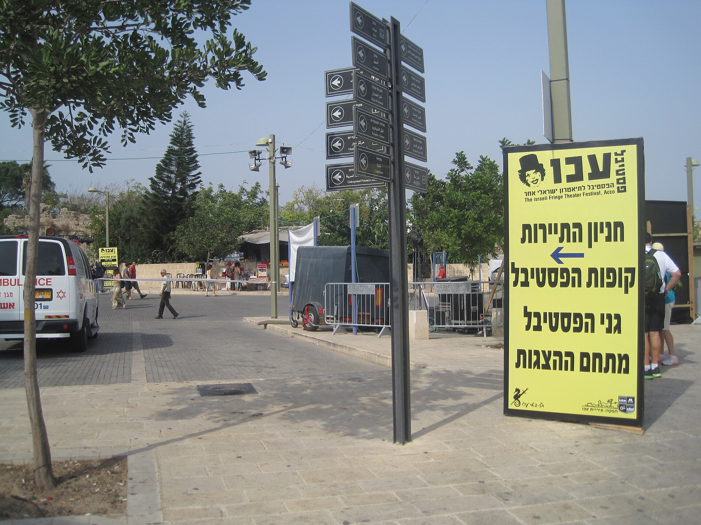

מה קורה כשמורידים את הקיר הרביעי לגמרי, מכבים את שלט ה"שקט בבקשה" ומזמינים את הקהל להיכנס פנימה? התשובה נקראת **תיאטרון אימרסיבי** — ז'אנר שבו הצופה איננו יושב בחושך ומביט מרחוק, אלא נע במרחב, פותח דלתות, מציץ למגירות ולעיתים אף משפיע על מהלך העלילה. זו אולי אחת המגמות המרתקות בתיאטרון העכשווי, והיא מגיעה בהדרגה גם אל הבמות והמרחבים העצמאיים בישראל.

## מה זה בעצם תיאטרון אימרסיבי?

המונח *אימרסיבי* (מלשון "טבילה", *immersion*) מתאר חוויה שבה הצופה שקוע כולו בתוך העולם הבדיוני. במקום שורות כיסאות מול במה, ההפקה מתרחשת בבניין נטוש, במחסן, בדירה או במלון שלם — והקהל מוזמן להלך בין החדרים, לבחור אחרי איזו דמות לעקוב, ולעיתים אף לגעת בחפצים ולהריח את הבישול.

התוצאה היא חוויה אינטימית ובלתי חוזרת: שני צופים שנכנסו לאותה הצגה עשויים לצאת עם סיפורים שונים לגמרי, פשוט משום שבחרו מסלולים אחרים. זהו ההבדל המהותי מהתיאטרון המסורתי — כאן הצופה הוא שותף לכתיבת החוויה, לא נמען פסיבי שלה.

## מאיפה זה הגיע?

רבים רואים בלהקה הבריטית **פאנצ'דראנק** (Punchdrunk) את חלוצת הז'אנר. ההפקה האגדית שלהם, "שלא תישן עוד" (Sleep No More), שהתבססה באופן חופשי על "מקבת" של שייקספיר, הפכה מחסן בן חמש קומות בניו יורק לעולם קולנואי-אפל שבו הקהל, עטוי מסכות לבנות, משוטט חופשי בין הסצנות. ההפקה הפכה לתופעה ורצה שנים ארוכות.

במקביל פרחו בעולם יוזמות דומות — מהצגות סביבתיות בפסטיבל אדינבורו ועד חדרי בריחה תיאטרליים והצגות אחד-על-אחד שבהן שחקן יחיד מבצע מופע לצופה בודד. השורשים הרעיוניים נעוצים עמוק יותר, אצל הוגים כמו אנטונן ארטו ותיאטרון האכזריות שלו, וכן במסורת התיאטרון הסביבתי של שנות השישים.

## למה זה עובד על הקהל?

בעידן שבו כמעט כל חוויה מתווכת דרך מסך, יש עוצמה מיוחדת בהצגה שדורשת נוכחות פיזית מלאה. הצופה לא יכול לגלול, לעצור או לשלוח הודעה — הוא **בתוך** הסיפור.

- **תחושת סוכנות:** הבחירה לאן ללכת יוצרת אחריות ומעורבות רגשית.
- **אינטימיות:** המרחק הקטן מהשחקנים מגביר את המתח והריגוש.
- **ייחודיות:** כל הצגה היא חד-פעמית, מה שמייצר תחושת אירוע נדיר.
- **גירוי חושי:** ריחות, מרקמים וצלילים הופכים את הצפייה לחוויה גופנית.

## תיאטרון אימרסיבי בישראל

בישראל הז'אנר עדיין בתהליך התבססות, אך ניכרת סקרנות גוברת. **פסטיבל עכו לתיאטרון אחר** משמש זה שנים חממה לפורמטים סביבתיים וחוויתיים, שבהם המרחב ההיסטורי של העיר העתיקה הופך לחלק מהמופע. גם בתל אביב וירושלים צצות הפקות עצמאיות שמתקיימות בדירות, במחסנים ובחצרות, לצד יוצרים צעירים שמנסים לשבור את מוסכמות האולם הקלאסי.

מוסדות מבוססים כמו תיאטרון הבימה או הקאמרי נוטים עדיין לפורמט המסורתי, אך גם בהם ניכר ניסיון לשלב אלמנטים אינטראקטיביים ומרחביים בהפקות נבחרות. הסינמטקים והמרכזים לאמנות עכשווית מארחים לעיתים מיצגי-ביצוע שמטשטשים את הגבול בין תיאטרון, מיצג ואמנות פלסטית.

## מדריך קצר: סוגי החוויה האימרסיבית

| סוג | מה קורה בו | דוגמה אופיינית |
|------|-------------|----------------|
| סביבתי (סייט-ספסיפיק) | ההצגה בנויה סביב מקום אמיתי | מופע בבניין נטוש או בעיר עתיקה |
| חופשי ומשוטט | הקהל נע ובוחר אחרי מי לעקוב | סגנון "שלא תישן עוד" |
| אחד-על-אחד | שחקן יחיד מול צופה בודד | חוויה אינטימית של דקות ספורות |
| משתתף פעיל | הקהל מקבל תפקיד בעלילה | הצגות משחק תפקידים תיאטרליות |

## מה מאתגר בז'אנר הזה?

החופש שהופך את החוויה לעוצמתית הוא גם מקור המורכבות שלה. הפקה אימרסיבית דורשת מרחבים גדולים, צוות שחקנים ער לתגובות בלתי צפויות, ותקציבים לא מבוטלים לעיצוב עולם שלם. יש גם צופים שמתקשים עם דרישת המעורבות — לא כולם רוצים לצאת מאזור הנוחות ולהפוך לשחקן.

ובכל זאת, נראה שדווקא בגלל האתגר, המגמה ממשיכה למשוך יוצרים וקהל כאחד. תיאטרון אימרסיבי מזכיר לנו שהתיאטרון, בבסיסו, הוא מפגש חי — ואין דבר חי יותר מלהיות ממש בתוכו.
