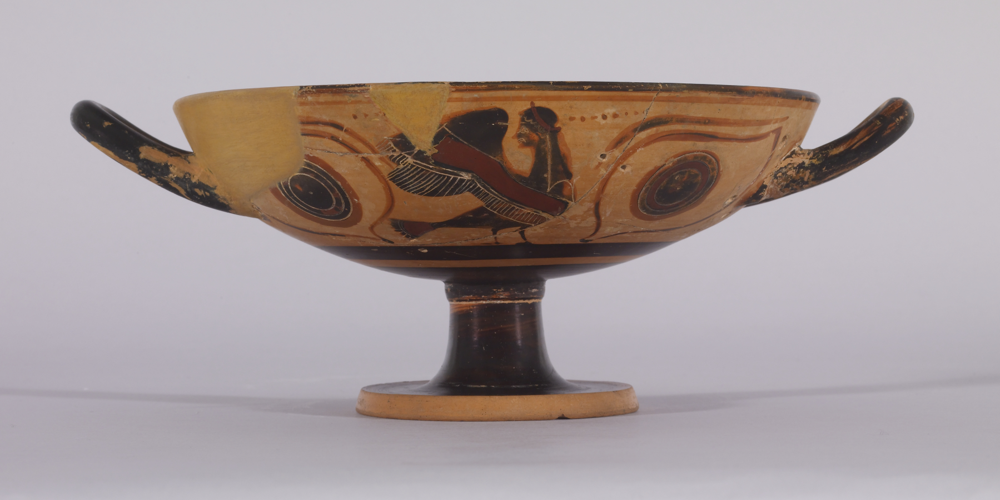

מדוע דווקא עכשיו, בעידן של בינה מלאכותית ורשתות חברתיות, חוזרים קוראים רבים כל כך אל אלים, גיבורים ומפלצות מלפני שלושת אלפים שנה? התשובה הקצרה: **מיתולוגיה מסופרת מחדש** הפכה לאחד הז'אנרים הפורחים בספרות העולמית, והיא מציעה בדיוק את מה שחסר לנו — סיפורים גדולים, ארכיטיפיים ורגשיים, מסופרים מזווית חדשה לגמרי. במקום להאדיר את הגיבור הלוחם, הספרים החדשים נותנים קול למי שנשארו בשוליים: הנשים, השבויות, המכשפות והמנוצחים.

המגמה הזו אינה גחמה חולפת. בשנים האחרונות היא טיפסה בעקביות אל ראש רשימות רבי המכר, מילאה מדפים שלמים בחנויות והציתה דיונים לוהטים במועדוני קריאה. הקהל הישראלי, שגדל על סיפורי המיתולוגיה בשיעורי ספרות, מגלה אותם מחדש דרך פרוזה עכשווית וקולחת.

## מהי בעצם מיתולוגיה מסופרת מחדש?

מדובר ביצירות פרוזה שלוקחות עלילה מוכרת מן המיתולוגיה — לרוב היוונית, אך לא רק — ומספרות אותה מזווית חדשה. לעיתים זהו שינוי של המספר: במקום אכילס, שומעים את סיפורו של אהובו; במקום אודיסאוס, מדברת אשתו פנלופה. לעיתים זהו שינוי טון: מהאפוס ההרואי אל הסיפור האינטימי, הפגיע, האנושי.

הכוח של הז'אנר טמון במתח בין המוכר לחדש. אנחנו יודעים כיצד יסתיים מסע ה"אודיסאה" של הומרוס, ובכל זאת קריאת אותו סיפור מבעד לעיניה של דמות מושתקת הופכת אותו לחוויה חדשה לגמרי.

## מי הן החלוצות של הגל?

השם הבולט ביותר הוא **מדליין מילר** (Madeline Miller). ספרה "שיר של אכילס" הפך את סיפור מלחמת טרויה לרומן אהבה עדין ושובר לב בין אכילס לפטרוקלוס, וספרה השני, "קירקה", העניק במה ומונולוג נוקב לאלה־מכשפה שהומרוס הקדיש לה שורות ספורות בלבד. שני הספרים הפכו לתופעה, וזכו למעמד של קלאסיקות מודרניות.

לצידה בולטת **נטלי היינס** (Natalie Haynes), מחברת "אלף ספינות", שמעמידה במרכז את נשות טרויה — המלכות, השבויות והאלות — ומספרת את המלחמה כולה מנקודת מבטן. **פט בארקר** (Pat Barker), סופרת בריטית ותיקה ועטורת פרסים, תרמה את "שתיקת הנערות", המספר את האיליאדה מפי בריסאיס, השבויה שהפכה לעצם המריבה בין אכילס לאגממנון.

### ולא רק יוון

הגל התרחב גם אל מיתולוגיות אחרות. סופרות ויוצרים פונים אל האגדות הנורדיות, אל המיתוסים ההודיים ואל סיפורי המקרא, מתוך אותו דחף לשמוע את הקולות שנשכחו. אך לב הז'אנר, לפחות בינתיים, נותר נטוע באולימפוס.

## מדוע דווקא עכשיו?

כמה כוחות פועלים כאן במקביל. ראשית, **הצמא לסיפור גדול**: בעולם מקוטע וחרד, יש נחמה בעלילות שעברו את מבחן הזמן. שנית, **המבט הפמיניסטי**: המגמה משתלבת ברוח התקופה, שמבקשת להשמיע קולות שהודרו מן ההיסטוריה. שלישית, **הרשתות החברתיות**: קהילות הקריאה בטיקטוק ובאינסטגרם הפכו את "שיר של אכילס" ואת "קירקה" ללהיטים מתגלגלים, שנים אחרי צאתם לאור.

לכך מתווסף יתרון נגישות: הספרים כתובים בפרוזה עכשווית וזורמת, ואינם דורשים ידע מוקדם בקלאסיקה. הם משמשים שער כניסה נעים אל עולם שנתפס פעם כמנת חלקם של מלומדים בלבד.

## מאיפה כדאי להתחיל? טבלת המלצות

| הספר | היוצר/ת | מזווית מי מסופר | למי מתאים |
|------|---------|-----------------|-----------|
| שיר של אכילס | מדליין מילר | פטרוקלוס | אוהבי רומן רגשי ושובר לב |
| קירקה | מדליין מילר | האלה קירקה | מחפשי גיבורה עצמאית ומורכבת |
| אלף ספינות | נטלי היינס | נשות טרויה | חובבי מבט רחב ורב־קולי |
| שתיקת הנערות | פט בארקר | בריסאיס | קוראים המחפשים עוצמה חדה ובוגרת |

## האם זו ספרות "גבוהה" או בידור?

זו בדיוק השאלה שהופכת את הז'אנר למרתק. יש הרואים בו פישוט של הקלאסיקה, קיצור דרך רגשי אל חומרים עתיקים ומורכבים. אחרים טוענים ההפך: שמדובר בדיאלוג לגיטימי ופורה עם המסורת, בדיוק כפי שהטרגיקנים היוונים עצמם סיפרו מחדש מיתוסים ישנים בכל דור. 

האמת, כנראה, נמצאת באמצע. הספרים הטובים בז'אנר אינם מסתפקים בהלבשת עלילה עתיקה בשמלה מודרנית — הם שואלים שאלות חדות על כוח, מגדר, זיכרון והיסטוריה. וזה, בסופו של דבר, מה שספרות טובה עושה מאז ומעולם.

## שורה תחתונה

מיתולוגיה מסופרת מחדש היא הרבה יותר מטרנד חולף. היא מזכירה לנו שהסיפורים הישנים ביותר עדיין חיים, ושתמיד יש קול נוסף שממתין להישמע. אם עוד לא נכנסתם, זה הזמן המושלם להתחיל — ולגלות שהאלים והגיבורים מעולם לא היו אנושיים כל כך.
