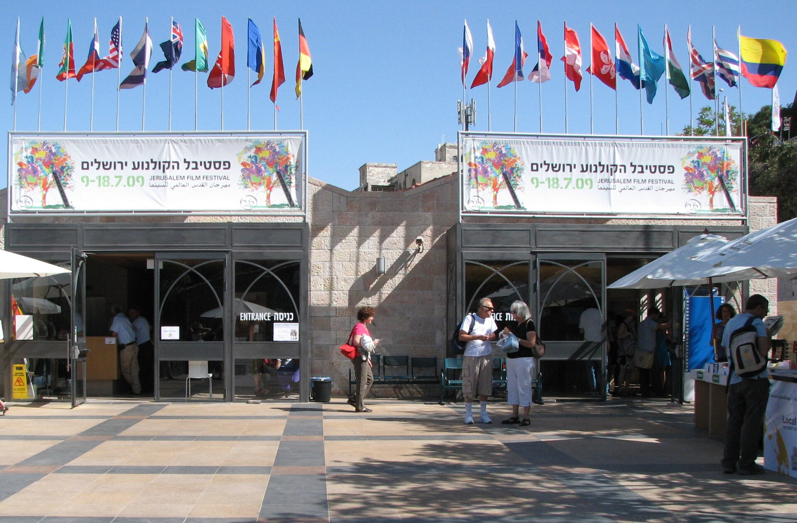

בעידן שבו תשומת הלב שלנו נמדדת בשניות והטיקטוק חינך אותנו לצרוך תוכן במנות זעירות, קורה משהו מוזר באולמות הקולנוע: **הסרטים הארוכים חזרו בגדול**. סרטים של שעתיים וחצי, שלוש שעות ואף למעלה מכך הפכו מחריגה יוקרתית לכמעט נורמה בקולנוע השאפתני. התשובה הקצרה לשאלה "למה" היא שילוב של אמביציה אמנותית, יוקרה תרבותית ורצון של יוצרים גדולים להחזיר לקולנוע את תחושת האירוע — חוויה שאי אפשר לדחוס למסך של טלפון.

## מה הפך את הסרטים הארוכים לטרנד?

כשכריסטופר נולאן שחרר את "אופנהיימר" (Oppenheimer) באורך של כשלוש שעות, רבים ניבאו שהקהל יברח. במקום זאת, הסרט הפך לתופעה תרבותית ולהצלחת קופות אדירה. מרטין סקורסזה, בסרטו "רוצחי הירח המלא", מתח את הסיפור על פני שלוש שעות וחצי, ובראיונות טען בפשטות שהסיפור "דרש" את הזמן הזה. בֶּן־עדינות דומה פעל בְּרֵיידי קורבֶּה ב"הברוטליסט", אפוס בן כשלוש שעות וחצי שאף החזיר למסך את מוסד ה"אינטרמישן" — הפסקה באמצע ההקרנה, מחווה נוסטלגית לימי הזוהר של הוליווד.

המגמה הזו אינה מקרית. היא מסמנת חזרה אל תפיסת הקולנוע כ"יצירה שלמה", כטקסט קולנועי שדורש התמסרות מלאה — בניגוד גמור להיגיון של פלטפורמות הסטרימינג, שמעודדות צפייה מפוזרת עם טלפון ביד.

## הפרדוקס: דור קצר הריכוז שיושב שלוש שעות

כאן מסתתר הפרדוקס המרתק ביותר. אותו דור שמואשם בקוצר ריכוז כרוני הוא בדיוק הקהל שממלא את האולמות לסרטים הארוכים. ההסבר טמון אולי בכך שהצפייה בסרט של שלוש שעות הפכה לאקט של התנגדות — הצהרה תרבותית נגד ההיסח הדעת המתמיד. הישיבה באולם החשוך, בלי טלפון, למשך שלוש שעות רצופות, הפכה לסוג של פינוק נדיר, כמעט מדיטטיבי.

יש לכך גם ממד של יוקרה. סרט ארוך משדר רצינות, שאפתנות ומעמד של "יצירת מופת". לא במקרה רבים מהסרטים הארוכים של השנים האחרונות הם בדיוק אלה שנחשבים למועמדים לפרסי האוסקר ומככבים בפסטיבלים כמו קאן, ונציה וברלין.

## טבלה: סרטים ארוכים בולטים מהשנים האחרונות

| הסרט | הבמאי | משך משוער |
|------|--------|-----------|
| אופנהיימר | כריסטופר נולאן | כ-3 שעות |
| רוצחי הירח המלא | מרטין סקורסזה | כ-3.5 שעות |
| הברוטליסט | ברֵיידי קורבֶּה | כ-3.5 שעות |
| בייבילון | דיימיאן שאזל | כ-3 שעות |
| אוסף מלכות | מרטין מקדונה (השוואתי) | קצר יותר |

*המשכים הם הערכה כללית ועשויים להשתנות בין גרסאות.*

## מה המחיר של האורך?

למגמה הזו יש גם צד אפל. בתי הקולנוע מתמודדים עם אתגר כלכלי ממשי: ככל שהסרט ארוך יותר, כך פוחת מספר ההקרנות האפשריות ביום, מה שפוגע בהכנסות. סרט של שלוש שעות וחצי מאפשר בקושי שתי הקרנות בערב, לעומת שלוש או ארבע של סרט רגיל.

מעבר לכלכלה, ישנה גם שאלת המשמעת האמנותית. לא כל סרט ארוך הוא בהכרח סרט טוב. יש הטוענים שחלק מהיוצרים, מרוב חופש שהעניקו להם האולפנים והזכייה בפרסים, מאבדים את חוש המידה. **סרט ארוך שמצדיק את אורכו הוא הישג; סרט ארוך שסתם מתמשך הוא מבחן סבלנות.**

### וישראל? 

גם הקהל הישראלי חלק מהמגמה. הסינמטקים בתל אביב, בירושלים ובחיפה, כמו גם פסטיבל הקולנוע בירושלים, מציעים בקביעות סרטים ארוכים ותובעניים, והקהל המקומי — שנחשב לצרכן קולנוע נלהב ואיכותי — מגיע. חלק מהאולמות אף התאימו את עצמם עם כיסאות נוחים יותר והפסקות, בהבנה שחוויית הצפייה הארוכה דורשת תשתית מתאימה.

## אז לאן זה הולך?

המגמה של הסרטים הארוכים ככל הנראה תישאר איתנו, לפחות בקולנוע היוקרתי. היא מבטאת געגוע עמוק לחוויה הקולנועית האותנטית — לרגע שבו האורות כבים, הטלפון נכבה, והזמן מתמסר לחלוטין לסיפור שעל המסך. בעולם שמתפורר לרסיסים של תוכן, אולי דווקא שלוש השעות באולם החשוך הן הדבר הכי מהפכני שנשאר לקולנוע להציע.
