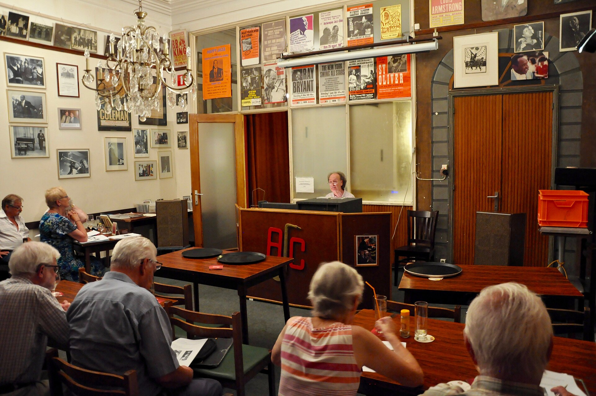

מי היה מאמין שדווקא מדינה קטנה בקצה הים התיכון תהפוך לאחת מספקיות הכישרונות המבוקשות ביותר בעולם הג'אז? התשובה הקצרה: **הג'אז הישראלי** הוא כבר מזמן לא סוד מקומי. בעשורים האחרונים גל של נגנים ישראלים כבש בימות מרכזיות בניו יורק, בפריז ובטוקיו, וקנה לעצמו שם כתופעה מוזיקלית עצמאית — צליל שמערבב וירטואוזיות, רגש ושורשים ים־תיכוניים.

## למה הג'אז הישראלי הפך לתופעה בינלאומית?

הסיפור מתחיל בזרם של מוזיקאים צעירים שיצאו ללמוד במוסדות היוקרתיים של ארצות הברית — ובהם בית הספר ברקלי בבוסטון וה"ניו סקול" בניו יורק. הם ספגו את המסורת האמריקאית של הבִּיבּופ וההארד־בופ, אבל הביאו איתם משהו משלהם: מנגינות שנשמעות כמו תפילה, מקצבים לא־שגרתיים ורגישות מלודית שקל לזהות כישראלית.

התוצאה היא שפה מוזיקלית שמצליחה לדבר אל קהל עולמי מבלי לוותר על הזהות המקומית. מבקרים רבים רואים בכך את סוד הקסם: הג'אז הישראלי אינו חיקוי של האמריקאים, אלא דיאלוג איתם.

## מי הם השמות הבולטים?

הקונטרבסיסט אבישי כהן (Avishai Cohen) נחשב לאחד השגרירים המזוהים ביותר של הסצנה. הרכביו ממלאים אולמות באירופה, והשילוב שלו בין ג'אז לצלילים ים־תיכוניים ולעברית הפך למותג. לצדו בולט החצוצרן אבישי כהן — שם זהה, אמן אחר — שמזוהה עם הצליל האינטימי והמופנם.

הפסנתרן שי מאסטרו, שליווה שנים את החצוצרן רוי הרגרוב, זכה להערכה בזכות נגינה לירית ורגישה. עמרי מור פורט על מסורות מזרחיות בפסנתר, אנאט כהן הפכה לאחת הקלרניתיות המוערכות בעולם, והבסיסטית והזמרת נגה ארז מייצגת גל צעיר יותר של הכלאות ז'אנרים.

### טבלת נגני הג'אז הישראלים הבולטים

| אמן | כלי / תחום | סימן היכר |
|------|-------------|-----------|
| אבישי כהן | קונטרבס, שירה | ג'אז ים־תיכוני עם עברית |
| שי מאסטרו | פסנתר | ליריות ורגש |
| אנאט כהן | קלרינט | חום ומגוון סגנוני |
| עמרי מור | פסנתר | מזרחיות וג'אז |
| נגה ארז | הפקה, שירה | הכלאות עכשוויות |

## מה הופך את הצליל הישראלי לייחודי?

אם יש חוט מקשר בין האמנים השונים, זהו המפגש בין עולמות. הג'אז הישראלי סופג השפעות מהמוזיקה המזרחית, מהפיוט, מהזמר העברי ומהצלילים הבלקניים והערביים — ומהתך אותם אל תוך המבנה החופשי של האלתור הג'אזי.

רבים מתארים זאת כ"ג'אז עם נשמה ים־תיכונית": פחות קרירות אינטלקטואלית, יותר רגש ישיר. אין זה מקרה שאמנים אלה מצליחים דווקא בקהל הרחב, ולא רק בקרב חובבי הז'אנר המושבעים.

## איפה שומעים ג'אז ישראלי בארץ?

הסצנה המקומית חיה ובועטת. בתל אביב פועלים מועדונים אינטימיים המוקדשים לג'אז, פסטיבלים עונתיים מארחים אמנים מקומיים ובינלאומיים, ובתי הספר למוזיקה — כמו רימון ומגמות הג'אז באקדמיות — ממשיכים להזרים דור חדש של נגנים.

מי שרוצה להתחיל, יכול לחפש ערבי ג'אז קבועים במועדונים בתל אביב, מופעים בסינמטקים ובמרכזי תרבות, ולעקוב אחר פסטיבלי הג'אז שמתקיימים לאורך השנה. חוויית ההאזנה החיה, בחלל קטן ואינטימי, היא הדרך הטובה ביותר להבין למה הצליל הזה כבש את העולם.

## מדריך התחלה מהיר להאזנה

- **למתחילים:** התחילו מאלבומים מלודיים ונגישים של אבישי כהן הקונטרבסיסט.
- **לאוהבי פסנתר:** נגינתו הלירית של שי מאסטרו היא כניסה מושלמת.
- **לחובבי גיוון:** אנאט כהן מציעה מסע בין סגנונות וצבעים.
- **למחפשים משהו עכשווי:** בדקו את ההכלאות הז'אנריות של הדור הצעיר.

הג'אז הישראלי הוכיח שאפשר להיות מקומי ובינלאומי בו־זמנית — ושצליל שנולד בין הים התיכון לרחובות תל אביב יכול להדהד היישב בלב ניו יורק.
