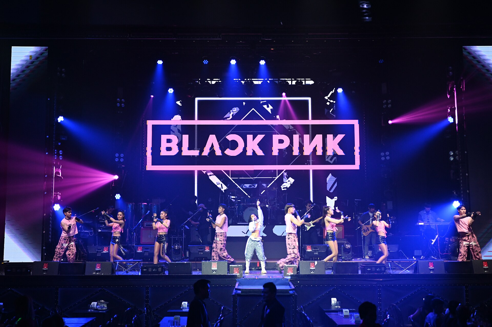

מה גרם לאלפי בני נוער ישראלים ללמוד מילים בקוריאנית, לחקות כוריאוגרפיות מסובכות ולמלא אולמות במסיבות ריקוד? התשובה היא **קיי-פופ בישראל** — תופעה שהתחילה כקהילת נישה קטנה והפכה בשנים האחרונות לאחד הזרמים המוזיקליים המדוברים בקרב הדור הצעיר. זהו לא סתם ז'אנר; זו חבילה שלמה של מוזיקה, אופנה, ריקוד וזהות קהילתית.

## מה זה בכלל קיי-פופ ולמה כולם מדברים עליו?

קיי-פופ (K-Pop), הפופ הקוריאני, הוא ז'אנר שמשלב פופ, היפ-הופ, אלקטרוניקה ובלדות עם הפקה חזותית מוקפדת עד הפרט האחרון. מה שמייחד אותו הוא לא רק הצליל, אלא **החוויה המלאה**: קליפים קולנועיים, כוריאוגרפיות מסונכרנות להפליא ואסתטיקה צבעונית שהפכה לשפה בפני עצמה.

להקות כמו בי-טי-אס (BTS) ובלאקפינק (BLACKPINK) פרצו את חומת השפה והפכו לתופעה גלובלית. בישראל, כמו בשאר העולם, הן היו נקודת הכניסה של רבים אל העולם הזה — ומשם הדרך לקהילה שלמה של אמנים ולהקות הייתה קצרה.

## איך הגל הקוריאני הגיע לישראל?

המסע של הקיי-פופ בישראל התחיל, כמו תופעות רבות בעידן הזה, ברשת. קבוצות מעריצים בפייסבוק ובטלגרם, ערוצי יוטיוב ואלגוריתמים של טיקטוק חשפו קהל צעיר לצלילים ולריקודים שלא נשמעו קודם ברדיו המקומי. מה שהתחיל כצפייה סקרנית הפך במהרה למחויבות רגשית עמוקה.

המאפיין הבולט של הקהילה הישראלית הוא ה**מעבר מהמסך אל המציאות**. מסיבות ריקוד ייעודיות, אירועי צפייה משותפת בקליפים חדשים, וירידים שבהם מוכרים כרטיסי אספנות (הפוטוקארדים המבוקשים) הפכו לחלק מהנוף. הקהילה בנתה לעצמה חיים חברתיים אמיתיים סביב האהבה למוזיקה.

### למה דווקא הנוער?

הקיי-פופ מדבר בשפה שהדור הצעיר מבין: ויזואליות עוצמתית, נגישות דיגיטלית ותחושת שייכות. המעריצים אינם צרכנים פסיביים — הם משתתפים פעילים שמצביעים בפרסי מוזיקה, מתאמנים על ריקודים ומתרגמים מילים. זו תרבות של **מעורבות**, לא רק של האזנה.

## מה הופך את הקיי-פופ לכל כך ממכר?

מעבר ללחנים הקליטים, יש כאן נוסחה מדויקת:

- **הפקה ללא פשרות** — כל שנייה בקליפ מתוכננת, כל תנועה מתוזמנת.
- **כוריאוגרפיה כשפה** — הריקוד הוא חלק בלתי נפרד מהשיר, לא קישוט.
- **קשר אישי עם המעריצים** — שידורים חיים, יומני וידאו ותכנים מאחורי הקלעים יוצרים אינטימיות.
- **אסתטיקה מתחלפת** — כל אלבום מגיע עם "קונספט" חזותי חדש שמחדש את העניין.

## הלהקות שכדאי להכיר

למי שרוצה להיכנס לעולם הזה, הנה מפת דרכים בסיסית — מהלהקות הוותיקות ועד הדור החדש:

| להקה / אמן | סגנון בולט | למה כדאי להאזין |
|---|---|---|
| בי-טי-אס | פופ, היפ-הופ, בלדות | הלהקה שפרצה את הז'אנר לעולם |
| בלאקפינק | פופ-ראפ נועז | אנרגיה, אופנה ונוכחות במה |
| טווייס | פופ קליט ומואר | להיטים אופטימיים וכיפיים |
| סטריי קידס | היפ-הופ אגרסיבי | הפקה עוצמתית וכתיבה עצמית |
| ניוג'ינס | פופ מינימליסטי ורענן | הצליל של הדור החדש |

## האם זו תופעה חולפת או מגמה שנשארת?

רבים ניסו להגדיר את הקיי-פופ כאופנה חולפת, אך המספרים והמעורבות מספרים סיפור אחר. הקהילה הישראלית ממשיכה לגדול, האירועים מתרבים, וחנויות מקומיות כבר מקדישות מדפים למרצ'נדייז ולאלבומים פיזיים. מעבר לכך, הז'אנר משפיע גם על אמנים מקומיים — בהפקה, באסתטיקה של קליפים ובגישה לרשתות החברתיות.

הקיי-פופ הוכיח שגבולות שפה וגיאוגרפיה כבר אינם רלוונטיים בעידן הסטרימינג. הוא הביא איתו לא רק מוזיקה, אלא **דרך חדשה לצרוך תרבות** — קהילתית, אינטראקטיבית ועולמית. ובישראל, כפי שנראה, הוא כאן כדי להישאר.
