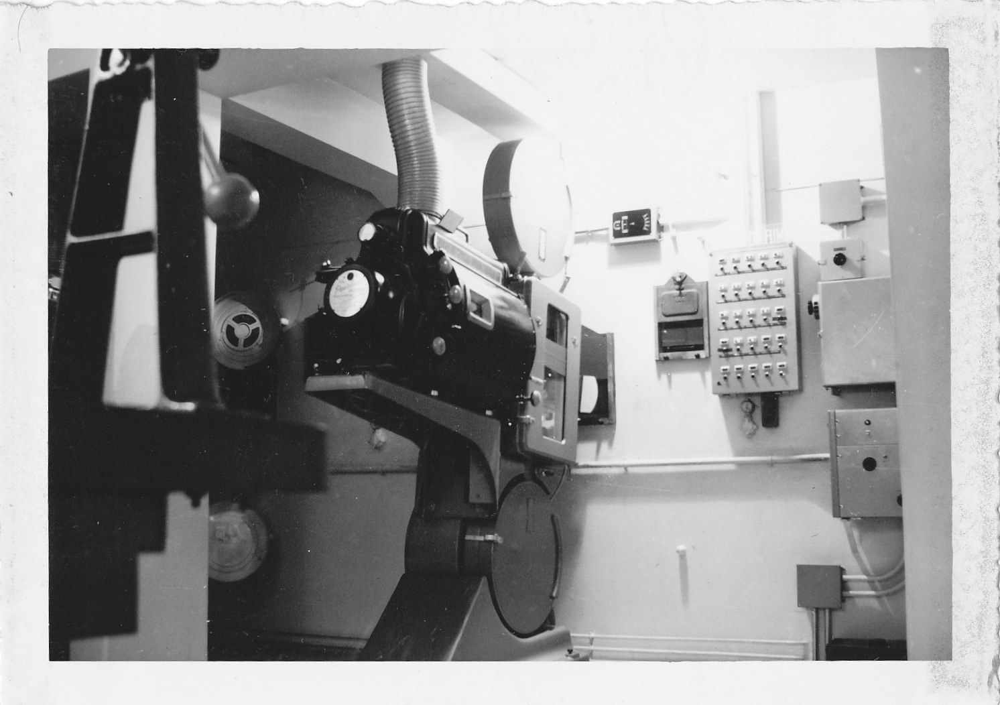
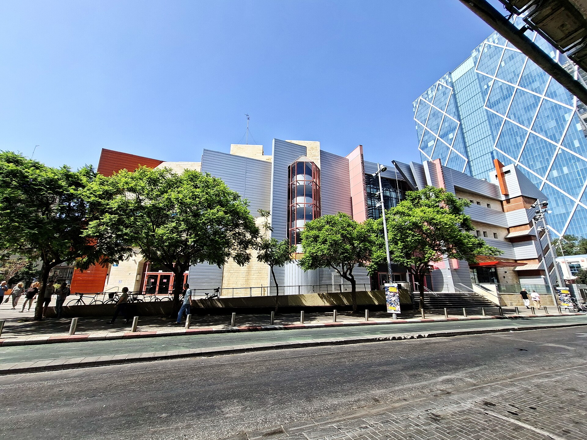

בעוד שרוב הקולנוע עבר מזמן לדיגיטל נקי ומדויק, קורה משהו מפתיע: שורה של יוצרים בולטים חוזרים דווקא אל הסלולואיד — הפילם הפיזי, המגורען, זה שדורש מעבדות, פיתוח וגלגלים כבדים. התשובה הקצרה לשאלה "למה" היא שילוב של אסתטיקה, נוסטלגיה וסטטוס: הפילם נראה אחרת, מרגיש אחרת, והפך לחותם של קולנוע רציני.

זו לא סתם קפריזה של אמנים. מדובר במגמה תרבותית של ממש, שבה הסלולואיד עבר מחומר גלם שנחשב מיושן לסמל של יוקרה קולנועית. כשקהל מוכן לנסוע רחוק ולשלם יותר כדי לראות סרט בהקרנת 70 מ"מ, ברור שמשהו עמוק יותר קורה כאן.

## מי מחזיר את הסלולואיד לחיים?

השמות שמובילים את המהפכה מוכרים היטב. כריסטופר נולאן (Christopher Nolan) הפך כמעט לשגריר הרשמי של הפורמט, ומתעקש לצלם את סרטיו על פילם ואף להקרינם ב-70 מ"מ במקומות נבחרים. קוונטין טרנטינו (Quentin Tarantino), חובב קולנוע אנלוגי מוצהר, נלחם שנים על שימור הפילם והקרנותיו. אליהם מצטרפים במאים כמו פול תומאס אנדרסון וגם יוצרים צעירים יותר שרואים בפילם הצהרת כוונות.

העניין אינו מסתכם בגחמה אישית. אולפני הפילם, שכמעט נעלמו, חוזרים לפעילות, וחברות שסיפקו גלם צילומי מדווחות על ביקוש מתחדש. הפילם, שהוכרז כמעט מת לפני עשור, מוכיח עמידות מפתיעה.

## למה הפילם נראה אחרת מהדיגיטל?

ההבדל אינו רק רגשי. לפילם יש מאפיינים אסתטיים שקשה לחקות בדיגיטל: הגרעיניות העדינה, טווח הצבע והדינמיקה של האור, והתחושה ה"אורגנית" של התמונה. רבים רואים בפילם עומק וממדיות שהדיגיטל, על אף חדותו, לעיתים משטח.

יש גם ממד פילוסופי. צילום על פילם כרוך במגבלה — כל שנייה עולה כסף, אין צפייה מיידית בתוצאה, וצריך לתכנן כל צילום בקפידה. המשמעת הזו, טוענים היוצרים, מחזירה כובד ראש ומחשבה לתהליך, במקום פיתוי הצילום האינסופי של הדיגיטל.

### הפורמטים המרכזיים

| פורמט | מאפיין בולט | חוויית צפייה |
|-------|-------------|--------------|
| 70 מ"מ | רזולוציה ועומק גבוהים במיוחד | מונומנטלי, שמור לאירועי בכורה |
| 35 מ"מ | תקן קלאסי היסטורי של הקולנוע | חמים, גרעיני, נוסטלגי |
| איי-מקס פילם | פורמט ענק לחוויה סוחפת | מרהיב, אולמות ספורים בעולם |
| דיגיטל | חד, נוח וזול להפצה | סטנדרטי, נגיש בכל אולם |

## הסלולואיד כחוויה יוקרתית

אחד הדברים המרתקים במגמה הוא שהפילם הפך למוצר פרימיום. הקרנות 70 מ"מ הופכות לאירועים שמתמלאים במהירות, וצופים מוכנים לנסוע ולשלם פרמיה עבור חוויה שנתפסת כאותנטית ונדירה. במקום שהנדירות תהרוג את הפורמט, היא הפכה אותו לנחשק.

זהו חלק ממגמה רחבה יותר של חזרה אל האנלוגי — בדומה לתחייתם של תקליטי הוויניל ומצלמות הפילם. בעידן שבו הכל מיידי, זמין ומושלם דיגיטלית, יש קסם מחודש בדברים שדורשים סבלנות, מלאכת יד וחיכוך עם החומר.

## מה קורה בישראל?

גם בזירה המקומית ניכר עניין מתחדש. הסינמטקים בתל אביב, בירושלים ובחיפה מקרינים מדי פעם עותקי פילם נדירים, ומועדוני קולנוע עצמאיים מקדשים הקרנות אנלוגיות כאירועים מיוחדים. עבור חובבי הקולנוע הישראלים, הזדמנות לראות קלאסיקה בהקרנת 35 מ"מ מקורית היא לא פחות ממאורע.

עם זאת, האתגר הישראלי ברור: ציוד ההקרנה של הפילם דורש תחזוקה, מקרנים ותיקים והולכים, ומומחים לתפעולם מתמעטים. שימור התשתית הזו הוא מרוץ נגד הזמן, ותלוי במידה רבה במסירותם של אנשי הסינמטקים.

## אז האם הדיגיטל נגמר?

מובן שלא. הדיגיטל ימשיך להיות התקן השולט בזכות הנוחות, הזמינות והעלות. אבל חזרת הסלולואיד מלמדת שקולנוע אינו רק תוכן — הוא גם חומר, טקסטורה וטקס. הבחירה בפילם היא אמירה: על איטיות, על מלאכה, ועל האמונה שהאופן שבו סרט מצולם ומוקרן הוא חלק בלתי נפרד ממה שהוא אומר.

בסופו של דבר, המהפכה הזו אינה על טכנולוגיה אלא על ערכים. ובעולם שבו הכל הופך לפיקסלים, יש משהו מנחם בכך שדווקא היוצרים הגדולים בוחרים לחזור אל האור העובר דרך פיסת פילם.
