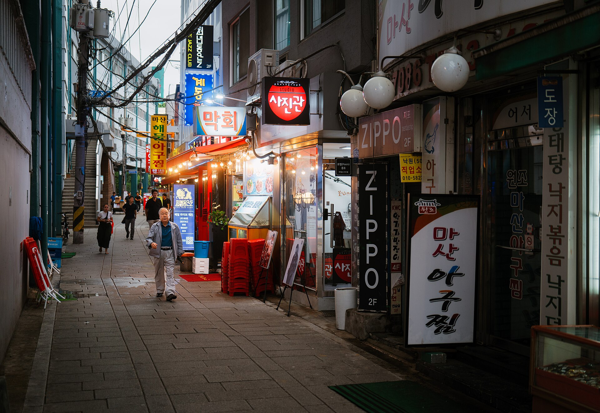

מה הופך צלילים בקוריאנית, כוריאוגרפיה מסונכרנת עד השנייה וקליפים ססגוניים לאחת המגמות המוזיקליות החמות בקרב צעירים בישראל? התשובה הקצרה: **קיי-פופ**. מה שנחשב עד לא מזמן לתחביב נישתי של קבוצה קטנה של מעריצים הפך בשנים האחרונות לתרבות המונים, עם קהילות תוססות, מסיבות ריקוד ייעודיות וביקוש גובר לכל טיפה של תוכן מקוריאה.

הקיי-פופ (בקיצור מ"קוריאן פופ") הוא הרבה יותר מז'אנר מוזיקלי. זוהי חבילת חוויה שלמה שמשלבת פופ ממכר, ריקוד מדויק, קליפים קולנועיים ואסתטיקה חזותית מוקפדת — והיא כובשת את לב הדור הצעיר בישראל בדיוק כמו בשאר העולם.

## מה זה בעצם קיי-פופ ולמה הוא שונה?

הקיי-פופ נולד בדרום קוריאה בשנות התשעים, אבל הזהות שאנחנו מכירים היום התגבשה בעשור וחצי האחרונים. בניגוד לפופ מערבי שמתמקד לרוב באמן יחיד, התעשייה הקוריאנית בנויה סביב **להקות** — קבוצות של זמרים-רקדנים שעברו שנים של אימונים אינטנסיביים לפני שיצאו לאור.

התוצאה היא מוצר מלוטש עד הפרט האחרון: הרמוניות קוליות, מעברים חדים בין סגנונות בתוך שיר אחד, וכוריאוגרפיות שהפכו לשפה בפני עצמן. מעריצים ברחבי העולם, כולל בישראל, לומדים את הריקודים צעד-צעד ומעלים גרסאות משלהם.

### הכוכבים שפרצו את הדרך

אי אפשר לדבר על קיי-פופ בלי להזכיר את **בי־טי־אס** (BTS), שבע החברים שהפכו לתופעה גלובלית וסחפו קהל עצום גם מחוץ לקוריאה. לצידם, **בלאקפינק** (BLACKPINK) הביאו את הפאן-נשי לחזית והפכו לפרצוף של קמפיינים בינלאומיים באופנה ובביוטי. הדור החדש — עם שמות כמו **הליון** (NewJeans), **סטרייז קידז** ו"אייב" — כבר גדל על ההצלחה הזו ומרחיב אותה.

## איך הקיי-פופ כבש את ישראל?

בישראל התחילה המגמה, כמו במקומות רבים, מקבוצות מעריצים באינטרנט. אבל בשנים האחרונות היא יצאה מהמסך אל העולם האמיתי. כיום מתקיימות מסיבות ריקוד ייעודיות בתל אביב ובערים נוספות, ערבי צפייה משותפים בקליפים ובהופעות, ואירועי קהילה שבהם מעריצים חוגגים ימי הולדת של האמנים האהובים עליהם.

הקהילה הישראלית היא מהפעילות והנלהבות בתחום. חנויות שמתמחות במרצ'נדייז — מאלבומים ועד כרטיסי אספנות ("פוטוקארד") — צצות ומשגשגות, ורשתות חברתיות מקומיות מלאות בתכנים בעברית על החדשות האחרונות מקוריאה.

### מי הקהל?

בליבת הקהל עומדים בני נוער וצעירים, עם נוכחות נשית בולטת אך גם קהל מגוון יותר משהיה בעבר. מה שמאחד אותם הוא לא רק המוזיקה, אלא תחושת השייכות לקהילה גלובלית — הרגשה שאתה חלק ממשהו גדול שחוצה גבולות ושפות.

## למה דווקא עכשיו? חמש סיבות למגמה

| סיבה | איך היא מזינה את הגל |
|------|----------------------|
| מוזיקה ממכרת | הפקה מלוטשת ומלודיות קליטות שנצמדות לזיכרון |
| חוויה חזותית | קליפים קולנועיים וכוריאוגרפיות מרהיבות |
| קהילה גלובלית | תחושת שייכות ומעורבות פעילה של המעריצים |
| נגישות דיגיטלית | פלטפורמות הזרמה ורשתות חברתיות שמפזרות תוכן מיידית |
| אורח חיים שלם | אופנה, ביוטי ותרבות פופ קוריאנית נלווית |

השילוב הזה יוצר מעגל שמזין את עצמו: ככל שהקהילה גדלה, כך גדל התוכן בעברית, וכך קל יותר למצטרפים חדשים למצוא את דרכם פנימה.

## מעבר למוזיקה: ייצוא של תרבות שלמה

הקיי-פופ הוא חוד החנית של מה שמכונה "הגל הקוריאני" (Hallyu) — גל שכולל גם דרמות טלוויזיה, קולנוע (הזוכה "פרזיטים" של בונג ג'ון-הו הוא דוגמה מובהקת), אוכל ואופנה. מי שנכנס דרך שיר אחד מוצא את עצמו לא פעם צולל אל עולם שלם: לומד מילים בקוריאנית, מגלה מטבח חדש ומאמץ טרנדים של ביוטי.

זו בדיוק העוצמה של המגמה. היא לא מסתפקת בשלוש דקות של להיט אלא מציעה שער אל תרבות שלמה, רחוקה גיאוגרפית אך קרובה מתמיד בזכות העולם הדיגיטלי.

## מה צפוי בהמשך?

השאלה הגדולה היא האם הגל יגיע לשיא ויתמסמס, או שימשיך להתבסס כחלק קבוע מנוף המוזיקה הישראלי. הסימנים מצביעים על התבססות: הדור הצעיר שגדל על הז'אנר לא נוטש אותו, והתעשייה הקוריאנית ממשיכה לייצר להקות חדשות בקצב מסחרר. גם אם השמות ישתנו, נראה שהקיי-פופ הפך לחלק בלתי נפרד מהתפריט המוזיקלי של הצעירים בישראל — ולא לכוכב שביט חולף.
