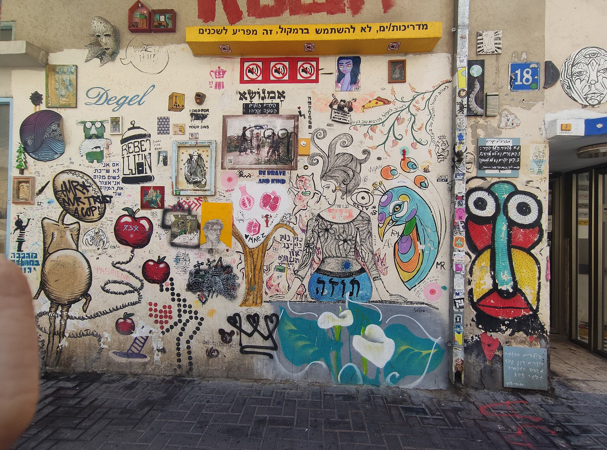

מי שמטייל בשעת בין ערביים ברחובות פלורנטין שבדרום תל אביב מגלה מהר מאוד שהקירות מדברים. אמנות רחוב חדלה מזמן להיות מעשה חתרני של נערים עם ספריי בלילה, והפכה לאחד הביטויים החזותיים החיים והנוכחים ביותר במרחב הישראלי. היום היא מזמינה סיורים מודרכים, זוכה לתערוכות בגלריות ממוסדות, ומושכת אספנים שמוכנים לשלם על יצירה שנולדה על קיר מתקלף.

התשובה הקצרה לשאלה מה קרה כאן: המרחב הציבורי הפך למוזיאון פתוח, נגיש וחינמי, שבו כל חזית בניין היא פוטנציאל לבמה. וזה קורה בדיוק בזמן שבו הקהל הישראלי צמא לאמנות שאינה כלואה מאחורי כרטיס כניסה.

## למה דווקא פלורנטין הפכה לבירת אמנות הרחוב?

השילוב שהפך את פלורנטין למרכז הסצנה אינו מקרי. שכונת המלאכה הישנה, על בנייני התעשייה הזעירה, החזיתות המתקלפות והשכירויות שהיו בעבר זולות, סיפקה ליוצרים בדיוק את מה שאמנות רחוב צריכה: משטחים גדולים, אווירה בוהמיינית וקהילה סובלנית. במהלך העשור האחרון הפכה השכונה למגנט ליוצרים מקומיים ובינלאומיים כאחד.

היום אפשר למצוא שם הכל: מדימויים פוליטיים חדים, דרך דיוקנאות ענק על קירות שלמים, ועד הומור ויזואלי קטן שמסתתר בפינת רחוב. הקיר הפך לעיתון, לבלוג ולפמפלט מחאה — הכל בבת אחת.

## מי הם היוצרים שמאחורי הקירות?

הסצנה הישראלית פיתחה כוכבים משלה, שחלקם זכו להכרה גם מעבר לים. אמן הרחוב הידוע בכינויו דדה (Dede) הפך את דמות הפלסטר שלו לחתימה מזוהה ברחבי העיר. קלונה (Klone), יליד אוקראינה שגדל בישראל, נודע ביצורים ההיברידיים והמלנכוליים שלו, ועבר בהצלחה גם אל עולם הגלריות. אמנים כמו זירו סנטו וקבוצות אנונימיות נוספות ממשיכות למלא את הרחוב בשכבות חדשות של דימויים.

המעבר בין הרחוב לגלריה הממוסדת הוא אחד הסיפורים המרתקים בתחום. יוצרים שהתחילו בהתגנבות לילית מוצאים את עצמם היום מציגים במרחבים מכובדים, ומתמודדים עם השאלה הנצחית: האם אמנות רחוב שמאבדת את הרחוב עדיין נאמנה לעצמה?

## אילו טכניקות תפגשו על הקיר?

אמנות הרחוב רחוקה מלהיות מדיום אחיד. מדובר בשפה עשירה של טכניקות, שלכל אחת אופי משלה:

- **גרפיטי קלאסי** — כתב יד וחתימות (טאגים) בספריי, שורש התרבות כולה.
- **סטנסיל** — שבלונות חתוכות המאפשרות שכפול מהיר של דימוי, בסגנון שהפך מזוהה עם בנקסי.
- **פייסטינג** — הדבקת פוסטרים ודימויים מודפסים על הקיר, מהיר וחמקמק.
- **פסיפס ומיצב** — יצירות תלת ממדיות שמשתלבות בארכיטקטורה של הרחוב.
- **מוראל** — ציור קיר בקנה מידה גדול, לרוב מוזמן ומתוכנן.

## איפה עוד שווה לחפש אמנות רחוב בישראל?

פלורנטין אולי מובילה, אבל היא רחוקה מלהיות לבד. הנה מפה תמציתית של מוקדי הסצנה:

| מוקד | מאפיין בולט | קהל |
|------|-------------|------|
| פלורנטין, תל אביב | לב הסצנה, ריכוז יוצרים גבוה | מקומיים ותיירים |
| נחלת בנימין והכרם | דימויים פוליטיים וחברתיים | הולכי רגל |
| חיפה התחתית | חזיתות גדולות והתחדשות עירונית | קהילת אמנים צומחת |
| שכונות ירושלים | מתח בין מסורת לחדשנות | מגוון רחב |

## מוונדליזם למוצר תרבותי

המעבר של אמנות הרחוב מהמחתרת אל המיינסטרים מלווה במתח מובנה. מצד אחד, סיורי גרפיטי מודרכים, גלויות ופרויקטים עירוניים ממוסדים העלו את קרנה והפכו אותה לנכס תיירותי ותרבותי. מצד שני, יש הטוענים שברגע שהעירייה מזמינה מוראל, האמנות מאבדת את העוקץ החתרני שהוליד אותה.

האמת, כמו תמיד, נמצאת אי שם באמצע. הרחוב הישראלי ממשיך להיות מרחב חי, שבו נמחקים ונצבעים דימויים חדשים כמעט מדי שבוע. זה בדיוק היופי של המדיום: הוא ארעי, נושם, ומשתנה עם העיר עצמה. אמנות רחוב אינה שואפת לנצחיות מוזיאלית — היא חוגגת את הרגע החולף, ובכך אולי נאמנה יותר לחיים מכל יצירה תחת זכוכית.

בפעם הבאה שתעברו בפלורנטין, האטו את הצעד והרימו את המבט. הגלריה הפתוחה ביותר בישראל פרושה ממש מעל הראש שלכם.
