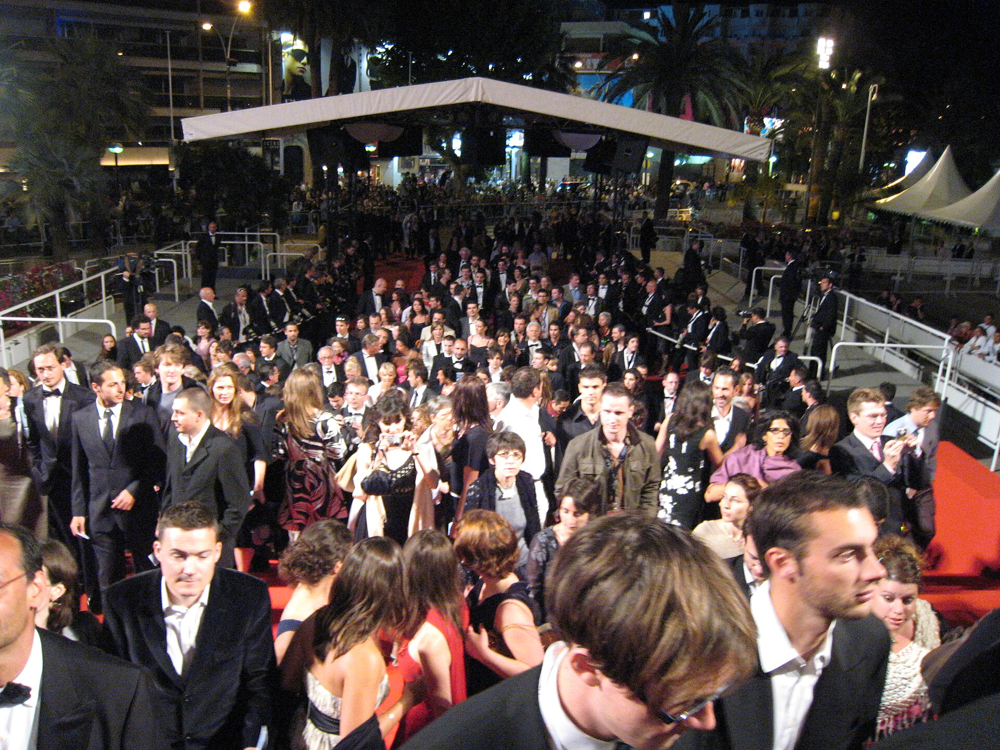

יש רגע שחוזר על עצמו יותר ויותר בשנים האחרונות: אתה מתיישב באולם, מציץ בשעון, ומגלה שהסרט יסתיים רק בעוד שלוש שעות ורבע. **סרטים ארוכים** חדלו להיות חריגה מוזרה והפכו כמעט לסימן היכר של קולנוע שאפתני. מ'אופנהיימר' של כריסטופר נולאן ועד 'רוצחי הירח המלא' של מרטין סקורסזה, נדמה שבמאי הדגל של התקופה מסרבים להתקצר — ודווקא הקהל, למרבה ההפתעה, מגיע.

אז מה קורה כאן? למה בעידן שבו כולם מתלוננים על טווח קשב מתכווץ, על סרטונים בני חמש עשרה שניות ועל צפייה במהירות כפולה, דווקא הסרט הארוך חוזר בגדול לקדמת הבמה?

## למה סרטים ארוכים חזרו לאופנה?

התשובה הראשונה היא פרדוקסלית: ככל שהתוכן המהיר משתלט על חיי היומיום, כך ההתמסרות לסרט ארוך הופכת ליוקרתית יותר. לשבת שלוש שעות מול מסך ענק, בלי טלפון, זו הצהרה תרבותית. זהו ההיפך הגמור מהגלילה האינסופית — טקס של קשב מרוכז שהופך את הצפייה ל'אירוע'.

התשובה השנייה נעוצה בכלכלה של התעשייה. סטודיו שמשקיע עשרות מיליוני דולרים בסרט מקורי, שאינו סרט המשך של גיבורי-על, רוצה שהצופה ירגיש שקיבל משהו גדול, כבד משקל, ראוי ליציאה מהבית. האורך הפך לחלק מהמיתוג: סרט של שלוש שעות משדר שאפתנות, עומק ורצינות אמנותית עוד לפני שהוקרן הפריים הראשון.

## האורך כאמצעי אמנותי

חשוב להבחין בין אורך שהוא התפנקות לבין אורך שהוא בחירה. אצל היוצרים הטובים, הזמן הנוסף אינו מילוי אלא כלי. כריסטופר נולאן ב'אופנהיימר' בונה מתח מצטבר לאורך שעות, כך שהצופה ממש חש את משקל ההיסטוריה מתהדק. מרטין סקורסזה, לעומתו, משתמש באורך כדי לשחוק את הצופה בכוונה — לגרום לנו להרגיש את ההתמשכות המוסרית של פשע שאינו נגמר.

גם גרטה גרוויג, פרנסיס פורד קופולה ופול תומאס אנדרסון ידועים ביחס הרוחב שהם מעניקים לדמויות. במקום לרוץ מנקודת עלילה אחת לשנייה, הם מרשים לסצנות לנשום, לשתיקות להתקיים, ולדמויות להתפתח בזמן אמת. זהו קולנוע שמבקש מאיתנו סבלנות — ומתגמל אותה.

## לוח 'הענקים': סרטים ארוכים שהחזירו את הקהל לאולם

הנה מבט על כמה מהיצירות שהזכירו לנו שאורך אינו בהכרח מגרעת:

| הסרט | הבמאי | טווח אורך משוער | מה מצדיק את האורך |
|---|---|---|---|
| אופנהיימר | כריסטופר נולאן | כשלוש שעות | מתח היסטורי מצטבר |
| רוצחי הירח המלא | מרטין סקורסזה | מעל שלוש שעות | שחיקה מוסרית מכוונת |
| בבילון | דמיאן שאזל | כשלוש שעות | פריחה ונפילה של הוליווד |
| הרוזן ממונטה כריסטו | עיבודים צרפתיים חדשים | כשלוש שעות | נאמנות לרוחב הרומן |

(האורכים מובאים כהערכה כללית ועשויים להשתנות בין גרסאות והפצות.)

## מה זה אומר על בתי הקולנוע?

כאן מתחיל האתגר האמיתי. סרט של שלוש שעות פירושו פחות הקרנות ביום, כלומר פחות כרטיסים שאפשר למכור. עבור רשתות הקולנוע ובתי הסינמטק, זו משוואה מורכבת: מצד אחד היוקרה והבאזז, מצד שני שורת רווח מאתגרת יותר.

ובכל זאת, נראה שהמגמה משרתת דווקא את חוויית האולם בעידן הסטרימינג. כשאפשר לעצור, להשהות ולפצל כל תוכן ביתי לכמה ערבים, הסרט הארוך באולם מציע בדיוק את מה שאי אפשר לשחזר על הספה: התמסרות רצופה, בלי הפסקות, בחברת קהל. הסינמטקים בתל אביב, בירושלים ובחיפה כבר מזמן הפכו את ההקרנות הארוכות לאירועי דגל, לעיתים בליווי שיחה או מבוא.

## מתי אורך הופך לפגם?

חשוב לא להתמכר לרומנטיקה. לא כל סרט ארוך הוא יצירת מופת, ולא מעט הפקות משתמשות באורך כדי להסוות חוסר עריכה, עלילה מרוחה או אגו של יוצר. ההבדל בין 'אפוס' ל'התארכות' הוא לרוב שאלה של הכרח: האם הרגע הזה חייב להיות שם? האם הסצנה הזו משנה משהו?

הקהל הישראלי, שגדל על מסורת של סרטי מופת ארוכים בסינמטק, יודע להבחין. סרט ארוך שמצדיק את עצמו יוצא מהאולם ומרגיש קצר; סרט ארוך שלא — הופך את כל אחת מהדקות למורגשת בכאב.

בשורה התחתונה, חזרת הסרט הארוך אינה אופנה חולפת אלא הצהרה: הקולנוע, מול הסטרימינג המקוטע, בוחר להזכיר לנו למה נולד מלכתחילה — כדי לרתק אותנו לחושך, ביחד, לאורך זמן.
