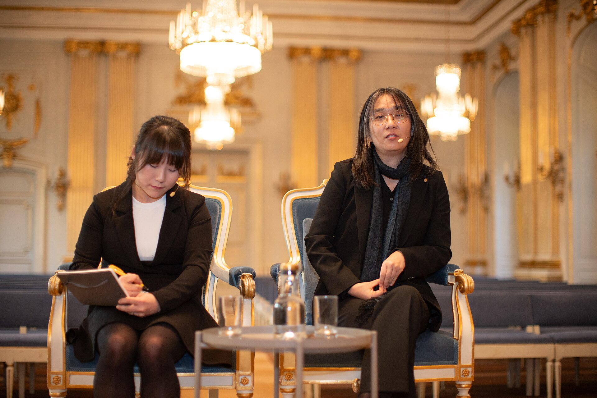

מדוע פתאום כולם מדברים על **ספרות קוריאנית**? התשובה הקצרה: שילוב נדיר של הכרה בינלאומית, כתיבה נועזת ורגע תרבותי מושלם. זכייתה ההיסטורית של הסופרת האן קאנג (Han Kang) בפרס נובל לספרות ב-2024 — האישה הראשונה מאסיה שזוכה בו — הפכה גל שכבר תפח בשקט לצונאמי של ממש. בישראל, כמו בשאר העולם, מדפי הרבי-מכר מתמלאים בתרגומים מקוריאנית, והקוראים מגלים עולם ספרותי שלם שהיה עד לא מזמן מעבר לאופק.

## איך הגענו לכאן? הרקע לגל

העניין בקוריאה הדרומית לא נולד יש מאין. בעשור האחרון התרבות הפופולרית הקוריאנית — מהמוזיקה של להקות הקיי-פופ, דרך סרטים כמו 'פרזיטים' של בונג ג'ון-הו שסחף את פרסי האוסקר, ועד סדרות טלוויזיה שכבשו את פלטפורמות הסטרימינג — יצרה סקרנות עולמית עצומה. הצופים והמאזינים שהתאהבו ברגישות האסתטית, בחדות החברתית ובאומץ הרגשי של היצירה הקוריאנית, החלו לחפש את המקבילה הספרותית.

והמקבילה הזו קיימת, ועוד איך. הספרות הקוריאנית העכשווית מצטיינת בשילוב של מינימליזם צלול עם עוצמה רגשית עזה, בעיסוק נוקב במגדר, בזיכרון היסטורי טראומטי ובניכור העירוני המודרני.

## למה הספרות הקוריאנית מדברת אל הקורא הישראלי?

יש משהו בספרות הקוריאנית שמהדהד באופן מפתיע לקורא המקומי. ההתמודדות עם היסטוריה כואבת, עם צל של אלימות פוליטית ועם שאלות של זהות והישרדות — כל אלה נושאים שאינם זרים לתרבות הישראלית. בה בעת, הכתיבה מציעה מבט זר ומרענן, חלון אל חברה שמתמודדת עם לחצים דומים אך בדרכים שונות לחלוטין.

גורם נוסף הוא **גל התרגומים לעברית**. הוצאות הספרים בישראל, שזיהו את הביקוש, מזרימות למדפים יצירות מתורגמות בקצב מואץ. מה שהיה פעם נישה של מבינים הפך לזרם מרכזי.

### האן קאנג: הקול שמוביל את הגל

אם יש שם אחד שמסמל את הפריצה, זו האן קאנג. הרומן שלה 'הצמחונית' (The Vegetarian), שזכה בפרס בוקר הבינלאומי עוד ב-2016, הוא נקודת כניסה אידיאלית: סיפור מטריד ומהפנט על אישה שמחליטה להפסיק לאכול בשר, החלטה שמתפרשת כמרד שקט נגד כל מוסכמה חברתית. הפרוזה של האן קאנג, כפי שרבים מציינים, נעה בין העדין לאלים, בין הפיוטי למחריד.

## מה כדאי לקרוא? מדריך התחלה

הטבלה הבאה מציעה נקודות פתיחה מומלצות לפי סוג הקורא — מהמתלבטים ועד למעמיקים:

| היצירה | הסופר/ת | למי מתאים |
|---|---|---|
| הצמחונית | האן קאנג | מי שמחפש כניסה עוצמתית לספרות הקוריאנית |
| פעולות אנוש | האן קאנג | קוראים שאוהבים ספרות פוליטית והיסטורית |
| קים ג'י-יונג ילידת 1982 | צ'ו נאם-ג'ו | מתעניינים בפמיניזם וביקורת חברתית |
| בבית הקפה של השעה הנכונה | (ספרות נחמה) | מחפשי קריאה מנחמת ואופטימית |

**חשוב לזכור:** זו רק ההתחלה. שוק התרגום מתעדכן כל הזמן, וכדאי לעקוב אחר קטלוגי ההוצאות ואחר המלצות בסינמטק הספרותי של הרשתות החברתיות.

## מגמה חולפת או שינוי עמוק?

השאלה המתבקשת היא האם מדובר באופנה חולפת. הערכתנו היא שלא. בניגוד לטרנדים ספרותיים שמתנפחים ומתפוצצים, הספרות הקוריאנית נשענת על תשתית איתנה: דורות של סופרים מוכשרים, מסורת תרגום שהולכת ומשתכללת, ותשומת לב בינלאומית שרק הולכת וגוברת. הזכייה בנובל אינה סוף הדרך אלא אות פתיחה — היא מסמנת לעולם שיש כאן ספרות שראוי להתייחס אליה ברצינות מלאה.

למעשה, אפשר לראות בגל הזה חלק ממגמה רחבה יותר של פתיחות הקורא הישראלי לספרות מתורגמת מתרבויות שאינן מערביות-קלאסיות. אחרי גל הספרות הסקנדינבית וגל הספרות היפנית, תורה של קוריאה להאיר את המדפים.

## בשורה התחתונה

הספרות הקוריאנית מציעה חוויית קריאה שהיא בו-זמנית זרה ומוכרת, מטרידה ומרגשת, מינימליסטית ועוצמתית. אם עדיין לא נגעתם בה — עכשיו הרגע המושלם. התחילו מהאן קאנג, והרשו לעצמכם ללכת לאיבוד בעולם ספרותי שלם שרק מתחיל להיפתח בפניכם.
