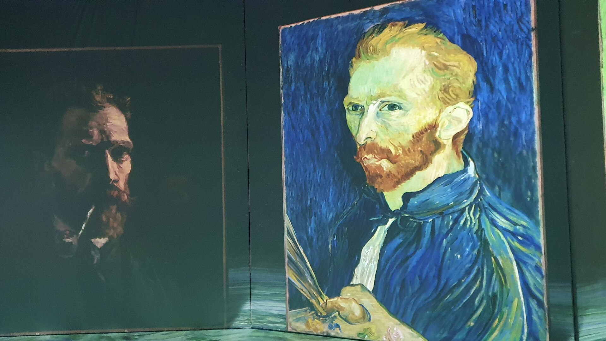

מה הופך תערוכה ל"אימרסיבית"? בקצרה: במקום לעמוד ממטר מול תמונה תלויה על קיר, אתם נכנסים אל תוך היצירה. **תערוכות אימרסיביות** הן חללים ענקיים שבהם צבעים, מוזיקה, וידאו והקרנות עוטפים את הצופה מכל כיוון — הרצפה, הקירות והתקרה הופכים למסך אחד גדול. בשנים האחרונות הפורמט הזה הפך לאחת המגמות החמות בעולם האמנות, וגם לזירת ויכוח נוקבת על מהי בכלל חוויה אמנותית.

## איך התחיל השגעון?

הגל הנוכחי מזוהה יותר מכל עם דמותו של וינסנט ואן גוך. הפקות כמו "ואן גוך האימרסיבי" נדדו בין ערים ברחבי העולם והפכו את "ליל הכוכבים" ו"חמניות" למפל של אור נע ברוחב של קירות שלמים. ההצלחה המסחרית הייתה מסחררת, ובעקבותיה הגיעו גרסאות דומות שהוקדשו לקלוד מונה, גוסטב קלימט ופרידה קאלו.

העיקרון פשוט להפליא: לוקחים יצירות מופת מוכרות, מפרקים אותן לרכיבים, ומקרינים אותן בתנועה מתוזמנת לפסקול דרמטי. התוצאה נגישה, מרהיבה ומאוד "אינסטגרמית" — וזה בדיוק מה שהפך אותה ללהיט המוני.

## טימלאב: כשהדיגיטל הוא האמנות עצמה

לצד ההפקות שממחזרות ציורים קלאסיים, קיים זרם שני ומעניין הרבה יותר — כזה שיוצר אמנות אימרסיבית מקורית. הקולקטיב היפני **טימלאב** (teamLab) הוא הדוגמה הבולטת. במוזיאונים שלהם בטוקיו הצופים משוטטים בין מפלי אור ווירטואליים, פרחים שנפתחים על גופם ומרחבים אינסופיים של נקודות זוהרות.

כאן כבר לא מדובר בהקרנה של יצירה קיימת, אלא ביצירה שנולדה דיגיטלית מלכתחילה ותלויה בנוכחות הצופה ובתנועתו. זו אמנות שאי אפשר לתלות על קיר — היא קיימת רק ברגע ובמרחב.

## מדוע דווקא עכשיו?

כמה כוחות נפגשו יחד. הטכנולוגיה של מקרנים והדמיה הפכה זולה ונגישה; קהל שגדל על מסכים מחפש חוויות שאפשר לצלם ולשתף; ומוזיאונים מסורתיים מתמודדים עם קושי למשוך דור צעיר אל אולמות שקטים. התערוכה האימרסיבית מציעה פתרון — היא רועשת, צבעונית ובלתי נשכחת.

| היבט | תערוכה מסורתית | תערוכה אימרסיבית |
|---|---|---|
| מיקום היצירה | על הקיר, במרחק | עוטפת מכל הכיוונים |
| חוויית הצופה | התבוננות שקטה | טבילה חושית מלאה |
| קהל היעד | חובבי אמנות ותיקים | קהל רחב, כולל צעירים ומשפחות |
| ביקורת נפוצה | "אליטיסטית" | "מסחרית, שטחית" |

## דמוקרטיזציה או ראווה ריקה?

כאן מתחיל הוויכוח האמיתי. מצדדי הפורמט טוענים שמדובר בדמוקרטיזציה של האמנות: אנשים שמעולם לא היו נכנסים למוזיאון מוצאים את עצמם עומדים מוקסמים מול ואן גוך. החוויה מפרקת את המחסום המאיים של הגלריה הלבנה והשקטה.

מנגד, מבקרים רבים רואים בכך היפוך מסוכן. הם טוענים שהמפגש עם הציור המקורי — עם משיכות המכחול, עם המרקם, עם הגודל האמיתי — הוחלף במופע אור ריק מתוכן. במקרים רבים אין ביצירות המוקרנות שום מגע ידו של האמן, אלא עיבוד דיגיטלי שנועד להרשים ולא לחנך.

> האם חוויה עוטפת יכולה להחליף מפגש עם יצירה מקורית — או שהיא בסך הכול מסלול מהיר לצילום מוצלח?

## והמצב בישראל?

גם אצלנו הגל הורגש. הפקות אימרסיביות בינלאומיות הגיעו למרחבי תצוגה בתל אביב ובמרכז הארץ, ומשכו קהל גדול שכלל דווקא לא מעט מבקרים לא מנוסים. במקביל, מוסדות מבוססים כמו מוזיאון תל אביב לאמנות ממשיכים לטפח את המפגש הישיר עם היצירה, ואמנים ישראלים בתחום המיצב והווידאו־ארט חוקרים בעצמם את גבולות המרחב העוטף.

השאלה המעניינת אינה אם הפורמט יישאר — נראה שכן — אלא לאן הוא יתפתח: האם ישרת אמנים מקוריים ליצירת שפה חדשה, או יישאר בעיקר תעשיית בידור שממחזרת מופת ישן.

## איך לצפות נכון?

כמה עצות למי שנכנס לחוויה אימרסיבית: הגיעו בשעות פחות עמוסות כדי לחוות את המרחב בשקט יחסי; שבו בזמן שהמיצג רץ ואל תמהרו לצלם מיד; ואם אתם אוהבים את היצירות המקוריות — השלימו את הביקור בהמשך במפגש עם ציורים אמיתיים במוזיאון. שני העולמות אינם סותרים, ולעיתים דווקא משלימים זה את זה.
